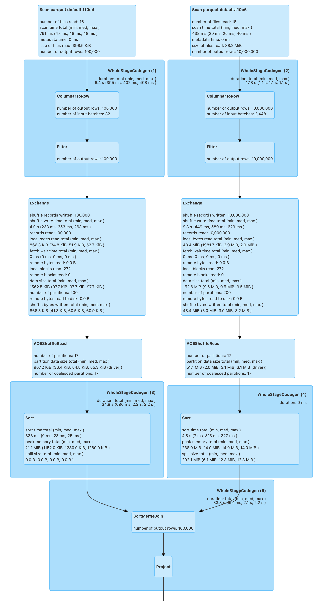
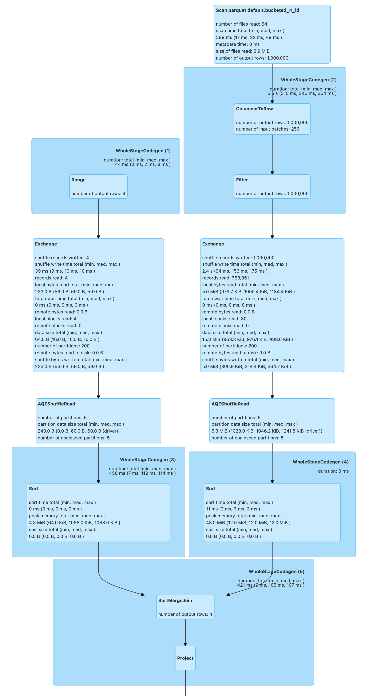

# Bucketing

**Bucketing** is an optimization technique that uses **buckets** (and **bucketing columns**) to determine data partitioning and avoid data shuffle in join queries.

The motivation is to optimize performance of a join query by avoiding shuffles (_exchanges_) of tables participating in the join. Bucketing results in fewer exchanges (and so stages).

!!! note
    Bucketing can show the biggest benefit when **pre-shuffled bucketed tables** are used more than once as bucketing itself takes time (that you will offset executing multiple join queries later).

Bucketing is supported for permanent tables in the following catalogs (_metastores_):

* [HiveExternalCatalog](../hive/HiveExternalCatalog.md#getBucketSpecFromTableProperties)
* [TransformHelper](../connector/TransformHelper.md#convertTransforms)

Bucketing is configured using [spark.sql.sources.bucketing.enabled](../configuration-properties.md#spark.sql.sources.bucketing.enabled) configuration property.

```scala
assert(spark.sessionState.conf.bucketingEnabled, "Bucketing disabled?!")
```

Bucketing is used exclusively in [FileSourceScanExec](../physical-operators/FileSourceScanExec.md) physical operator (when requested for the [input RDD](../physical-operators/FileSourceScanExec.md#inputRDD) and to determine the [partitioning](../physical-operators/FileSourceScanExec.md#outputPartitioning) and [ordering](../physical-operators/FileSourceScanExec.md#outputOrdering) of the output).

## Delta Lake

Bucketing is not supported by Delta Lake (so it's not really true to say that _"all file-based data sources_ are supported, unfortunatelly).

## Create Bucketed Tables

Bucketed tables can be created using the following higher-level operators:

* [AstBuilder](../sql/AstBuilder.md#visitBucketSpec)
* [CreateTableAsSelectExec](../physical-operators/CreateTableAsSelectExec.md)
* `CreateTableExec`
* [DataFrameWriter](../DataFrameWriter.md#numBuckets)
* `ReplaceTableAsSelectExec`
* `ReplaceTableExec`

## SHOW CREATE TABLE

[SHOW CREATE TABLE](../sql/AstBuilder.md#visitShowCreateTable) SQL statement is used to display bucketing specification of a table.

## Demo: SortMergeJoin of Two FileScans

```scala
import org.apache.spark.sql.SaveMode
spark.range(10e4.toLong).write.mode(SaveMode.Overwrite).saveAsTable("t10e4")
spark.range(10e6.toLong).write.mode(SaveMode.Overwrite).saveAsTable("t10e6")
```

Bucketing is enabled by default. Let's check it out, anyway.

```scala
assert(spark.sessionState.conf.bucketingEnabled, "Bucketing disabled?!")
```

Make sure that you don't end up with a [BroadcastHashJoinExec](../physical-operators/BroadcastHashJoinExec.md) and a [BroadcastExchangeExec](../physical-operators/BroadcastExchangeExec.md). Disable auto broadcasting.

```scala
spark.conf.set("spark.sql.autoBroadcastJoinThreshold", -1)
```

```scala
val tables = spark.catalog.listTables.where($"name" startsWith "t10e")
```

```text
scala> tables.show
+-----+--------+-----------+---------+-----------+
| name|database|description|tableType|isTemporary|
+-----+--------+-----------+---------+-----------+
|t10e4| default|       null|  MANAGED|      false|
|t10e6| default|       null|  MANAGED|      false|
+-----+--------+-----------+---------+-----------+
```

```scala
val t4 = spark.table("t10e4")
val t6 = spark.table("t10e6")

assert(t4.count == 10e4)
assert(t6.count == 10e6)

// trigger execution of the join query
t4.join(t6, "id").foreach(_ => ())
```

The above join query is a fine example of a [SortMergeJoinExec](../physical-operators/SortMergeJoinExec.md) (_SortMergeJoin_) of two [FileSourceScanExec](../physical-operators/FileSourceScanExec.md)s (the two _Scans_ at the top). The join query uses [ShuffleExchangeExec](../physical-operators/ShuffleExchangeExec.md) physical operators (_Exchange_) to shuffle the tables for the `SortMergeJoin`.



## Creating Bucketed Tables

One way to avoid the exchanges (and so optimize the join query) is to use table bucketing that is applicable for all file-based data sources (e.g. Parquet, ORC, JSON, CSV) that are saved as a table using [DataFrameWrite.saveAsTable](../DataFrameWriter.md#saveAsTable) or simply available in a [catalog](../Catalog.md) by [SparkSession.table](../SparkSession.md#table).

!!! note
    [Bucketing is not supported](../DataFrameWriter.md#assertNotBucketed) for [DataFrameWriter.save](../DataFrameWriter.md#save), [DataFrameWriter.insertInto](../DataFrameWriter.md#insertInto) and [DataFrameWriter.jdbc](../DataFrameWriter.md#jdbc) methods.

[DataFrameWriter.bucketBy](../DataFrameWriter.md#bucketBy) method is used to specify the number of buckets and the bucketing columns.

You can optionally sort the output rows in buckets using [DataFrameWriter.sortBy](../DataFrameWriter.md#sortBy) method.

```scala
val large = spark.range(10e6.toLong)
import org.apache.spark.sql.SaveMode
large.write
  .bucketBy(4, "id")
  .sortBy("id")
  .mode(SaveMode.Overwrite)
  .saveAsTable("bucketed_4_id")
```

!!! note
    [DataFrameWriter.bucketBy](../DataFrameWriter.md#bucketBy) and [DataFrameWriter.sortBy](../DataFrameWriter.md#sortBy) are used to define a [bucketing specification](BucketSpec.md).

Unlike bucketing in Apache Hive, Spark SQL creates the bucket files per the number of buckets and partitions. In other words, the number of bucketing files is the number of buckets multiplied by the number of task writers (one per partition).

```text
// the number of partitions depends on the cluster manager
// In local[*], the default parallelism is the number of CPU cores
// I've got a 16-core laptop
scala> println(large.queryExecution.toRdd.getNumPartitions)
16
```

```text
// That gives 16 (partitions/task writers) x 4 (buckets) = 64 files
// With _SUCCESS extra file and the ls -l header "total 794624" that gives 66 files
$ ls -tlr spark-warehouse/bucketed_4_id | wc -l
      66
```

With bucketing, the `Exchange`s will no longer be necessary (as the tables are already pre-shuffled). Let's create bucketed tables (using `DataFrameWriter.bucketBy`).

```scala
import org.apache.spark.sql.SaveMode
spark.range(10e4.toLong)
  .write
  .bucketBy(4, "id")
  .sortBy("id")
  .mode(SaveMode.Overwrite)
  .saveAsTable("bucketed_4_10e4")
spark.range(10e6.toLong)
  .write
  .bucketBy(4, "id")
  .sortBy("id")
  .mode(SaveMode.Overwrite)
  .saveAsTable("bucketed_4_10e6")
```

```scala
val bucketed_4_10e4 = spark.table("bucketed_4_10e4")
val bucketed_4_10e6 = spark.table("bucketed_4_10e6")
```

```scala
// trigger execution of the join query
bucketed_4_10e4.join(bucketed_4_10e6, "id").foreach(_ => ())
```

The above join query of the bucketed tables shows no [ShuffleExchangeExec](../physical-operators/ShuffleExchangeExec.md) physical operators (_Exchanges_) as the shuffling has already been executed (before the query was run).


The number of partitions of a bucketed table is exactly the number of buckets.

```scala
val bucketed_4_10e4 = spark.table("bucketed_4_10e4")
val numPartitions = bucketed_4_10e4.queryExecution.toRdd.getNumPartitions
assert(numPartitions == 16)
```

## DESCRIBE EXTENDED

Use [SessionCatalog](../SessionCatalog.md#getTableMetadata) or `DESCRIBE EXTENDED` SQL command to find the bucketing information.

```scala
val bucketed_tables = spark
  .catalog
  .listTables
  .where($"name" startsWith "bucketed_")
```

```text
scala> bucketed_tables.show
+---------------+--------+-----------+---------+-----------+
|           name|database|description|tableType|isTemporary|
+---------------+--------+-----------+---------+-----------+
|bucketed_4_10e4| default|       null|  MANAGED|      false|
|bucketed_4_10e6| default|       null|  MANAGED|      false|
|  bucketed_4_id| default|       null|  MANAGED|      false|
+---------------+--------+-----------+---------+-----------+
```

```scala
val demoTable = "bucketed_4_10e4"
```

```text
// DESC EXTENDED or DESC FORMATTED would also work
val describeSQL = sql(s"DESCRIBE EXTENDED $demoTable")
scala> describeSQL.show(numRows = Integer.MAX_VALUE, truncate = false)
+----------------------------+---------------------------------------------------------------+-------+
|col_name                    |data_type                                                      |comment|
+----------------------------+---------------------------------------------------------------+-------+
|id                          |bigint                                                         |null   |
|                            |                                                               |       |
|# Detailed Table Information|                                                               |       |
|Database                    |default                                                        |       |
|Table                       |bucketed_4_10e4                                                |       |
|Owner                       |jacek                                                          |       |
|Created Time                |Wed Feb 09 21:29:12 CET 2022                                   |       |
|Last Access                 |UNKNOWN                                                        |       |
|Created By                  |Spark 3.2.1                                                    |       |
|Type                        |MANAGED                                                        |       |
|Provider                    |parquet                                                        |       |
|Num Buckets                 |4                                                              |       |
|Bucket Columns              |[`id`]                                                         |       |
|Sort Columns                |[`id`]                                                         |       |
|Statistics                  |432802 bytes                                                   |       |
|Location                    |file:/Users/jacek/dev/oss/spark/spark-warehouse/bucketed_4_10e4|       |
|Serde Library               |org.apache.hadoop.hive.ql.io.parquet.serde.ParquetHiveSerDe    |       |
|InputFormat                 |org.apache.hadoop.hive.ql.io.parquet.MapredParquetInputFormat  |       |
|OutputFormat                |org.apache.hadoop.hive.ql.io.parquet.MapredParquetOutputFormat |       |
+----------------------------+---------------------------------------------------------------+-------+
```

```scala
import org.apache.spark.sql.catalyst.TableIdentifier
val metadata = spark
  .sessionState
  .catalog
  .getTableMetadata(TableIdentifier(demoTable))
```

```text
scala> metadata.bucketSpec.foreach(println)
4 buckets, bucket columns: [id], sort columns: [id]
```

The [number of buckets](BucketSpec.md#numBuckets) has to be between `0` and `100000` exclusive or Spark SQL throws an `AnalysisException`:

```text
Number of buckets should be greater than 0 but less than 100000. Got `[numBuckets]`
```

There are however requirements that have to be met before [SparkOptimizer](../SparkOptimizer.md) gives a no-Exchange query plan:

1. The number of partitions on both sides of a join has to be exactly the same
1. Both join operators have to use [HashPartitioning](../expressions/HashPartitioning.md) partitioning scheme

It is acceptable to use bucketing for one side of a join.

```scala
// Make sure that you don't end up with a BroadcastHashJoin and a BroadcastExchange
// For this, let's disable auto broadcasting
spark.conf.set("spark.sql.autoBroadcastJoinThreshold", -1)

val bucketedTableName = "bucketed_4_id"
val large = spark.range(10e5.toLong)
import org.apache.spark.sql.SaveMode
large.write
  .bucketBy(4, "id")
  .sortBy("id")
  .mode(SaveMode.Overwrite)
  .saveAsTable(bucketedTableName)
val bucketedTable = spark.table(bucketedTableName)

val t1 = spark
  .range(4)
  .repartition(4, $"id")  // Make sure that the number of partitions matches the other side

val q = t1.join(bucketedTable, "id")
```

```text
scala> q.explain
== Physical Plan ==
AdaptiveSparkPlan isFinalPlan=false
+- Project [id#151L]
   +- SortMergeJoin [id#151L], [id#149L], Inner
      :- Sort [id#151L ASC NULLS FIRST], false, 0
      :  +- Exchange hashpartitioning(id#151L, 4), REPARTITION_BY_NUM, [id=#385]
      :     +- Range (0, 4, step=1, splits=16)
      +- Sort [id#149L ASC NULLS FIRST], false, 0
         +- Filter isnotnull(id#149L)
            +- FileScan parquet default.bucketed_4_id[id#149L] Batched: true, DataFilters: [isnotnull(id#149L)], Format: Parquet, Location: InMemoryFileIndex(1 paths)[file:/Users/jacek/dev/oss/spark/spark-warehouse/bucketed_4_id], PartitionFilters: [], PushedFilters: [IsNotNull(id)], ReadSchema: struct<id:bigint>, SelectedBucketsCount: 4 out of 4
```

```scala
q.foreach(_ => ())
```


## Bucket Pruning

As of [Spark 2.4.0](https://issues.apache.org/jira/browse/SPARK-23803), Spark SQL supports **bucket pruning** to optimize filtering on a bucketed column (by reducing the number of bucket files to scan).

Bucket pruning supports the following predicate expressions:

* [EqualTo](../expressions/EqualTo.md)
* [EqualNullSafe](../expressions/EqualNullSafe.md)
* [In](../expressions/In.md)
* [InSet](../expressions/InSet.md)
* `And` and `Or` of the above

[FileSourceStrategy](../execution-planning-strategies/FileSourceStrategy.md) execution planning strategy is responsible for selecting only [LogicalRelation](../logical-operators/LogicalRelation.md)s over [HadoopFsRelation](../files/HadoopFsRelation.md) with the [bucketing specification](../files/HadoopFsRelation.md#bucketSpec) with the following:

1. There is exactly one bucketing column
1. The number of buckets is greater than 1

### Demo

Enable `INFO` logging level of [FileSourceStrategy](../execution-planning-strategies/FileSourceStrategy.md) logger to look under the covers.

```scala
import org.apache.spark.sql.execution.datasources.FileSourceStrategy
val logger = FileSourceStrategy.getClass.getName.replace("$", "")
import org.apache.log4j.{Level, Logger}
Logger.getLogger(logger).setLevel(Level.INFO)
```

```text
val q57 = q.where($"id" isin (50, 70))
scala> val sparkPlan57 = q57.queryExecution.executedPlan
22/02/09 21:35:06 INFO FileSourceStrategy: Pruned 2 out of 4 buckets.
22/02/09 21:35:06 INFO FileSourceStrategy: Pushed Filters: In(id, [50,70]),IsNotNull(id)
22/02/09 21:35:06 INFO FileSourceStrategy: Post-Scan Filters: id#149L IN (50,70),isnotnull(id#149L)
22/02/09 21:35:06 INFO FileSourceStrategy: Output Data Schema: struct<id: bigint>
...
```

```text
scala> println(sparkPlan57.numberedTreeString)
00 AdaptiveSparkPlan isFinalPlan=false
01 +- Project [id#151L]
02    +- SortMergeJoin [id#151L], [id#149L], Inner
03       :- Sort [id#151L ASC NULLS FIRST], false, 0
04       :  +- Exchange hashpartitioning(id#151L, 4), REPARTITION_BY_NUM, [id=#514]
05       :     +- Filter id#151L IN (50,70)
06       :        +- Range (0, 4, step=1, splits=16)
07       +- Sort [id#149L ASC NULLS FIRST], false, 0
08          +- Filter (id#149L IN (50,70) AND isnotnull(id#149L))
09             +- FileScan parquet default.bucketed_4_id[id#149L] Batched: true, DataFilters: [id#149L IN (50,70), isnotnull(id#149L)], Format: Parquet, Location: InMemoryFileIndex(1 paths)[file:/Users/jacek/dev/oss/spark/spark-warehouse/bucketed_4_id], PartitionFilters: [], PushedFilters: [In(id, [50,70]), IsNotNull(id)], ReadSchema: struct<id:bigint>, SelectedBucketsCount: 2 out of 4
```

Execute the query to trigger [Adaptive Query Execution](../adaptive-query-execution/index.md).

```scala
sparkPlan57.executeTake(0)
```

```scala
import org.apache.spark.sql.execution.adaptive.AdaptiveSparkPlanExec
val initialPlan = sparkPlan57.asInstanceOf[AdaptiveSparkPlanExec].initialPlan
```

```scala
import org.apache.spark.sql.execution.FileSourceScanExec
val scan57 = initialPlan.collectFirst { case exec: FileSourceScanExec => exec }.get

import org.apache.spark.sql.execution.datasources.FileScanRDD
val rdd57 = scan57.inputRDDs.head.asInstanceOf[FileScanRDD]

import org.apache.spark.sql.execution.datasources.FilePartition
val bucketFiles57 = for {
  FilePartition(bucketId, files) <- rdd57.filePartitions
  f <- files
} yield s"Bucket $bucketId => $f"
```

```text
scala> println(bucketFiles57.size)
32
```

## Sorting

Disable auto broadcasting.

```scala
spark.conf.set("spark.sql.autoBroadcastJoinThreshold", -1)
```

```scala
val bucketedTableName = "bucketed_4_id"
val large = spark.range(10e5.toLong)
import org.apache.spark.sql.SaveMode
large.write
  .bucketBy(4, "id")
  .sortBy("id")
  .mode(SaveMode.Overwrite)
  .saveAsTable(bucketedTableName)

// Describe the table and include bucketing spec only
val descSQL = sql(s"DESC FORMATTED $bucketedTableName")
  .filter($"col_name".contains("Bucket") || $"col_name" === "Sort Columns")
```

```text
scala> descSQL.show
+--------------+---------+-------+
|      col_name|data_type|comment|
+--------------+---------+-------+
|   Num Buckets|        4|       |
|Bucket Columns|   [`id`]|       |
|  Sort Columns|   [`id`]|       |
+--------------+---------+-------+
```

```scala
val bucketedTable = spark.table(bucketedTableName)

val t1 = spark.range(4)
  .repartition(2, $"id")  // Use just 2 partitions
  .sortWithinPartitions("id") // sort partitions

val q = t1.join(bucketedTable, "id")
```

```text
// Note two exchanges and sorts
scala> q.explain
== Physical Plan ==
AdaptiveSparkPlan isFinalPlan=false
+- Project [id#183L]
   +- SortMergeJoin [id#183L], [id#181L], Inner
      :- Sort [id#183L ASC NULLS FIRST], false, 0
      :  +- Exchange hashpartitioning(id#183L, 200), ENSURE_REQUIREMENTS, [id=#597]
      :     +- Range (0, 4, step=1, splits=16)
      +- Sort [id#181L ASC NULLS FIRST], false, 0
         +- Exchange hashpartitioning(id#181L, 200), ENSURE_REQUIREMENTS, [id=#605]
            +- Filter isnotnull(id#181L)
               +- FileScan parquet default.bucketed_4_id[id#181L] Batched: true, DataFilters: [isnotnull(id#181L)], Format: Parquet, Location: InMemoryFileIndex(1 paths)[file:/Users/jacek/dev/oss/spark/spark-warehouse/bucketed_4_id], PartitionFilters: [], PushedFilters: [IsNotNull(id)], ReadSchema: struct<id:bigint>
```

```scala
q.foreach(_ => ())
```

!!! warn
    There are two exchanges and sorts which makes the above use case almost unusable. I filed an issue at [SPARK-24025 Join of bucketed and non-bucketed tables can give two exchanges and sorts for non-bucketed side](https://issues.apache.org/jira/browse/SPARK-24025).


