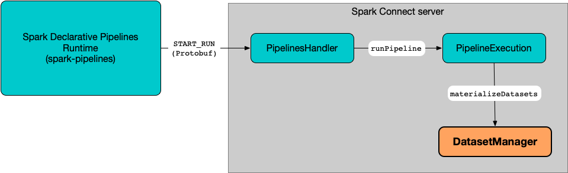

# DatasetManager

`DatasetManager` is a global manager to [materialize datasets](#materializeDatasets) (tables and persistent views) right after a [pipeline update](PipelineExecution.md#startPipeline).



!!! note ""
    **Materialization** is a process of publishing tables and persistent views to session [TableCatalog](../connector/catalog/TableCatalog.md) and [SessionCatalog](../SessionCatalog.md), for tables and persistent views, respectively.

??? note "Scala object"
    `DatasetManager` is an `object` in Scala which means it is a class that has exactly one instance (itself).
    A Scala `object` is created lazily when it is referenced for the first time.

    Learn more in [Tour of Scala](https://docs.scala-lang.org/tour/singleton-objects.html).

## Materialize Datasets { #materializeDatasets }

```scala
materializeDatasets(
  resolvedDataflowGraph: DataflowGraph,
  context: PipelineUpdateContext): DataflowGraph
```

`materializeDatasets` [constructFullRefreshSet](#constructFullRefreshSet) for the [tables](DataflowGraph.md#tables) in the given [DataflowGraph](DataflowGraph.md) (and the [PipelineUpdateContext](PipelineUpdateContext.md)).

`materializeDatasets` marks the [tables](DataflowGraph.md#tables) (in the given [DataflowGraph](DataflowGraph.md)) as to be refreshed and fully-refreshed.

`materializeDatasets`...FIXME

For every table to be materialized, `materializeDatasets` [materializeTable](#materializeTable).

In the end, `materializeDatasets` [materializeViews](#materializeViews).

---

`materializeDatasets` is used when:

* `PipelineExecution` is requested to [initialize the dataflow graph](PipelineExecution.md#initializeGraph)

### Materialize Table { #materializeTable }

```scala
materializeTable(
  resolvedDataflowGraph: DataflowGraph,
  table: Table,
  isFullRefresh: Boolean,
  context: PipelineUpdateContext): Table
```

`materializeTable` prints out the following INFO message to the logs:

```text
Materializing metadata for table [identifier].
```

`materializeTable` uses the given [PipelineUpdateContext](PipelineUpdateContext.md) to find the [CatalogManager](../connector/catalog/CatalogManager.md) (in the [SparkSession](PipelineUpdateContext.md#spark)).

`materializeTable` finds the [TableCatalog](../connector/catalog/TableCatalog.md) for the table.

`materializeTable` requests the `TableCatalog` to [load the table](../connector/catalog/TableCatalog.md#loadTable) if [exists](../connector/catalog/TableCatalog.md#tableExists) already.

For an existing table, `materializeTable` wipes data out (`TRUNCATE TABLE`) if it is`isFullRefresh` or the table is not [streaming](Table.md#isStreamingTable).

For an existing table, `materializeTable` requests the `TableCatalog` to [alter the table](../connector/catalog/TableCatalog.md#alterTable) if there are any changes in the schema or table properties.

Unless created already, `materializeTable` requests the `TableCatalog` to [create the table](../connector/catalog/TableCatalog.md#createTable).

In the end, `materializeTable` requests the `TableCatalog` to [load the materialized table](../connector/catalog/TableCatalog.md#loadTable) and returns the given [Table](Table.md) back (with the [normalized table storage path](Table.md#normalizedPath) updated to the `location` property of the materialized table).

### Materialize Views { #materializeViews }

```scala
materializeViews(
  virtualizedConnectedGraphWithTables: DataflowGraph,
  context: PipelineUpdateContext): Unit
```

`materializeViews` requests the given [DataflowGraph](DataflowGraph.md) for the [persisted views](DataflowGraph.md#persistedViews) to materialize (_publish or refresh_).

!!! note "Publish (Materialize) Views"
    To publish a view, it is required that all the input sources must exist in the metastore.
    If a Persisted View target reads another Persisted View source, the source must be published first.

`materializeViews`...FIXME

For each view to be persisted (with no pending inputs), `materializeViews` [materialize the view](#materializeView).

#### Materialize View { #materializeView }

```scala
materializeView(
  view: View,
  flow: ResolvedFlow,
  spark: SparkSession): Unit
```

`materializeView` [executes a CreateViewCommand logical command](../logical-operators/CreateViewCommand.md).

---

`materializeView` creates a [CreateViewCommand](../logical-operators/CreateViewCommand.md) logical command (as a `PersistedView` with `allowExisting` and `replace` flags enabled).

`materializeView` requests the given [ResolvedFlow](ResolvedFlow.md) for the [QueryContext](ResolutionCompletedFlow.md#queryContext) to set the current catalog and current database, if defined, in the session [CatalogManager](../connector/catalog/CatalogManager.md).

In the end, `materializeView` [executes the CreateViewCommand](../logical-operators/CreateViewCommand.md#run).

## constructFullRefreshSet { #constructFullRefreshSet }

```scala
constructFullRefreshSet(
  graphTables: Seq[Table],
  context: PipelineUpdateContext): (Seq[Table], Seq[TableIdentifier], Seq[TableIdentifier])
```

`constructFullRefreshSet` gives the following collections:

* [Table](Table.md)s to be refreshed (incl. a full refresh)
* `TableIdentifier`s of the tables to be refreshed (excl. fully refreshed)
* `TableIdentifier`s of the tables to be fully refreshed only

If there are tables to be fully refreshed yet not allowed for a full refresh, `constructFullRefreshSet` prints out the following INFO message to the logs:

```text
Skipping full refresh on some tables because pipelines.reset.allowed was set to false.
Tables: [fullRefreshNotAllowed]
```

`constructFullRefreshSet`...FIXME

---

`constructFullRefreshSet` is used when:

* `PipelineExecution` is requested to [initialize the dataflow graph](PipelineExecution.md#initializeGraph)
