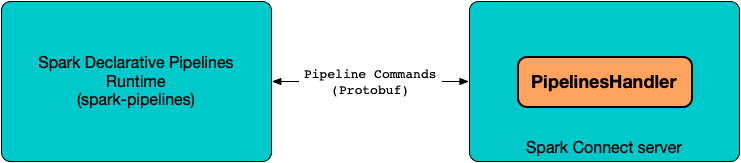

# PipelinesHandler

`PipelinesHandler` is used to [handle pipeline commands](#handlePipelinesCommand) in [Spark Connect]({{ book.spark_connect }}) ([SparkConnectPlanner]({{ book.spark_connect }}/server/SparkConnectPlanner), precisely).

`PipelinesHandler` acts as a bridge between Python execution environment of [Spark Declarative Pipelines](index.md) and [Spark Connect Server]({{ book.spark_connect }}/server/) (where pipeline execution happens).



## Handle Pipelines Command { #handlePipelinesCommand }

```scala
handlePipelinesCommand(
  sessionHolder: SessionHolder,
  cmd: proto.PipelineCommand,
  responseObserver: StreamObserver[ExecutePlanResponse],
  transformRelationFunc: Relation => LogicalPlan): PipelineCommandResult
```

`handlePipelinesCommand` handles the given pipeline `cmd` command.

| PipelineCommand | Description | Initiator |
|-----------------|-------------|-----------|
| `CREATE_DATAFLOW_GRAPH` | [Creates a new dataflow graph](#CREATE_DATAFLOW_GRAPH) | [pyspark.pipelines.spark_connect_pipeline](spark_connect_pipeline.md#create_dataflow_graph) |
| `DROP_DATAFLOW_GRAPH` | [Drops a pipeline](#DROP_DATAFLOW_GRAPH) ||
| `DEFINE_DATASET` | [Defines a dataset](#DEFINE_DATASET) | [SparkConnectGraphElementRegistry](SparkConnectGraphElementRegistry.md#register_dataset) |
| `DEFINE_FLOW` | [Defines a flow](#DEFINE_FLOW) | [SparkConnectGraphElementRegistry](SparkConnectGraphElementRegistry.md#register_flow) |
| `START_RUN` | [Starts a pipeline run](#START_RUN) | [pyspark.pipelines.spark_connect_pipeline](spark_connect_pipeline.md#start_run) |
| `DEFINE_SQL_GRAPH_ELEMENTS` | [DEFINE_SQL_GRAPH_ELEMENTS](#DEFINE_SQL_GRAPH_ELEMENTS) | [SparkConnectGraphElementRegistry](SparkConnectGraphElementRegistry.md#register_sql) |

`handlePipelinesCommand` reports an `UnsupportedOperationException` for incorrect commands:

```text
[other] not supported
```

---

`handlePipelinesCommand` is used when:

* `SparkConnectPlanner` ([Spark Connect]({{ book.spark_connect }}/server/SparkConnectPlanner)) is requested to `handlePipelineCommand` (for `PIPELINE_COMMAND` command)

### <span id="CreateDataflowGraph"> CREATE_DATAFLOW_GRAPH { #CREATE_DATAFLOW_GRAPH }

[handlePipelinesCommand](#handlePipelinesCommand) creates a [dataflow graph](#createDataflowGraph) and sends the graph ID back.

### DROP_DATAFLOW_GRAPH { #DROP_DATAFLOW_GRAPH }

[handlePipelinesCommand](#handlePipelinesCommand)...FIXME

### <span id="DefineDataset"> DEFINE_DATASET { #DEFINE_DATASET }

[handlePipelinesCommand](#handlePipelinesCommand) prints out the following INFO message to the logs:

```text
Define pipelines dataset cmd received: [cmd]
```

`handlePipelinesCommand` [defines a dataset](#defineDataset).

### <span id="DefineFlow"> DEFINE_FLOW { #DEFINE_FLOW }

[handlePipelinesCommand](#handlePipelinesCommand) prints out the following INFO message to the logs:

```text
Define pipelines flow cmd received: [cmd]
```

`handlePipelinesCommand` [defines a flow](#defineFlow).

### START_RUN { #START_RUN }

[handlePipelinesCommand](#handlePipelinesCommand) prints out the following INFO message to the logs:

```text
Start pipeline cmd received: [cmd]
```

`handlePipelinesCommand` [starts a pipeline run](#startRun).

### DEFINE_SQL_GRAPH_ELEMENTS { #DEFINE_SQL_GRAPH_ELEMENTS }

[handlePipelinesCommand](#handlePipelinesCommand)...FIXME

## Start Pipeline Run { #startRun }

```scala
startRun(
  cmd: proto.PipelineCommand.StartRun,
  responseObserver: StreamObserver[ExecutePlanResponse],
  sessionHolder: SessionHolder): Unit
```

??? note "`START_RUN` Pipeline Command"
    `startRun` is used when `PipelinesHandler` is requested to handle [proto.PipelineCommand.CommandTypeCase.START_RUN](#START_RUN) command.

`startRun` finds the [GraphRegistrationContext](GraphRegistrationContext.md) by `dataflowGraphId` in the [DataflowGraphRegistry](DataflowGraphRegistry.md) (in the given `SessionHolder`).

`startRun` creates a [PipelineEventSender](PipelineEventSender.md) to [send pipeline execution progress events back to the Spark Connect client](PipelineEventSender.md#sendEvent) (_Python pipeline runtime_).

`startRun` creates a [PipelineUpdateContextImpl](PipelineUpdateContextImpl.md) (with the `PipelineEventSender`).

In the end, `startRun` requests the `PipelineUpdateContextImpl` for the [PipelineExecution](PipelineUpdateContext.md#pipelineExecution) to [run a pipeline](PipelineExecution.md#runPipeline) or [dry-run a pipeline](PipelineExecution.md#dryRunPipeline) for `dry-run` or `run` command, respectively.

## Create Dataflow Graph { #createDataflowGraph }

```scala
createDataflowGraph(
  cmd: proto.PipelineCommand.CreateDataflowGraph,
  spark: SparkSession): String
```

`createDataflowGraph` gets the catalog (from the given `CreateDataflowGraph` if defined in the [pipeline specification file](index.md#pipeline-specification-file)) or prints out the following INFO message to the logs and uses the current catalog instead.

```text
No default catalog was supplied. Falling back to the current catalog: [currentCatalog].
```

`createDataflowGraph` gets the database (from the given `CreateDataflowGraph` if defined in the [pipeline specification file](index.md#pipeline-specification-file)) or prints out the following INFO message to the logs and uses the current database instead.

```text
No default database was supplied. Falling back to the current database: [currentDatabase].
```

In the end, `createDataflowGraph` [creates a dataflow graph](DataflowGraphRegistry.md#createDataflowGraph) (in the session's [DataflowGraphRegistry](DataflowGraphRegistry.md)).

## defineSqlGraphElements { #defineSqlGraphElements }

```scala
defineSqlGraphElements(
  cmd: proto.PipelineCommand.DefineSqlGraphElements,
  session: SparkSession): Unit
```

`defineSqlGraphElements` [looks up the GraphRegistrationContext for the dataflow graph ID](DataflowGraphRegistry.md#getDataflowGraphOrThrow) (from the given `DefineSqlGraphElements` command and in the given `SessionHolder`).

`defineSqlGraphElements` creates a new [SqlGraphRegistrationContext](SqlGraphRegistrationContext.md) (for the `GraphRegistrationContext`) to [process the SQL definition file](SqlGraphRegistrationContext.md#processSqlFile).

## Define Dataset (Table or View) { #defineDataset }

```scala
defineDataset(
  dataset: proto.PipelineCommand.DefineDataset,
  sparkSession: SparkSession): Unit
```

`defineDataset` looks up the [GraphRegistrationContext](DataflowGraphRegistry.md#getDataflowGraphOrThrow) for the given `dataset` (or throws a `SparkException` if not found).

`defineDataset` branches off based on the `dataset` type:

| Dataset Type | Action |
|--------------|--------|
| `MATERIALIZED_VIEW` or `TABLE` | [Registers a table](GraphRegistrationContext.md#registerTable) |
| `TEMPORARY_VIEW` | [Registers a view](GraphRegistrationContext.md#registerView) |

For unknown types, `defineDataset` reports an `IllegalArgumentException`:

```text
Unknown dataset type: [type]
```

## Define Flow { #defineFlow }

```scala
defineFlow(
  flow: proto.PipelineCommand.DefineFlow,
  transformRelationFunc: Relation => LogicalPlan,
  sparkSession: SparkSession): Unit
```

??? note "DEFINE_FLOW Pipeline Command"
    `defineFlow` is used to handle [DEFINE_FLOW](#DEFINE_FLOW).

`defineFlow` looks up the [GraphRegistrationContext](DataflowGraphRegistry.md#getDataflowGraphOrThrow) for the given `flow` (or throws a `SparkException` if not found).

??? note "Implicit Flows"
    **Implicit Flows** are flows with the name of the target datasets (i.e. one defined as part of dataset creation).

    Implicit flows can be defined with multi-part identifiers (as the corresponding datasets).

    Multi-part identifiers are composed of catalog, schema and table parts (separated by `.` (dot)).

`defineFlow` [creates a flow identifier](GraphIdentifierManager.md#parseTableIdentifier) (for the `flow` name).

??? note "AnalysisException"
    `defineFlow` reports an `AnalysisException` if the given `flow` is not an implicit flow, but is defined with a multi-part identifier.

In the end, `defineFlow` [registers a flow](GraphRegistrationContext.md#registerFlow) (with a proper [FlowFunction](FlowAnalysis.md#createFlowFunctionFromLogicalPlan)).
