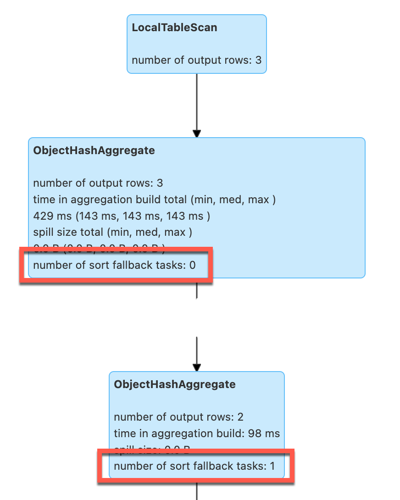
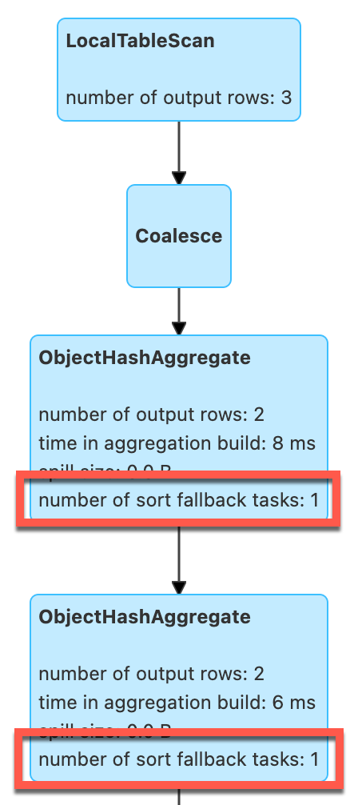

# Demo: ObjectHashAggregateExec and Sort-Based Fallback Tasks

This demo shows when [ObjectHashAggregateExec](../physical-operators/ObjectHashAggregateExec.md) physical operator falls back to sort-based aggregation (that Spark SQL hoped to avoid [while planning an aggregation](../execution-planning-strategies/Aggregation.md)).

`ObjectHashAggregateExec` physical operator uses [spark.sql.objectHashAggregate.sortBased.fallbackThreshold](../configuration-properties.md#spark.sql.objectHashAggregate.sortBased.fallbackThreshold) configuration property to control when to switch to sort-based aggregation.

## Configure SparkSession

```shell
./bin/spark-shell
```

```scala
import org.apache.spark.sql.internal.SQLConf
assert(SQLConf.get.objectAggSortBasedFallbackThreshold == 128)
```

```scala
spark.sessionState.conf.setConf(SQLConf.OBJECT_AGG_SORT_BASED_FALLBACK_THRESHOLD, 1)
assert(SQLConf.get.objectAggSortBasedFallbackThreshold == 1)
```

## No Sort Fallback Tasks

[collect_set](../functions/aggregate-functions.md#collect_set) standard function (a [TypedImperativeAggregate](../expressions/TypedImperativeAggregate.md) expression) is one of the built-in standard functions that are planned for execution using [ObjectHashAggregateExec](../physical-operators/ObjectHashAggregateExec.md) physical operator.

The following query over a single-row dataset produces one group (so it is under `spark.sql.objectHashAggregate.sortBased.fallbackThreshold` of `1`) and hence there will be no [sort fallback tasks](../physical-operators/ObjectHashAggregateExec.md#number-of-sort-fallback-tasks).

```scala
val oneRowDataset = Seq(
    (0, 0)
  ).toDF("id", "gid")
val q = oneRowDataset
  .groupBy("gid")
  .agg(collect_set("id") as "ids")
q.write.format("noop").mode("overwrite").save
```


## Sort Fallback Tasks

When an aggregation happens to use more than one group (and crosses `spark.sql.objectHashAggregate.sortBased.fallbackThreshold`), there will be as many [sort fallback tasks](../physical-operators/ObjectHashAggregateExec.md#number-of-sort-fallback-tasks) as there were partitions with enough groups above the threshold.

```scala
val threeRowDataset = Seq(
    (0, 0),
    (1, 1),
    (2, 1),
  ).toDF("id", "gid")
val q = threeRowDataset
  .groupBy("gid")
  .agg(collect_set("id") as "ids")
q.write.format("noop").mode("overwrite").save
```

<figure markdown>
  
</figure>

## Sort Fallback Tasks After Repartition

```scala
val q = threeRowDataset
  .coalesce(1) // all rows in one partition
  .groupBy("gid")
  .agg(collect_set("id") as "ids")
q.write.format("noop").mode("overwrite").save
```

<figure markdown>
  
</figure>
