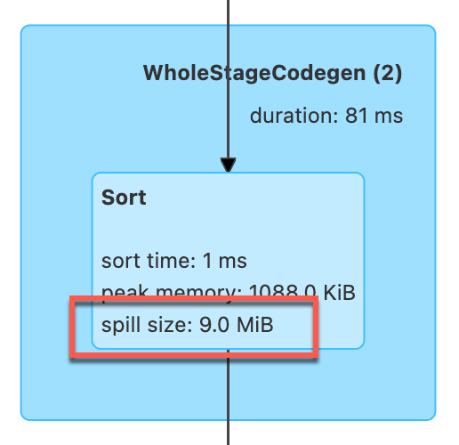

# Demo: Spilling

This demo shows in-memory data spilling while sorting (using [SortExec](../physical-operators/SortExec.md) physical operator).



## Configuration

Disable [Adaptive Query Execution](../adaptive-query-execution/index.md) and force spilling at a very low threshold using `spark.shuffle.spill.numElementsForceSpillThreshold` ([Spark Core]({{ book.spark_core }}/configuration-properties#spark.shuffle.spill.numElementsForceSpillThreshold)).

```shell
./bin/spark-shell \
  --conf spark.shuffle.spill.numElementsForceSpillThreshold=1 \
  --conf spark.sql.adaptive.enabled=false \
  --conf spark.sql.shuffle.partitions=1
```

## Create Table

```scala
spark.range(2)
  .writeTo("tiny")
  .using("parquet")
  .create
```

## Spilling

One of the physical operators that are susceptible to spilling is [SortExec](../physical-operators/SortExec.md).

```scala
spark.table("tiny")
  .orderBy("id")
  .write
  .format("noop")
  .mode("overwrite")
  .save
```

??? note "FIXME"
    Why does `show` not work (as `format("noop")` does)?

## web UI

### Details for Stage


### Tasks


