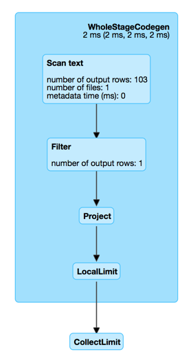

# FilterExec Unary Physical Operator

`FilterExec` is a [unary physical operator](UnaryExecNode.md) that represents `Filter` and `TypedFilter` unary logical operators at execution time.

## Creating Instance

`FilterExec` takes the following to be created:

* <span id="condition"> Condition ([Expression](../expressions/Expression.md))
* <span id="child"> Child [physical operator](SparkPlan.md)

`FilterExec` is created when:

* [BasicOperators](../execution-planning-strategies/BasicOperators.md) execution planning strategy is executed (and plans [Filter](../execution-planning-strategies/BasicOperators.md#Filter) and [TypedFilter](../execution-planning-strategies/BasicOperators.md#TypedFilter) unary logical operators
* _others_

## Performance Metrics { #metrics }

Key             | Name (in web UI)        | Description
----------------|-------------------------|---------
numOutputRows   | number of output rows   | Number of output rows



## Executing Operator { #doExecute }

??? note "SparkPlan"

    ```scala
    doExecute(): RDD[InternalRow]
    ```

    `doExecute` is part of the [SparkPlan](SparkPlan.md#doExecute) abstraction.

`doExecute` creates a [FilterEvaluatorFactory](../FilterEvaluatorFactory.md) (with the [condition](#condition), the [output](../catalyst/QueryPlan.md#output) of the [child operator](#child), and the [numOutputRows](#numOutputRows) metric).

With [spark.sql.execution.usePartitionEvaluator](../configuration-properties.md#spark.sql.execution.usePartitionEvaluator) enabled, `doExecute` requests the [child operator](#child) to [execute](SparkPlan.md#execute) (that gives a `RDD[InternalRow]`). In the end, `doExecute` uses `RDD.mapPartitionsWithEvaluator` operator ([Spark Core]({{ book.spark_core }}/rdd/RDD#mapPartitionsWithEvaluator)) with the `FilterEvaluatorFactory`.

Otherwise, `doExecute`...FIXME

<!---
## Review Me

`FilterExec` supports [Java code generation](CodegenSupport.md) (aka _codegen_) as follows:

* <<usedInputs, usedInputs>> is an empty `AttributeSet` (to defer evaluation of attribute expressions until they are actually used, i.e. in the [generated Java source code for consume path](CodegenSupport.md#consume))

* Uses whatever the <<child, child>> physical operator uses for the [input RDDs](CodegenSupport.md#inputRDDs)

* Generates a Java source code for the <<doProduce, produce>> and <<doConsume, consume>> paths in whole-stage code generation

[[inputRDDs]]
[[outputOrdering]]
[[outputPartitioning]]
`FilterExec` uses whatever the <<child, child>> physical operator uses for the [input RDDs](CodegenSupport.md#inputRDDs), the [outputOrdering](SparkPlan.md#outputOrdering) and the [outputPartitioning](SparkPlan.md#outputPartitioning).

=== [[doExecute]] Executing Physical Operator (Generating RDD[InternalRow]) -- `doExecute` Method

[source, scala]
----
doExecute(): RDD[InternalRow]
----

`doExecute` is part of the [SparkPlan](SparkPlan.md#doExecute) abstraction.

`doExecute` executes the <<child, child>> physical operator and creates a new `MapPartitionsRDD` that does the filtering.

[source, scala]
----
// DEMO Show the RDD lineage with the new MapPartitionsRDD after FilterExec
----

Internally, `doExecute` takes the <<numOutputRows, numOutputRows>> metric.

In the end, `doExecute` requests the <<child, child>> physical operator to <<SparkPlan.md#execute, execute>> (that triggers physical query planning and generates an `RDD[InternalRow]`) and transforms it by executing the following function on internal rows per partition with index (using `RDD.mapPartitionsWithIndexInternal` that creates another RDD):

. Creates a partition filter as a new <<SparkPlan.md#newPredicate, GenPredicate>> (for the <<condition, filter condition>> expression and the <<catalyst/QueryPlan.md#output, output schema>> of the <<child, child>> physical operator)

. Requests the generated partition filter `Predicate` to `initialize` (with `0` partition index)

. Filters out elements from the partition iterator (`Iterator[InternalRow]`) by requesting the generated partition filter `Predicate` to evaluate for every `InternalRow`
.. Increments the <<numOutputRows, numOutputRows>> metric for positive evaluations (i.e. that returned `true`)

NOTE: `doExecute` (by `RDD.mapPartitionsWithIndexInternal`) adds a new `MapPartitionsRDD` to the RDD lineage. Use `RDD.toDebugString` to see the additional `MapPartitionsRDD`.
-->
