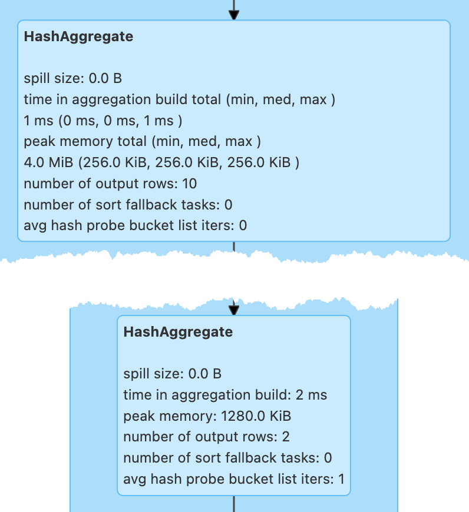

# HashAggregateExec Physical Operator

`HashAggregateExec` is an [AggregateCodegenSupport](AggregateCodegenSupport.md) physical operator for **Hash-Based Aggregation**.



`HashAggregateExec` is the [preferred aggregate physical operator](../execution-planning-strategies/Aggregation.md#aggregate-physical-operator-preference) for [Aggregation](../execution-planning-strategies/Aggregation.md) execution planning strategy (over [ObjectHashAggregateExec](ObjectHashAggregateExec.md) and [SortAggregateExec](SortAggregateExec.md) operators).

`HashAggregateExec` uses [TungstenAggregationIterator](../aggregations/TungstenAggregationIterator.md) (to iterate over `UnsafeRows` in partitions) when [executed](#doExecute).

!!! note
    `HashAggregateExec` uses `TungstenAggregationIterator` that can (theoretically) [switch to a sort-based aggregation when the hash-based approach is unable to acquire enough memory](../aggregations/TungstenAggregationIterator.md#switchToSortBasedAggregation).

    See [testFallbackStartsAt](#testFallbackStartsAt) internal property and [spark.sql.TungstenAggregate.testFallbackStartsAt](../configuration-properties.md#spark.sql.TungstenAggregate.testFallbackStartsAt) configuration property.

    Search logs for the following INFO message to know whether the switch has happened.

    ```text
    falling back to sort based aggregation.
    ```

The prefix for variable names for `HashAggregateExec` operators in [CodegenSupport](CodegenSupport.md)-generated code is **agg**.

## Creating Instance

`HashAggregateExec` takes the following to be created:

* <span id="requiredChildDistributionExpressions"> Required child distribution [expressions](../expressions/Expression.md)
* <span id="isStreaming"> `isStreaming` flag
* <span id="numShufflePartitions"> Number of Shuffle Partitions (optional)
* [Grouping Keys](#groupingExpressions)
* <span id="aggregateExpressions"> [AggregateExpression](../expressions/AggregateExpression.md)s
* <span id="aggregateAttributes"> Aggregate [attribute](../expressions/Attribute.md)s
* <span id="initialInputBufferOffset"> Initial input buffer offset
* <span id="resultExpressions"> Output [named expressions](../expressions/NamedExpression.md)
* <span id="child"> Child [physical operator](SparkPlan.md)

`HashAggregateExec` is created (indirectly through [AggUtils.createAggregate](../AggUtils.md#createAggregate)) when:

* [Aggregation](../execution-planning-strategies/Aggregation.md) execution planning strategy is executed (to select the aggregate physical operator for an [Aggregate](../logical-operators/Aggregate.md) logical operator)
* `StatefulAggregationStrategy` ([Spark Structured Streaming]({{ book.structured_streaming }}/execution-planning-strategies/StatefulAggregationStrategy)) execution planning strategy creates plan for streaming `EventTimeWatermark` or [Aggregate](../logical-operators/Aggregate.md) logical operators

### Grouping Keys { #groupingExpressions }

```scala
groupingExpressions: Seq[NamedExpression]
```

`HashAggregateExec` can be given grouping keys ([NamedExpression](../expressions/NamedExpression.md)s) when [created](#creating-instance).

`groupingExpressions` is part of the [BaseAggregateExec](BaseAggregateExec.md#groupingExpressions) abstraction.

The grouping keys are the [groupingExpressions](../logical-operators/Aggregate.md#groupingExpressions) of [Aggregate](../logical-operators/Aggregate.md), if any.

## Performance Metrics { #metrics }

### avg hash probe bucket list iters { #avgHashProbe }

Average hash map probe per lookup (i.e. `numProbes` / `numKeyLookups`)

`numProbes` and `numKeyLookups` are used in `BytesToBytesMap` ([Spark Core]({{ book.spark_core }}/BytesToBytesMap)) append-only hash map for the number of iteration to look up a single key and the number of all the lookups in total, respectively.

### number of output rows { #numOutputRows }

Average hash map probe per lookup (i.e. `numProbes` / `numKeyLookups`)

Number of groups (per partition) that (depending on the number of partitions and the side of ShuffleExchangeExec.md[ShuffleExchangeExec] operator) is the number of groups

* `0` for no input with a grouping expression, e.g. `spark.range(0).groupBy($"id").count.show`

* `1` for no grouping expression and no input, e.g. `spark.range(0).groupBy().count.show`

!!! tip
    Use different number of elements and partitions in `range` operator to observe the difference in `numOutputRows` metric, e.g.

    ```scala
    spark.
      range(0, 10, 1, numPartitions = 1).
      groupBy($"id" % 5 as "gid").
      count.
      show
    ```

    ```scala
    spark.
      range(0, 10, 1, numPartitions = 5).
      groupBy($"id" % 5 as "gid").
      count.
      show
    ```

### number of sort fallback tasks { #numTasksFallBacked }

This metric is managed entirely by a [TungstenAggregationIterator](../aggregations/TungstenAggregationIterator.md#numTasksFallBacked).

Indicates how many tasks (that used [TungstenAggregationIterator](../aggregations/TungstenAggregationIterator.md) to process input rows for aggregates) switched (_fell back_) to [sort-based aggregation](../aggregations/TungstenAggregationIterator.md#switchToSortBasedAggregation)

!!! note "Number of Input Rows in Partition Matters"
    Not every task will use [TungstenAggregationIterator](../aggregations/TungstenAggregationIterator.md) and may even have a chance to fall back to [sort-based aggregation](../aggregations/TungstenAggregationIterator.md#switchToSortBasedAggregation).

### peak memory { #peakMemory }

### spill size { #spillSize }

Used to create a [TungstenAggregationIterator](../aggregations/TungstenAggregationIterator.md#spillSize) when [doExecute](#doExecute)

### time in aggregation build { #aggTime }

## <span id="requiredChildDistribution"> Required Child Distribution

```scala
requiredChildDistribution: List[Distribution]
```

`requiredChildDistribution` is part of the [SparkPlan](SparkPlan.md#requiredChildDistribution) abstraction.

`requiredChildDistribution` varies per the input [required child distribution expressions](#requiredChildDistributionExpressions):

* [AllTuples](AllTuples.md) when defined, but empty
* [ClusteredDistribution](ClusteredDistribution.md) for non-empty expressions
* [UnspecifiedDistribution](UnspecifiedDistribution.md) when undefined

!!! note
    `requiredChildDistributionExpressions` is exactly `requiredChildDistributionExpressions` from [AggUtils.createAggregate](../AggUtils.md#createAggregate) and is undefined by default.

    ---

    (No distinct in aggregation) `requiredChildDistributionExpressions` is undefined when `HashAggregateExec` is created for partial aggregations (i.e. `mode` is `Partial` for aggregate expressions).

    `requiredChildDistributionExpressions` is defined, but could possibly be empty, when `HashAggregateExec` is created for final aggregations (i.e. `mode` is `Final` for aggregate expressions).

    ---

    (one distinct in aggregation) `requiredChildDistributionExpressions` is undefined when `HashAggregateExec` is created for partial aggregations (i.e. `mode` is `Partial` for aggregate expressions) with one distinct in aggregation.

    `requiredChildDistributionExpressions` is defined, but could possibly be empty, when `HashAggregateExec` is created for partial merge aggregations (i.e. `mode` is `PartialMerge` for aggregate expressions).

    *FIXME* for the following two cases in aggregation with one distinct.

## Executing Physical Operator { #doExecute }

??? note "SparkPlan"

    ```scala
    doExecute(): RDD[InternalRow]
    ```

    `doExecute` is part of the [SparkPlan](SparkPlan.md#doExecute) abstraction.

`doExecute` requests the [child physical operator](#child) to [execute](SparkPlan.md#execute) (that triggers physical query planning and generates an `RDD[InternalRow]`).

`doExecute` transforms the `RDD[InternalRow]` with the [transformation `f` function](#doExecute-mapPartitionsWithIndex) for every partition (using [RDD.mapPartitionsWithIndex](#mapPartitionsWithIndex) transformation).

### Transformation Function { #doExecute-mapPartitionsWithIndex }

`doExecute` uses [RDD.mapPartitionsWithIndex](#mapPartitionsWithIndex) to process partition [InternalRow](../InternalRow.md)s (with a partition ID).

```scala
f: (Int, Iterator[T]) => Iterator[U]
```

For every partition, `mapPartitionsWithIndex` records the start execution time (`beforeAgg`).

`mapPartitionsWithIndex` branches off based on whether there are input rows and [grouping keys](#groupingExpressions).

For a _grouped aggregate_ ([grouping keys](#groupingExpressions) defined) with no input rows (an empty partition), `doExecute` returns an empty iterator.

Otherwise, `doExecute` creates a [TungstenAggregationIterator](../aggregations/TungstenAggregationIterator.md).

With no [grouping keys](#groupingExpressions) defined and no input rows (an empty partition), `doExecute` increments the [numOutputRows](#numOutputRows) metric and returns a single-element `Iterator[UnsafeRow]` from the [TungstenAggregationIterator](../aggregations/TungstenAggregationIterator.md#outputForEmptyGroupingKeyWithoutInput).

With input rows available (and regardless of [grouping keys](#groupingExpressions)), `doExecute` returns the `TungstenAggregationIterator`.

In the end, `doExecute` calculates the [aggTime](#aggTime) metric and returns an `Iterator[UnsafeRow]` that can be as follows:

* Empty
* A single-element one
* The [TungstenAggregationIterator](../aggregations/TungstenAggregationIterator.md)

### RDD.mapPartitionsWithIndex { #mapPartitionsWithIndex }

!!! note "RDD.mapPartitionsWithIndex"

    ```scala
    mapPartitionsWithIndex[U: ClassTag](
      f: (Int, Iterator[T]) => Iterator[U],
      preservesPartitioning: Boolean = false): RDD[U]
    ```

`mapPartitionsWithIndex` transformation adds a new [MapPartitionsRDD]({{ book.spark_core }}/rdd/MapPartitionsRDD) to the RDD lineage.

!!! warning "FIXME Disable AQE"

=== "Scala"

    ```scala
    val ids = spark.range(1)
    println(ids.queryExecution.toRdd.toDebugString)
    ```

```text
(12) SQLExecutionRDD[3] at toRdd at <console>:1 []
 |   MapPartitionsRDD[2] at toRdd at <console>:1 []
 |   MapPartitionsRDD[1] at toRdd at <console>:1 []
 |   ParallelCollectionRDD[0] at toRdd at <console>:1 []
```

=== "Scala"

    ```scala
    // Use groupBy that gives HashAggregateExec operator
    val q = ids.groupBy('id).count
    q.explain
    ```

```text
== Physical Plan ==
AdaptiveSparkPlan isFinalPlan=false
+- HashAggregate(keys=[id#2L], functions=[count(1)])
   +- HashAggregate(keys=[id#2L], functions=[partial_count(1)])
      +- Range (0, 1, step=1, splits=12)
```

=== "Scala"

    ```scala
    val rdd = q.queryExecution.toRdd
    println(rdd.toDebugString)
    ```

```text
(12) SQLExecutionRDD[11] at toRdd at <console>:1 []
 |   MapPartitionsRDD[10] at toRdd at <console>:1 []
 |   MapPartitionsRDD[9] at toRdd at <console>:1 []
 |   ParallelCollectionRDD[8] at toRdd at <console>:1 []
```

## Whole-Stage Code Generation

As an [AggregateCodegenSupport](AggregateCodegenSupport.md) physical operator, `HashAggregateExec` supports [Whole-Stage Code Generation](../whole-stage-code-generation/index.md) only when [supportCodegen](#supportCodegen) flag is enabled.

### doConsumeWithKeys { #doConsumeWithKeys }

??? note "AggregateCodegenSupport"

    ```scala
    doConsumeWithKeys(
      ctx: CodegenContext,
      input: Seq[ExprCode]): String
    ```

    `doConsumeWithKeys` is part of the [AggregateCodegenSupport](AggregateCodegenSupport.md#doConsumeWithKeys) abstraction.

`doConsumeWithKeys`...FIXME

### doProduceWithKeys { #doProduceWithKeys }

??? note "AggregateCodegenSupport"

    ```scala
    doProduceWithKeys(
      ctx: CodegenContext): String
    ```

    `doProduceWithKeys` is part of the [AggregateCodegenSupport](AggregateCodegenSupport.md#doProduceWithKeys) abstraction.

`doProduceWithKeys` uses the following configuration properties:

* [spark.sql.codegen.aggregate.map.twolevel.enabled](../configuration-properties.md#spark.sql.codegen.aggregate.map.twolevel.enabled)
* [spark.sql.codegen.aggregate.map.vectorized.enable](../configuration-properties.md#spark.sql.codegen.aggregate.map.vectorized.enable)
* [spark.sql.codegen.aggregate.fastHashMap.capacityBit](../configuration-properties.md#spark.sql.codegen.aggregate.fastHashMap.capacityBit)

`doProduceWithKeys`...FIXME

In the end, `doProduceWithKeys` generates the following Java code (with the `[]`-marked sections filled out):

```text
if (![initAgg]) {
  [initAgg] = true;
  [createFastHashMap]
  [addHookToCloseFastHashMap]
  [hashMapTerm] = [thisPlan].createHashMap();
  long [beforeAgg] = System.nanoTime();
  [doAggFuncName]();
  [aggTime].add((System.nanoTime() - [beforeAgg]) / [NANOS_PER_MILLIS]);
}
// output the result
[outputFromFastHashMap]
[outputFromRegularHashMap]
```

#### Creating HashMap { #createHashMap }

```scala
createHashMap(): UnsafeFixedWidthAggregationMap
```

!!! note
    `createHashMap` is used in the Java code from [doProduceWithKeys](#doProduceWithKeys).

`createHashMap` requests all the [DeclarativeAggregate functions](#declFunctions) for the [Catalyst expressions to initialize aggregation buffers](../expressions/DeclarativeAggregate.md#initialValues).

`createHashMap` [creates an UnsafeProjection](../expressions/UnsafeProjection.md#create) for the expressions and [executes it](../expressions/UnsafeProjection.md#apply) (with an "empty" `null` row).

!!! note
    [Executing an UnsafeProjection](../expressions/UnsafeProjection.md#apply) produces an [UnsafeRow](../UnsafeRow.md) that becomes an [empty aggregation buffer](../aggregations/UnsafeFixedWidthAggregationMap.md#emptyAggregationBuffer) of an [UnsafeFixedWidthAggregationMap](../aggregations/UnsafeFixedWidthAggregationMap.md) to be created.

In the end, `createHashMap` creates an [UnsafeFixedWidthAggregationMap](../aggregations/UnsafeFixedWidthAggregationMap.md) with the following:

UnsafeFixedWidthAggregationMap | Value
-------------------------------|-------
 [emptyAggregationBuffer](../aggregations/UnsafeFixedWidthAggregationMap.md#emptyAggregationBuffer) | The `UnsafeRow` after executing the `UnsafeProjection` to [initialize aggregation buffers](../expressions/DeclarativeAggregate.md#initialValues)
 [aggregationBufferSchema](../aggregations/UnsafeFixedWidthAggregationMap.md#aggregationBufferSchema) | [bufferSchema](#bufferSchema)
 [groupingKeySchema](../aggregations/UnsafeFixedWidthAggregationMap.md#groupingKeySchema) | [groupingKeySchema](#groupingKeySchema)

#### finishAggregate { #finishAggregate }

```scala
finishAggregate(
  hashMap: UnsafeFixedWidthAggregationMap,
  sorter: UnsafeKVExternalSorter,
  peakMemory: SQLMetric,
  spillSize: SQLMetric,
  avgHashProbe: SQLMetric,
  numTasksFallBacked: SQLMetric): KVIterator[UnsafeRow, UnsafeRow]
```

`finishAggregate`...FIXME

#### DeclarativeAggregate Functions { #declFunctions }

```scala
declFunctions: Seq[DeclarativeAggregate]
```

`declFunctions` is the [DeclarativeAggregate](../expressions/DeclarativeAggregate.md) expressions among the [AggregateFunction](../expressions/AggregateExpression.md#aggregateFunction)s of this [AggregateExpressions](#aggregateExpressions).

## Demo

### Aggregation Query

```scala
val data = spark.range(10)
val q = data
  .groupBy('id % 2 as "group")
  .agg(sum("id") as "sum")
```

`HashAggregateExec` operator should be selected due to:

1. `sum` uses mutable types for aggregate expression
1. just a single `id` column reference of `LongType` data type

```scala
scala> println(q.queryExecution.executedPlan.numberedTreeString)
00 AdaptiveSparkPlan isFinalPlan=false
01 +- HashAggregate(keys=[_groupingexpression#8L], functions=[sum(id#0L)], output=[group#2L, sum#5L])
02    +- Exchange hashpartitioning(_groupingexpression#8L, 200), ENSURE_REQUIREMENTS, [plan_id=15]
03       +- HashAggregate(keys=[_groupingexpression#8L], functions=[partial_sum(id#0L)], output=[_groupingexpression#8L, sum#10L])
04          +- Project [id#0L, (id#0L % 2) AS _groupingexpression#8L]
05             +- Range (0, 10, step=1, splits=16)
```

### Generate Final Plan

`isFinalPlan` flag is `false`. Let's execute it and access the final plan.

```scala
import org.apache.spark.sql.execution.adaptive.AdaptiveSparkPlanExec
val op = q
  .queryExecution
  .executedPlan
  .collect { case op: AdaptiveSparkPlanExec => op }
  .head
```

Execute the adaptive operator to generate the final execution plan.

```scala
op.executeTake(1)
```

`isFinalPlan` flag should now be `true`.

```scala
scala> println(op.treeString)
AdaptiveSparkPlan isFinalPlan=true
+- == Final Plan ==
   *(2) HashAggregate(keys=[_groupingexpression#8L], functions=[sum(id#0L)], output=[group#2L, sum#5L])
   +- AQEShuffleRead coalesced
      +- ShuffleQueryStage 0
         +- Exchange hashpartitioning(_groupingexpression#8L, 200), ENSURE_REQUIREMENTS, [plan_id=25]
            +- *(1) HashAggregate(keys=[_groupingexpression#8L], functions=[partial_sum(id#0L)], output=[_groupingexpression#8L, sum#10L])
               +- *(1) Project [id#0L, (id#0L % 2) AS _groupingexpression#8L]
                  +- *(1) Range (0, 10, step=1, splits=16)
+- == Initial Plan ==
   HashAggregate(keys=[_groupingexpression#8L], functions=[sum(id#0L)], output=[group#2L, sum#5L])
   +- Exchange hashpartitioning(_groupingexpression#8L, 200), ENSURE_REQUIREMENTS, [plan_id=15]
      +- HashAggregate(keys=[_groupingexpression#8L], functions=[partial_sum(id#0L)], output=[_groupingexpression#8L, sum#10L])
         +- Project [id#0L, (id#0L % 2) AS _groupingexpression#8L]
            +- Range (0, 10, step=1, splits=16)
```

With the `isFinalPlan` flag `true`, it is possible to print out the WholeStageCodegen subtrees.

```scala
scala> q.queryExecution.debug.codegen
Found 2 WholeStageCodegen subtrees.
== Subtree 1 / 2 (maxMethodCodeSize:284; maxConstantPoolSize:337(0.51% used); numInnerClasses:2) ==
*(1) HashAggregate(keys=[_groupingexpression#8L], functions=[partial_sum(id#0L)], output=[_groupingexpression#8L, sum#10L])
+- *(1) Project [id#0L, (id#0L % 2) AS _groupingexpression#8L]
   +- *(1) Range (0, 10, step=1, splits=16)

Generated code:
/* 001 */ public Object generate(Object[] references) {
/* 002 */   return new GeneratedIteratorForCodegenStage1(references);
/* 003 */ }
/* 004 */
/* 005 */ // codegenStageId=1
/* 006 */ final class GeneratedIteratorForCodegenStage1 extends org.apache.spark.sql.execution.BufferedRowIterator {
/* 007 */   private Object[] references;
/* 008 */   private scala.collection.Iterator[] inputs;
/* 009 */   private boolean hashAgg_initAgg_0;
/* 010 */   private org.apache.spark.unsafe.KVIterator hashAgg_mapIter_0;
/* 011 */   private org.apache.spark.sql.execution.UnsafeFixedWidthAggregationMap hashAgg_hashMap_0;
/* 012 */   private org.apache.spark.sql.execution.UnsafeKVExternalSorter hashAgg_sorter_0;
/* 013 */   private scala.collection.Iterator inputadapter_input_0;
/* 014 */   private boolean hashAgg_hashAgg_isNull_2_0;
...
```

Let's access the generated source code via [WholeStageCodegenExec](WholeStageCodegenExec.md) physical operator.

```scala
val aqe = op
import org.apache.spark.sql.execution.WholeStageCodegenExec
val wsce = aqe.executedPlan
  .collect { case op: WholeStageCodegenExec => op }
  .head
val (_, source) = wsce.doCodeGen
```

```scala
import org.apache.spark.sql.catalyst.expressions.codegen.CodeFormatter
val formattedCode = CodeFormatter.format(source)
```

```scala
scala> println(formattedCode)
/* 001 */ public Object generate(Object[] references) {
/* 002 */   return new GeneratedIteratorForCodegenStage2(references);
/* 003 */ }
/* 004 */
/* 005 */ // codegenStageId=2
/* 006 */ final class GeneratedIteratorForCodegenStage2 extends org.apache.spark.sql.execution.BufferedRowIterator {
/* 007 */   private Object[] references;
/* 008 */   private scala.collection.Iterator[] inputs;
/* 009 */   private boolean hashAgg_initAgg_0;
/* 010 */   private org.apache.spark.unsafe.KVIterator hashAgg_mapIter_0;
/* 011 */   private org.apache.spark.sql.execution.UnsafeFixedWidthAggregationMap hashAgg_hashMap_0;
/* 012 */   private org.apache.spark.sql.execution.UnsafeKVExternalSorter hashAgg_sorter_0;
/* 013 */   private scala.collection.Iterator inputadapter_input_0;
/* 014 */   private boolean hashAgg_hashAgg_isNull_2_0;
...
```

```scala
val execPlan = q.queryExecution.sparkPlan
```

```scala
scala> println(execPlan.numberedTreeString)
00 HashAggregate(keys=[_groupingexpression#8L], functions=[sum(id#0L)], output=[group#2L, sum#5L])
01 +- HashAggregate(keys=[_groupingexpression#8L], functions=[partial_sum(id#0L)], output=[_groupingexpression#8L, sum#10L])
02    +- Project [id#0L, (id#0L % 2) AS _groupingexpression#8L]
03       +- Range (0, 10, step=1, splits=16)
```

Going low level. Watch your steps :)

```scala
import org.apache.spark.sql.catalyst.plans.logical.Aggregate
val aggLog = q.queryExecution.optimizedPlan.asInstanceOf[Aggregate]

import org.apache.spark.sql.catalyst.planning.PhysicalAggregation
import org.apache.spark.sql.catalyst.expressions.aggregate.AggregateExpression
val (_, aggregateExpressions: Seq[AggregateExpression], _, _) = PhysicalAggregation.unapply(aggLog).get
val aggregateBufferAttributes =
  aggregateExpressions.flatMap(_.aggregateFunction.aggBufferAttributes)
```

Here comes the very reason why `HashAggregateExec` was selected. [Aggregation](../execution-planning-strategies/Aggregation.md) execution planning strategy prefers `HashAggregateExec` when `aggregateBufferAttributes` are supported.

```scala
import org.apache.spark.sql.catalyst.plans.logical.Aggregate
assert(Aggregate.supportsHashAggregate(aggregateBufferAttributes))
```

```scala
import org.apache.spark.sql.execution.aggregate.HashAggregateExec
val hashAggExec = execPlan.asInstanceOf[HashAggregateExec]
```

```scala
scala> println(execPlan.numberedTreeString)
00 HashAggregate(keys=[_groupingexpression#8L], functions=[sum(id#0L)], output=[group#2L, sum#5L])
01 +- HashAggregate(keys=[_groupingexpression#8L], functions=[partial_sum(id#0L)], output=[_groupingexpression#8L, sum#10L])
02    +- Project [id#0L, (id#0L % 2) AS _groupingexpression#8L]
03       +- Range (0, 10, step=1, splits=16)
```

### Execute HashAggregateExec

```scala
val hashAggExecRDD = hashAggExec.execute
```

```scala
println(hashAggExecRDD.toDebugString)
```

```text
(16) MapPartitionsRDD[4] at execute at <console>:1 []
 |   MapPartitionsRDD[3] at execute at <console>:1 []
 |   MapPartitionsRDD[2] at execute at <console>:1 []
 |   MapPartitionsRDD[1] at execute at <console>:1 []
 |   ParallelCollectionRDD[0] at execute at <console>:1 []
```

### Java Code for Produce Execution Path

```scala
import org.apache.spark.sql.catalyst.expressions.codegen.CodegenContext
val ctx = new CodegenContext
val parent = hashAggExec
val doProduceWithKeysCode = hashAggExec.produce(ctx, parent)
```

```scala
scala> println(doProduceWithKeysCode)
if (!hashAgg_initAgg_0) {
  hashAgg_initAgg_0 = true;


  hashAgg_hashMap_0 = ((org.apache.spark.sql.execution.aggregate.HashAggregateExec) references[0] /* plan */).createHashMap();
  long hashAgg_beforeAgg_1 = System.nanoTime();
  hashAgg_doAggregateWithKeys_0();
  ((org.apache.spark.sql.execution.metric.SQLMetric) references[16] /* aggTime */).add((System.nanoTime() - hashAgg_beforeAgg_1) / 1000000);
}
// output the result


while ( hashAgg_mapIter_0.next()) {
  UnsafeRow hashAgg_aggKey_1 = (UnsafeRow) hashAgg_mapIter_0.getKey();
  UnsafeRow hashAgg_aggBuffer_1 = (UnsafeRow) hashAgg_mapIter_0.getValue();
  hashAgg_doAggregateWithKeysOutput_1(hashAgg_aggKey_1, hashAgg_aggBuffer_1);
  if (shouldStop()) return;
}
hashAgg_mapIter_0.close();
if (hashAgg_sorter_0 == null) {
  hashAgg_hashMap_0.free();
}
```

<!---
## Internal Properties

| aggregateBufferAttributes
| [[aggregateBufferAttributes]] All the <<spark-sql-Expression-AggregateFunction.md#aggBufferAttributes, AttributeReferences>> of the [AggregateFunctions](../expressions/AggregateExpression.md#aggregateFunction) of the <<aggregateExpressions, AggregateExpressions>>

| testFallbackStartsAt
| [[testFallbackStartsAt]] Optional pair of numbers for controlled fall-back to a sort-based aggregation when the hash-based approach is unable to acquire enough memory.

| declFunctions
| [[declFunctions]] <<spark-sql-Expression-DeclarativeAggregate.md#, DeclarativeAggregate>> expressions (from the [AggregateFunctions](../expressions/AggregateExpression.md#aggregateFunction) of the <<aggregateExpressions, AggregateExpressions>>)

| bufferSchema
| [[bufferSchema]] [StructType](../types/StructType.md#fromAttributes) built from the <<aggregateBufferAttributes, aggregateBufferAttributes>>

| groupingKeySchema
| [[groupingKeySchema]] [StructType](../types/StructType.md#fromAttributes) built from the <<groupingAttributes, groupingAttributes>>

| groupingAttributes
| [[groupingAttributes]] <<expressions/NamedExpression.md#toAttribute, Attributes>> of the <<groupingExpressions, groupingExpressions>>
-->
