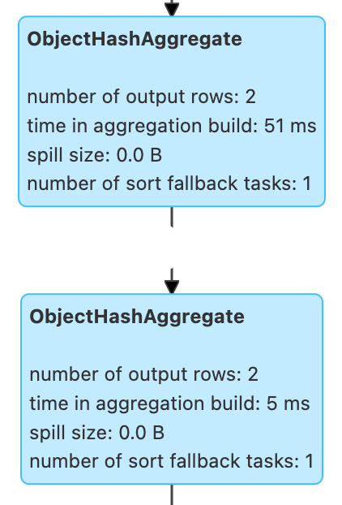

# ObjectHashAggregateExec Aggregate Physical Operator

`ObjectHashAggregateExec` is an [aggregate unary physical operator](BaseAggregateExec.md) for **object aggregation**.



## <span id="supportsAggregate"> Selection Requirements

```scala
supportsAggregate(
  aggregateExpressions: Seq[AggregateExpression]): Boolean
```

`supportsAggregate` is enabled (`true`) when there is a [TypedImperativeAggregate](../expressions/TypedImperativeAggregate.md) aggregate function among the [AggregateFunction](../expressions/AggregateFunction.md)s of the given [AggregateExpression](../expressions/AggregateExpression.md)s.

`supportsAggregate` is used when:

* `AggUtils` utility is used to [select an aggregate physical operator](../AggUtils.md#createAggregate)

## Creating Instance

`ObjectHashAggregateExec` takes the following to be created:

* <span id="requiredChildDistributionExpressions"> (optional) Required Child Distribution [Expression](../expressions/Expression.md)s
* <span id="groupingExpressions"> Grouping [NamedExpression](../expressions/NamedExpression.md)s
* <span id="aggregateExpressions"> [AggregateExpression](../expressions/AggregateExpression.md)s
* <span id="aggregateAttributes"> Aggregate [Attribute](../expressions/Attribute.md)s
* <span id="initialInputBufferOffset"> Initial Input Buffer Offset
* <span id="resultExpressions"> Result [NamedExpression](../expressions/NamedExpression.md)s
* <span id="child"> Child [Physical Operator](SparkPlan.md)

`ObjectHashAggregateExec` is created when:

* `AggUtils` utility is used to [create a physical operator for aggregation](../AggUtils.md#createAggregate)

## <span id="metrics"> Performance Metrics

Key             | Name (in web UI)
----------------|--------------------------
numOutputRows   | number of output rows
aggTime         | time in aggregation build

## <span id="doExecute"> Executing Physical Operator

```scala
doExecute(): RDD[InternalRow]
```

`doExecute` is part of the [SparkPlan](SparkPlan.md#doExecute) abstraction.

`doExecute` uses [ObjectAggregationIterator](../ObjectAggregationIterator.md) for aggregation (one per partition).

`doExecute`...FIXME

## Demo

`ObjectHashAggregateExec` is selected when [spark.sql.execution.useObjectHashAggregateExec](../configuration-properties.md#spark.sql.execution.useObjectHashAggregateExec) configuration property is enabled (and [HashAggregateExec](HashAggregateExec.md) could not be used).

```scala
assert(spark.sessionState.conf.useObjectHashAggregation)
```

Use [immutable](../UnsafeRow.md#isMutable) data types for `aggregateBufferAttributes`.

```scala
val dataset = Seq(
  (0, Seq.empty[Int]),
  (1, Seq(1, 1)),
  (2, Seq(2, 2))).toDF("id", "nums")
```

```scala
import org.apache.spark.sql.functions.size
val q = dataset.
  groupBy(size($"nums") as "group"). // <-- size over array
  agg(collect_list("id") as "ids")
```

```text
scala> q.explain
== Physical Plan ==
ObjectHashAggregate(keys=[size(nums#8, true)#18], functions=[collect_list(id#7, 0, 0)])
+- Exchange hashpartitioning(size(nums#8, true)#18, 200), ENSURE_REQUIREMENTS, [id=#10]
   +- ObjectHashAggregate(keys=[size(nums#8, true) AS size(nums#8, true)#18], functions=[partial_collect_list(id#7, 0, 0)])
      +- LocalTableScan [id#7, nums#8]
```

```text
scala> println(q.queryExecution.sparkPlan.numberedTreeString)
00 ObjectHashAggregate(keys=[size(nums#8, true)#18], functions=[collect_list(id#7, 0, 0)], output=[group#11, ids#15])
01 +- ObjectHashAggregate(keys=[size(nums#8, true) AS size(nums#8, true)#18], functions=[partial_collect_list(id#7, 0, 0)], output=[size(nums#8, true)#18, buf#20])
02    +- LocalTableScan [id#7, nums#8]
```

Going low level. Watch your steps :)

```text
// copied from HashAggregateExec as it is the preferred aggreate physical operator
// and HashAggregateExec is checked first
// When the check fails, ObjectHashAggregateExec is then checked
import q.queryExecution.optimizedPlan
import org.apache.spark.sql.catalyst.plans.logical.Aggregate
val aggLog = optimizedPlan.asInstanceOf[Aggregate]
import org.apache.spark.sql.catalyst.planning.PhysicalAggregation
import org.apache.spark.sql.catalyst.expressions.aggregate.AggregateExpression
// groupingExpressions, aggregateExpressions, resultExpressions, child
val (_, aggregateExpressions: Seq[AggregateExpression], _, _) = PhysicalAggregation.unapply(aggLog).get
val aggregateBufferAttributes =
  aggregateExpressions.flatMap(_.aggregateFunction.aggBufferAttributes)
```

One of the reasons why `ObjectHashAggregateExec` was selected is that `HashAggregateExec` did not meet the requirements.

```scala
import org.apache.spark.sql.execution.aggregate.HashAggregateExec
assert(HashAggregateExec.supportsAggregate(aggregateBufferAttributes) == false)
```

```scala
// collect_list aggregate function uses CollectList TypedImperativeAggregate under the covers
import org.apache.spark.sql.execution.aggregate.ObjectHashAggregateExec
assert(ObjectHashAggregateExec.supportsAggregate(aggregateExpressions))
```

```scala
val aggExec = q.queryExecution.sparkPlan.children.head.asInstanceOf[ObjectHashAggregateExec]
```

```text
scala> println(aggExec.aggregateExpressions.head.numberedTreeString)
00 partial_collect_list(id#7, 0, 0)
01 +- collect_list(id#7, 0, 0)
02    +- id#7: int
```
