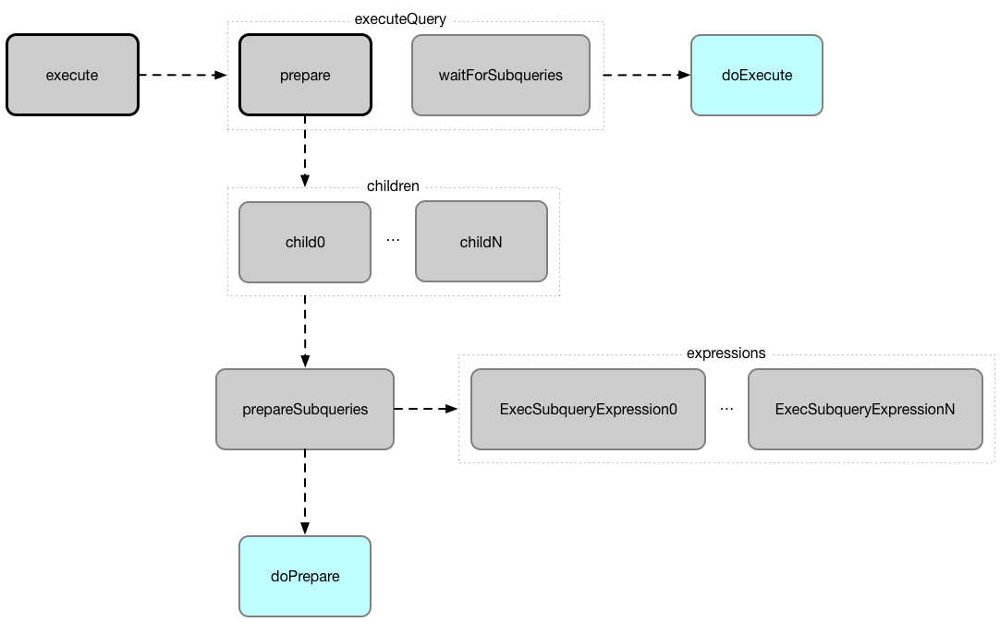

# SparkPlan &mdash; Physical Operators of Structured Query

`SparkPlan` is an [extension](#contract) of the [QueryPlan](../catalyst/QueryPlan.md) abstraction for [physical operators](#implementations) that can be [executed](#doExecute) (to generate `RDD[InternalRow]` that Spark can execute).

`SparkPlan` can build a **physical query plan** (_query execution plan_).

`SparkPlan` is a recursive data structure in Spark SQL's [Catalyst tree manipulation framework](../catalyst/index.md) and as such represents a single *physical operator* in a physical execution query plan as well as a *physical execution query plan* itself (i.e. a tree of physical operators in a query plan of a structured query).


??? note "High-Level Dataset API"
    A structured query can be expressed using Spark SQL's high-level [Dataset](../Dataset.md) API for Scala, Java, Python, R or good ol' SQL.

A `SparkPlan` physical operator is a [Catalyst tree node](../catalyst/TreeNode.md) that may have zero or more [child physical operators](../catalyst/TreeNode.md#children).

??? note "Catalyst Framework"
    A structured query is basically a single `SparkPlan` physical operator with [child physical operators](../catalyst/TreeNode.md#children).

    Spark SQL uses [Catalyst](../catalyst/index.md) tree manipulation framework to compose nodes to build a tree of (logical or physical) operators that, in this particular case, is composing `SparkPlan` physical operator nodes to build the physical execution plan tree of a structured query.

[[sparkContext]]
`SparkPlan` has access to the owning `SparkContext` (from the Spark Core).

??? tip "explain Operator"
    Use [explain](../spark-sql-dataset-operators.md#explain) operator to see the execution plan of a structured query.

    ```scala
    val q = // your query here
    q.explain
    ```

    You may also access the execution plan of a `Dataset` using its [queryExecution](../Dataset.md#queryExecution) property.

    ```scala
    val q = // your query here
    q.queryExecution.sparkPlan
    ```

`SparkPlan` assumes that concrete physical operators define [doExecute](#doExecute) (with optional [hooks](#hooks)).

## Contract

### <span id="doExecute"> doExecute

```scala
doExecute(): RDD[InternalRow]
```

Generates a distributed computation (that is a runtime representation of the operator in particular and a structured query in general) as an RDD of [InternalRow](../InternalRow.md)s (`RDD[InternalRow]`) and thus _execute_.

Part of [execute](#execute)

## Final Methods

`SparkPlan` has the following `final` methods that prepare execution environment and pass calls to corresponding methods (that constitute [SparkPlan](#contract) abstraction).

### <span id="execute"> execute

```scala
execute(): RDD[InternalRow]
```

"Executes" a physical operator (and its [children](../catalyst/TreeNode.md#children)) that triggers physical query planning and in the end generates an `RDD` of [InternalRow](../InternalRow.md)s (`RDD[InternalRow]`).

Used _mostly_ when `QueryExecution` is requested for the <<toRdd, RDD-based runtime representation of a structured query>> (that describes a distributed computation using Spark Core's RDD).

[execute](#execute) is called when `QueryExecution` is requested for the [RDD](../QueryExecution.md#toRdd) that is Spark Core's physical execution plan (as a RDD lineage) that triggers query execution (i.e. physical planning, but not execution of the plan) and _could_ be considered execution of a structured query.

The _could_ part above refers to the fact that the final execution of a structured query happens only when a RDD action is executed on the RDD of a structured query. And hence the need for Spark SQL's high-level Dataset API in which the Dataset operators simply execute a RDD action on the corresponding RDD. _Easy, isn't it?_

Internally, `execute` first <<executeQuery, prepares the physical operator for execution>> and eventually requests it to <<doExecute, doExecute>>.

!!! note
    Executing `doExecute` in a named scope happens only after the operator is <<prepare, prepared for execution>> followed by <<waitForSubqueries, waiting for any subqueries to finish>>.

### <span id="executeBroadcast"> executeBroadcast

```scala
executeBroadcast[T](): broadcast.Broadcast[T]
```

Calls [doExecuteBroadcast](#doExecuteBroadcast).

### <span id="executeColumnar"> Columnar Execution

```scala
executeColumnar(): RDD[ColumnarBatch]
```

`executeColumnar` [executeQuery](#executeQuery) with [doExecuteColumnar](#doExecuteColumnar).

`executeColumnar` is used when:

* [ColumnarToRowExec](ColumnarToRowExec.md) unary physical operator is executed and requested for the [inputRDDs](ColumnarToRowExec.md#inputRDDs)

### <span id="executeQuery"> executeQuery

```scala
executeQuery[T](
  query: => T): T
```

Executes the physical operator in a single RDD scope (all RDDs created during execution of the physical operator have the same scope).

`executeQuery` executes the input `query` block after the following (in order):

1. [Preparing for Execution](#prepare)
1. [Waiting for Subqueries to Finish](#waitForSubqueries)

`executeQuery` is used when:

* `SparkPlan` is requested for the following:
  * [execute](#execute) (the input `query` is [doExecute](#doExecute))
  * [executeBroadcast](#executeBroadcast) (the input `query` is [doExecuteBroadcast](#doExecuteBroadcast))
  * [executeColumnar](#executeColumnar) (the input `query` is [doExecuteColumnar()](#doExecuteColumnar()))
* `CodegenSupport` is requested to [produce a Java source code](CodegenSupport.md#produce) of a physical operator (with the input `query` being [doProduce](#doProduce))
* `QueryStageExec` is requested to [materialize](QueryStageExec.md#materialize) (with the input `query` being [doMaterialize](QueryStageExec.md##doMaterialize))

### <span id="prepare"> prepare

```scala
prepare(): Unit
```

Prepares a physical operator for execution

`prepare` is used mainly when a physical operator is requested to <<executeQuery, execute a structured query>>

`prepare` is also used recursively for every [child](../catalyst/TreeNode.md#children) physical operator (down the physical plan) and when a physical operator is requested to <<prepareSubqueries, prepare subqueries>>.

!!! note
    `prepare` is idempotent, i.e. can be called multiple times with no change to the final result. It uses <<prepared, prepared>> internal flag to execute the physical operator once only.

Internally, `prepare` calls <<doPrepare, doPrepare>> of its [children](../catalyst/TreeNode.md#children) before <<prepareSubqueries, prepareSubqueries>> and <<doPrepare, doPrepare>>.

## <span id="logicalLink"> logicalLink

```scala
logicalLink: Option[LogicalPlan]
```

`logicalLink` [gets the value](#getTagValue) of `logical_plan` node tag (if defined) or `logical_plan_inherited` node tag.

In other words, `logicalLink` is the [LogicalPlan](../logical-operators/LogicalPlan.md) this `SparkPlan` was planned from.

`logicalLink` is used when:

* `AdaptiveSparkPlanExec` physical operator is requested for the [final physical plan](AdaptiveSparkPlanExec.md#getFinalPhysicalPlan), [setLogicalLinkForNewQueryStage](AdaptiveSparkPlanExec.md#setLogicalLinkForNewQueryStage) and [replaceWithQueryStagesInLogicalPlan](AdaptiveSparkPlanExec.md#replaceWithQueryStagesInLogicalPlan)
* [InsertAdaptiveSparkPlan](../physical-optimizations/InsertAdaptiveSparkPlan.md), [PlanAdaptiveDynamicPruningFilters](../physical-optimizations/PlanAdaptiveDynamicPruningFilters.md) and [DisableUnnecessaryBucketedScan](../physical-optimizations/DisableUnnecessaryBucketedScan.md) physical optimizations are executed

## Extension Hooks

### doExecuteBroadcast

```scala
doExecuteBroadcast[T](): broadcast.Broadcast[T]
```

`doExecuteBroadcast` reports an `UnsupportedOperationException` by default:

```text
[nodeName] does not implement doExecuteBroadcast
```

Part of [executeBroadcast](#executeBroadcast)

`doExecuteBroadcast` is used when `RowToColumnarExec` and [InputAdapter](InputAdapter.md#doExecuteBroadcast) physical operators are requested to `doExecuteBroadcast`

### <span id="doExecuteColumnar"> doExecuteColumnar

```scala
doExecuteColumnar(): RDD[ColumnarBatch]
```

`doExecuteColumnar` throws an `IllegalStateException` by default:

```text
Internal Error [class] has column support mismatch:
[this]
```

Part of [Columnar Execution](#executeColumnar)

### <span id="doPrepare"> doPrepare

```scala
doPrepare(): Unit
```

`doPrepare` prepares the physical operator for execution

Part of [prepare](#prepare)

### <span id="requiredChildDistribution"> Required Child Output Distribution

```scala
requiredChildDistribution: Seq[Distribution]
```

**Required Partition Requirements** (*child output distributions*) of the input data, i.e. how [child](../catalyst/TreeNode.md#children) physical operators' output is split across partitions.

Defaults to a [UnspecifiedDistribution](UnspecifiedDistribution.md) for all of the [child](../catalyst/TreeNode.md#children) operators.

Used when:

* [EnsureRequirements](../physical-optimizations/EnsureRequirements.md) physical optimization is executed

### <span id="requiredChildOrdering"> Required Child Ordering

```scala
requiredChildOrdering: Seq[Seq[SortOrder]]
```

Specifies required sort ordering for each partition requirement (from [child](../catalyst/TreeNode.md#children) operators)

Defaults to no sort ordering for all of the physical operator's [child](../catalyst/TreeNode.md#children).

Used when:

* [EnsureRequirements](../physical-optimizations/EnsureRequirements.md) physical optimization is executed

## <span id="prepareSubqueries"> Preparing Subqueries

```scala
prepareSubqueries(): Unit
```

`prepareSubqueries`...FIXME

Part of [prepare](#prepare)

## <span id="waitForSubqueries"> Waiting for Subqueries to Finish

```scala
waitForSubqueries(): Unit
```

`waitForSubqueries` requests every [subquery expression](../expressions/ExecSubqueryExpression.md) (in [runningSubqueries](#runningSubqueries) registry) to [update](../expressions/ExecSubqueryExpression.md#updateResult).

In the end, `waitForSubqueries` clears up the [runningSubqueries](#runningSubqueries) registry.

`waitForSubqueries` is used when a physical operator is requested to [executeQuery](#executeQuery).

## Implementations

* [BaseSubqueryExec](BaseSubqueryExec.md)
* [CodegenSupport](CodegenSupport.md)
* [UnaryExecNode](UnaryExecNode.md)
* [V2CommandExec](V2CommandExec.md)
* _others_

## Naming Convention (Exec Suffix)

The naming convention of physical operators in Spark's source code is to have their names end with the **Exec** prefix, e.g. `DebugExec` or [LocalTableScanExec](LocalTableScanExec.md) that is however removed when the operator is displayed, e.g. in [web UI](../SQLTab.md).

## <span id="Physical-Operator-Execution-Pipeline"> Physical Operator Execution Pipeline

The entry point to **Physical Operator Execution Pipeline** is [execute](#execute).



When <<execute, executed>>, `SparkPlan` <<executeQuery, executes the internal query implementation>> in a named scope (for visualization purposes, e.g. web UI) that triggers <<prepare, prepare>> of the children physical operators first followed by <<prepareSubqueries, prepareSubqueries>> and finally <<doPrepare, doPrepare>> methods. After <<waitForSubqueries, subqueries have finished>>, <<doExecute, doExecute>> method is eventually triggered.


The result of <<execute, executing>> a `SparkPlan` is an `RDD` of [InternalRow](../InternalRow.md)s (`RDD[InternalRow]`).

!!! note
    Executing a structured query is simply a translation of the higher-level Dataset-based description to an RDD-based runtime representation that Spark will in the end execute (once an Dataset action is used).

CAUTION: FIXME Picture between Spark SQL's Dataset => Spark Core's RDD

## <span id="decodeUnsafeRows"> Decoding Byte Arrays Back to UnsafeRows

```scala
decodeUnsafeRows(
  bytes: Array[Byte]): Iterator[InternalRow]
```

`decodeUnsafeRows`...FIXME

`decodeUnsafeRows` is used when:

* `SparkPlan` is requested to [executeCollect](#executeCollect), [executeCollectIterator](#executeCollectIterator), [executeToIterator](#executeToIterator), and [executeTake](#executeTake)

## <span id="getByteArrayRdd"> Compressing RDD Partitions (of UnsafeRows) to Byte Arrays

```scala
getByteArrayRdd(
  n: Int = -1,
  takeFromEnd: Boolean = false): RDD[(Long, Array[Byte])]
```

`getByteArrayRdd` [executes this operator](#execute) and maps over partitions ([Spark Core]({{ book.spark_core }}/rdd/RDD#mapPartitionsInternal)) using the [partition processing function](#getByteArrayRdd-function).

!!! note
    `getByteArrayRdd` adds a `MapPartitionsRDD` ([Spark Core]({{ book.spark_core }}/rdd/MapPartitionsRDD)) to the RDD lineage.

`getByteArrayRdd` is used when:

* `SparkPlan` is requested to [executeCollect](#executeCollect), [executeCollectIterator](#executeCollectIterator), [executeToIterator](#executeToIterator), and [executeTake](#executeTake)

### <span id="getByteArrayRdd-function"> Partition Processing Function

The function creates a `CompressionCodec` ([Spark Core]({{ book.spark_core }}/CompressionCodec)) (to compress the output to a byte array).

The function takes [UnsafeRow](../UnsafeRow.md)s from the partition (one at a time) and writes them out (compressed) to the output as a series of the [size](../UnsafeRow.md#getSizeInBytes) and the [bytes](../UnsafeRow.md#writeToStream) of a single row.

Once all rows have been processed, the function writes out `-1` to the output, flushes and closes it.

In the end, the function returns the count of the rows written out and the byte array (with the rows).

## resetMetrics

```scala
resetMetrics(): Unit
```

`resetMetrics` takes <<metrics, metrics>> and request them to [reset](SQLMetric.md#reset).

`resetMetrics` is used when...FIXME

## executeToIterator

CAUTION: FIXME

## executeCollectIterator

```scala
executeCollectIterator(): (Long, Iterator[InternalRow])
```

`executeCollectIterator`...FIXME

`executeCollectIterator` is used when...FIXME

## <span id="executeQuery"> Preparing SparkPlan for Query Execution

```scala
executeQuery[T](query: => T): T
```

`executeQuery` executes the input `query` in a named scope (i.e. so that all RDDs created will have the same scope for visualization like web UI).

Internally, `executeQuery` calls <<prepare, prepare>> and <<waitForSubqueries, waitForSubqueries>> followed by executing `query`.

`executeQuery` is executed as part of <<execute, execute>>, <<executeBroadcast, executeBroadcast>> and when ``CodegenSupport``-enabled physical operator [produces a Java source code](CodegenSupport.md#produce).

## <span id="executeBroadcast"> Broadcasting Result of Structured Query

```scala
executeBroadcast[T](): broadcast.Broadcast[T]
```

`executeBroadcast` returns the result of a structured query as a broadcast variable.

Internally, `executeBroadcast` calls [doExecuteBroadcast](#doExecuteBroadcast) inside [executeQuery](#executeQuery).

`executeBroadcast` is used when:

* `SubqueryBroadcastExec` physical operator is requested for `relationFuture`
* [QueryStageExec](QueryStageExec.md) physical operator is requested for [doExecuteBroadcast](QueryStageExec.md#doExecuteBroadcast)
* [DebugExec](DebugExec.md) physical operator is requested for [doExecuteBroadcast](DebugExec.md#doExecuteBroadcast)
* [ReusedExchangeExec](ReusedExchangeExec.md) physical operator is requested for [doExecuteBroadcast](ReusedExchangeExec.md#doExecuteBroadcast)
* [BroadcastHashJoinExec](BroadcastHashJoinExec.md) physical operator is requested to [doExecute](BroadcastHashJoinExec.md#doExecute), [multipleOutputForOneInput](BroadcastHashJoinExec.md#multipleOutputForOneInput), [prepareBroadcast](BroadcastHashJoinExec.md#prepareBroadcast) and for [doExecuteBroadcast](BroadcastHashJoinExec.md#doExecuteBroadcast)
* [BroadcastNestedLoopJoinExec](BroadcastNestedLoopJoinExec.md) physical operator is requested for [doExecuteBroadcast](BroadcastNestedLoopJoinExec.md#doExecuteBroadcast)

## <span id="metrics"> Performance Metrics

```scala
metrics: Map[String, SQLMetric] = Map.empty
```

`metrics` is the [SQLMetrics](SQLMetric.md) by their names.

By default, `metrics` contains no `SQLMetrics` (i.e. `Map.empty`).

`metrics` is used when...FIXME

## <span id="executeTake"> Taking First N UnsafeRows

```scala
executeTake(
  n: Int): Array[InternalRow]
```

`executeTake` gives an array of up to `n` first [internal rows](../InternalRow.md).


`executeTake` [gets an RDD of byte array of `n` unsafe rows](#getByteArrayRdd) and scans the RDD partitions one by one until `n` is reached or all partitions were processed.

`executeTake` runs Spark jobs that take all the elements from requested number of partitions, starting from the 0th partition and increasing their number by [spark.sql.limit.scaleUpFactor](../configuration-properties.md#spark.sql.limit.scaleUpFactor) property (but minimum twice as many).

!!! note
    `executeTake` uses `SparkContext.runJob` to run a Spark job.

In the end, `executeTake` [decodes the unsafe rows](#decodeUnsafeRows).

!!! note
    `executeTake` gives an empty collection when `n` is 0 (and no Spark job is executed).

!!! note
    `executeTake` may take and decode more unsafe rows than really needed since all unsafe rows from a partition are read (if the partition is included in the scan).

### Example

```text
import org.apache.spark.sql.internal.SQLConf.SHUFFLE_PARTITIONS
spark.sessionState.conf.setConf(SHUFFLE_PARTITIONS, 10)

// 8 groups over 10 partitions
// only 7 partitions are with numbers
val nums = spark.
  range(start = 0, end = 20, step = 1, numPartitions = 4).
  repartition($"id" % 8)

import scala.collection.Iterator
val showElements = (it: Iterator[java.lang.Long]) => {
  val ns = it.toSeq
  import org.apache.spark.TaskContext
  val pid = TaskContext.get.partitionId
  println(s"[partition: $pid][size: ${ns.size}] ${ns.mkString(" ")}")
}
// ordered by partition id manually for demo purposes
scala> nums.foreachPartition(showElements)
[partition: 0][size: 2] 4 12
[partition: 1][size: 2] 7 15
[partition: 2][size: 0]
[partition: 3][size: 0]
[partition: 4][size: 0]
[partition: 5][size: 5] 0 6 8 14 16
[partition: 6][size: 0]
[partition: 7][size: 3] 3 11 19
[partition: 8][size: 5] 2 5 10 13 18
[partition: 9][size: 3] 1 9 17

scala> println(spark.sessionState.conf.limitScaleUpFactor)
4

// Think how many Spark jobs will the following queries run?
// Answers follow
scala> nums.take(13)
res0: Array[Long] = Array(4, 12, 7, 15, 0, 6, 8, 14, 16, 3, 11, 19, 2)

// The number of Spark jobs = 3

scala> nums.take(5)
res34: Array[Long] = Array(4, 12, 7, 15, 0)

// The number of Spark jobs = 4

scala> nums.take(3)
res38: Array[Long] = Array(4, 12, 7)

// The number of Spark jobs = 2
```

`executeTake` is used when:

* [CollectLimitExec](CollectLimitExec.md) physical operator is requested to [executeCollect](CollectLimitExec.md#executeCollect)
* [AnalyzeColumnCommand](../logical-operators/AnalyzeColumnCommand.md) logical command is executed

## <span id="executeCollect"> Executing Physical Operator and Collecting Results

```scala
executeCollect(): Array[InternalRow]
```

`executeCollect` [executes the physical operator and compresses partitions of UnsafeRows as byte arrays](#getByteArrayRdd) (that gives a `RDD[(Long, Array[Byte])]` and so no real Spark jobs may have been submitted).

`executeCollect` runs a Spark job to `collect` the elements of the RDD and for every pair in the result (of a count and bytes per partition) [decodes the byte arrays back to UnsafeRows](#decodeUnsafeRows) and stores the decoded arrays together as the final `Array[InternalRow]`.

!!! note
    `executeCollect` runs a Spark job using Spark Core's `RDD.collect` operator.

!!! note "Array[InternalRow]"
    `executeCollect` returns `Array[InternalRow]`, i.e. keeps the internal representation of rows unchanged and does not convert rows to JVM types.

`executeCollect` is used when:

* `Dataset` is requested for the Dataset.md#logicalPlan[logical plan] (being a single Command.md[Command] or their `Union`)

* spark-sql-dataset-operators.md#explain[explain] and spark-sql-dataset-operators.md#count[count] operators are executed

* `Dataset` is requested to `collectFromPlan`

* `SubqueryExec` is requested to SubqueryExec.md#doPrepare[prepare for execution] (and initializes SubqueryExec.md#relationFuture[relationFuture] for the first time)

* `SparkPlan` is requested to <<executeCollectPublic, executeCollectPublic>>

* `ScalarSubquery` and `InSubquery` plan expressions are requested to `updateResult`

## executeCollectPublic

```scala
executeCollectPublic(): Array[Row]
```

`executeCollectPublic`...FIXME

`executeCollectPublic` is used when...FIXME

## newPredicate

```scala
newPredicate(
  expression: Expression,
  inputSchema: Seq[Attribute]): GenPredicate
```

`newPredicate`...FIXME

`newPredicate` is used when...FIXME

## <span id="outputPartitioning"> Output Data Partitioning Requirements

```scala
outputPartitioning: Partitioning
```

`outputPartitioning` specifies the **output data partitioning requirements**, i.e. a hint for the Spark Physical Optimizer for the number of partitions the output of the physical operator should be split across.

`outputPartitioning` defaults to a `UnknownPartitioning` (with `0` partitions).

`outputPartitioning` is used when:

* [EnsureRequirements](../physical-optimizations/EnsureRequirements.md) physical optimization is executed

* `Dataset` is requested to [checkpoint](../spark-sql-dataset-operators.md#checkpoint)

## <span id="outputOrdering"> Output Data Ordering Requirements

```scala
outputOrdering: Seq[SortOrder]
```

`outputOrdering` specifies the **output data ordering requirements** of the physical operator, i.e. a hint for the Spark Physical Optimizer for the sorting (ordering) of the data (within and across partitions).

`outputOrdering` defaults to no ordering (`Nil`).

`outputOrdering` is used when:

* [EnsureRequirements](../physical-optimizations/EnsureRequirements.md) physical optimization is executed

* `Dataset` is requested to [checkpoint](../spark-sql-dataset-operators.md#checkpoint)

* `FileFormatWriter` is used to [write out a query result](../datasources/FileFormatWriter.md#write)

## <span id="supportsColumnar"> supportsColumnar

```scala
supportsColumnar: Boolean
```

`supportsColumnar` specifies whether the physical operator supports [Columnar Processing](../new-and-noteworthy/columnar-processing.md).

`supportsColumnar` is `false` by default.

!!! note
    `supportsColumnar` is or could possibly be `true` for the following physical operators (that override `supportsColumnar`):

    * `RowToColumnarExec`
    * [FileSourceScanExec](FileSourceScanExec.md)
    * [InMemoryTableScanExec](InMemoryTableScanExec.md)
    * [DataSourceV2ScanExecBase](DataSourceV2ScanExecBase.md)

    There are a few other physical operators that simply delegate to their child physical operators.

`supportsColumnar` is used when:

* [BatchScanExec](BatchScanExec.md) physical operator is requested for an [inputRDD](BatchScanExec.md#inputRDD)
* [ColumnarToRowExec](ColumnarToRowExec.md) physical operator is created and executed
* [ApplyColumnarRulesAndInsertTransitions](../physical-optimizations/ApplyColumnarRulesAndInsertTransitions.md) physical optimization is executed
* [FileSourceScanExec](FileSourceScanExec.md) physical operator is requested for [metadata](FileSourceScanExec.md#metadata) and [metrics](FileSourceScanExec.md#metrics)
* [DataSourceV2Strategy](../execution-planning-strategies/DataSourceV2Strategy.md) execution planning strategy is executed

## Internal Properties

### prepared

Flag that controls that [prepare](#prepare) is executed only once.

### subexpressionEliminationEnabled

Flag to control whether the [subexpression elimination optimization](../subexpression-elimination.md) is enabled or not.

Used when the following physical operators are requested to execute (i.e. describe a distributed computation as an RDD of internal rows):

* [ProjectExec](ProjectExec.md#doExecute)

* [HashAggregateExec](HashAggregateExec.md#doExecute) (and for [finishAggregate](HashAggregateExec.md#finishAggregate))

* [ObjectHashAggregateExec](ObjectHashAggregateExec.md#doExecute)

* [SortAggregateExec](SortAggregateExec.md#doExecute)

* [WindowExec](WindowExec.md#doExecute) (and creates a [lookup table for WindowExpressions and factory functions for WindowFunctionFrame](WindowExec.md#windowFrameExpressionFactoryPairs))
