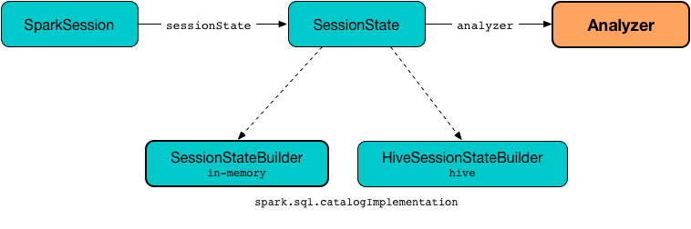

== [[Analyzer]] Analyzer -- Logical Query Plan Analyzer

`Analyzer` (aka _Spark Analyzer_ or _Query Analyzer_) is the *logical query plan analyzer* that <<execute, semantically validates and transforms an unresolved logical plan>> to an *analyzed logical plan*.

`Analyzer` is a concrete <<spark-sql-catalyst-RuleExecutor.adoc#, RuleExecutor>> of <<spark-sql-LogicalPlan.adoc#, LogicalPlan>> (i.e. `RuleExecutor[LogicalPlan]`) with the <<batches, logical evaluation rules>>.

```
Analyzer: Unresolved Logical Plan ==> Analyzed Logical Plan
```

`Analyzer` uses <<catalog, SessionCatalog>> while resolving relational entities, e.g. databases, tables, columns.

`Analyzer` is <<creating-instance, created>> when `SessionState` is requested for the <<spark-sql-SessionState.adoc#analyzer, analyzer>>.

.Creating Analyzer


`Analyzer` is available as the <<spark-sql-SessionState.adoc#analyzer, analyzer>> property of a session-specific `SessionState`.

[source, scala]
----
scala> :type spark
org.apache.spark.sql.SparkSession

scala> :type spark.sessionState.analyzer
org.apache.spark.sql.catalyst.analysis.Analyzer
----

You can access the analyzed logical plan of a structured query (as a <<spark-sql-Dataset.adoc#, Dataset>>) using <<spark-sql-dataset-operators.adoc#explain, Dataset.explain>> basic action (with `extended` flag enabled) or SQL's `EXPLAIN EXTENDED` SQL command.

[source, scala]
----
// sample structured query
val inventory = spark
  .range(5)
  .withColumn("new_column", 'id + 5 as "plus5")

// Using explain operator (with extended flag enabled)
scala> inventory.explain(extended = true)
== Parsed Logical Plan ==
'Project [id#0L, ('id + 5) AS plus5#2 AS new_column#3]
+- AnalysisBarrier
      +- Range (0, 5, step=1, splits=Some(8))

== Analyzed Logical Plan ==
id: bigint, new_column: bigint
Project [id#0L, (id#0L + cast(5 as bigint)) AS new_column#3L]
+- Range (0, 5, step=1, splits=Some(8))

== Optimized Logical Plan ==
Project [id#0L, (id#0L + 5) AS new_column#3L]
+- Range (0, 5, step=1, splits=Some(8))

== Physical Plan ==
*(1) Project [id#0L, (id#0L + 5) AS new_column#3L]
+- *(1) Range (0, 5, step=1, splits=8)
----

Alternatively, you can access the analyzed logical plan using `QueryExecution` and its <<spark-sql-QueryExecution.adoc#analyzed, analyzed>> property  (that together with `numberedTreeString` method is a very good "debugging" tool).

[source, scala]
----
val analyzedPlan = inventory.queryExecution.analyzed
scala> println(analyzedPlan.numberedTreeString)
00 Project [id#0L, (id#0L + cast(5 as bigint)) AS new_column#3L]
01 +- Range (0, 5, step=1, splits=Some(8))
----

`Analyzer` defines <<extendedResolutionRules, extendedResolutionRules>> extension point for additional logical evaluation rules that a custom `Analyzer` can use to extend the <<Resolution, Resolution>> rule batch. The rules are added at the end of the `Resolution` batch.

NOTE: link:spark-sql-SessionState.adoc[SessionState] uses its own `Analyzer` with custom <<extendedResolutionRules, extendedResolutionRules>>, <<postHocResolutionRules, postHocResolutionRules>>, and <<extendedCheckRules, extendedCheckRules>> extension methods.

[[internal-registries]]
.Analyzer's Internal Registries and Counters
[cols="1,2",options="header",width="100%"]
|===
| Name
| Description

| [[extendedResolutionRules]] `extendedResolutionRules`
| Additional link:spark-sql-catalyst-Rule.adoc[rules] for <<Resolution, Resolution>> batch.

Empty by default

| [[fixedPoint]] `fixedPoint`
| `FixedPoint` with <<maxIterations, maxIterations>> for <<Hints, Hints>>, <<Substitution, Substitution>>, <<Resolution, Resolution>> and <<Cleanup, Cleanup>> batches.

Set when `Analyzer` <<creating-instance, is created>> (and can be defined explicitly or through link:spark-sql-CatalystConf.adoc#optimizerMaxIterations[optimizerMaxIterations] configuration setting.

| [[postHocResolutionRules]] `postHocResolutionRules`
| The only link:spark-sql-catalyst-Rule.adoc[rules] in <<Post-Hoc-Resolution, Post-Hoc Resolution>> batch if defined (that are executed in one pass, i.e. `Once` strategy). Empty by default
|===

`Analyzer` is used by `QueryExecution` to link:spark-sql-QueryExecution.adoc#analyzed[resolve the managed `LogicalPlan`] (and, as a sort of follow-up, link:spark-sql-QueryExecution.adoc#assertAnalyzed[assert that a structured query has already been properly analyzed], i.e. no failed or unresolved or somehow broken logical plan operators and expressions exist).

[[logging]]
[TIP]
====
Enable `TRACE` or `DEBUG` logging levels for the respective session-specific loggers to see what happens inside `Analyzer`.

* `pass:[org.apache.spark.sql.internal.SessionState$$anon$1]`

* `pass:[org.apache.spark.sql.hive.HiveSessionStateBuilder$$anon$1]` when link:spark-sql-SparkSession.adoc#enableHiveSupport[Hive support is enabled]

Add the following line to `conf/log4j.properties`:

```
# with no Hive support
log4j.logger.org.apache.spark.sql.internal.SessionState$$anon$1=TRACE

# with Hive support enabled
log4j.logger.org.apache.spark.sql.hive.HiveSessionStateBuilder$$anon$1=DEBUG
```

Refer to link:spark-logging.adoc[Logging].

---

The reason for such weird-looking logger names is that `analyzer` attribute is created as an anonymous subclass of `Analyzer` class in the respective `SessionStates`.
====

=== [[execute]] Executing Logical Evaluation Rules -- `execute` Method

`Analyzer` is a link:spark-sql-catalyst-RuleExecutor.adoc[RuleExecutor] that defines the <<batches, logical rules>> (i.e. resolving, removing, and in general modifying it), e.g.

* Resolves unresolved <<ResolveRelations, relations>> and <<ResolveFunctions, functions>> (including link:spark-sql-Expression-UnresolvedGenerator.adoc[UnresolvedGenerators]) using provided <<catalog, SessionCatalog>>
* ...

[[batches]]
.Analyzer's Batches and Logical Evaluation Rules (in the order of execution)
[cols="2,1,3,3",options="header",width="100%"]
|===
^.^| Batch Name
^.^| Strategy
| Rules
| Description

.3+^.^| [[Hints]] Hints
.3+^.^| <<fixedPoint, FixedPoint>>

| <<spark-sql-Analyzer-ResolveBroadcastHints.adoc#, ResolveBroadcastHints>>
| [[ResolveBroadcastHints]] Resolves <<spark-sql-LogicalPlan-UnresolvedHint.adoc#, UnresolvedHint>> logical operators with `BROADCAST`, `BROADCASTJOIN` or `MAPJOIN` hints to <<spark-sql-LogicalPlan-ResolvedHint.adoc#, ResolvedHint>> operators

| <<spark-sql-Analyzer-ResolveCoalesceHints.adoc#, ResolveCoalesceHints>>
| [[ResolveCoalesceHints]] Resolves <<spark-sql-LogicalPlan-UnresolvedHint.adoc#, UnresolvedHint>> logical operators with `COALESCE` or `REPARTITION` hints to <<spark-sql-LogicalPlan-ResolvedHint.adoc#, ResolvedHint>> operators

| RemoveAllHints
| [[RemoveAllHints]] Removes all <<spark-sql-LogicalPlan-UnresolvedHint.adoc#, UnresolvedHint>> logical operators

^.^| [[Simple-Sanity-Check]] Simple Sanity Check
^.^| `Once`
| link:spark-sql-Analyzer-LookupFunctions.adoc[LookupFunctions]
| [[LookupFunctions]] Checks whether a function identifier (referenced by an link:spark-sql-Expression-UnresolvedFunction.adoc[UnresolvedFunction]) link:spark-sql-SessionCatalog.adoc#functionExists[exists in the function registry]. Throws a `NoSuchFunctionException` if not.

.4+^.^| [[Substitution]] Substitution
.4+^.^| <<fixedPoint, FixedPoint>>
| CTESubstitution
| Resolves `With` operators (and substitutes named common table expressions -- CTEs)

| [[WindowsSubstitution]] link:spark-sql-Analyzer-WindowsSubstitution.adoc[WindowsSubstitution]
| Substitutes an <<spark-sql-Expression-UnresolvedWindowExpression.adoc#, UnresolvedWindowExpression>> with a <<spark-sql-Expression-WindowExpression.adoc#, WindowExpression>> for link:spark-sql-LogicalPlan-WithWindowDefinition.adoc[WithWindowDefinition] logical operators.

| EliminateUnions
| Eliminates `Union` of one child into that child

| SubstituteUnresolvedOrdinals
| Replaces ordinals in <<spark-sql-LogicalPlan-Sort.adoc#, Sort>> and <<spark-sql-LogicalPlan-Aggregate.adoc#, Aggregate>> logical operators with <<spark-sql-Expression-UnresolvedOrdinal.adoc#, UnresolvedOrdinal>> expressions

.26+^.^| [[Resolution]] Resolution
.26+^.^| <<fixedPoint, FixedPoint>>
| ResolveTableValuedFunctions
| Replaces `UnresolvedTableValuedFunction` with table-valued function.

| [[ResolveRelations]] link:spark-sql-Analyzer-ResolveRelations.adoc[ResolveRelations]
a| Resolves:

* link:spark-sql-LogicalPlan-InsertIntoTable.adoc[InsertIntoTable]
* link:spark-sql-LogicalPlan-UnresolvedRelation.adoc[UnresolvedRelation]

| [[ResolveReferences]] link:spark-sql-Analyzer-ResolveReferences.adoc[ResolveReferences]
|

| [[ResolveCreateNamedStruct]] <<spark-sql-Analyzer-ResolveCreateNamedStruct.adoc#, ResolveCreateNamedStruct>>
| Resolves <<spark-sql-Expression-CreateNamedStruct.adoc#, CreateNamedStruct>> expressions (with `NamePlaceholders`) to use <<spark-sql-Expression-Literal.adoc#, Literal>> expressions

| ResolveDeserializer
|

| ResolveNewInstance
|

| ResolveUpCast
|

| [[ResolveGroupingAnalytics]] ResolveGroupingAnalytics
a|

Resolves grouping expressions up in a logical plan tree:

* `Cube`, `Rollup` and link:spark-sql-LogicalPlan-GroupingSets.adoc[GroupingSets] expressions
* `Filter` with `Grouping` or `GroupingID` expressions
* `Sort` with `Grouping` or `GroupingID` expressions

Expects that all children of a logical operator are already resolved (and given it belongs to a fixed-point batch it will likely happen at some iteration).

Fails analysis when `grouping__id` Hive function is used.

```
scala> sql("select grouping__id").queryExecution.analyzed
org.apache.spark.sql.AnalysisException: grouping__id is deprecated; use grouping_id() instead;
  at org.apache.spark.sql.catalyst.analysis.CheckAnalysis$class.failAnalysis(CheckAnalysis.scala:40)
  at org.apache.spark.sql.catalyst.analysis.Analyzer.failAnalysis(Analyzer.scala:91)
  at org.apache.spark.sql.catalyst.analysis.Analyzer$ResolveGroupingAnalytics$$anonfun$apply$6.applyOrElse(Analyzer.scala:451)
  at org.apache.spark.sql.catalyst.analysis.Analyzer$ResolveGroupingAnalytics$$anonfun$apply$6.applyOrElse(Analyzer.scala:448)
```

NOTE: `ResolveGroupingAnalytics` is only for grouping functions resolution while <<ResolveAggregateFunctions, ResolveAggregateFunctions>> is responsible for resolving the other aggregates.

| [[ResolvePivot]] ResolvePivot
| Resolves link:spark-sql-LogicalPlan-Pivot.adoc[Pivot] logical operator to `Project` with an link:spark-sql-LogicalPlan-Aggregate.adoc[Aggregate] unary logical operator (for supported data types in aggregates) or just a single `Aggregate`.

| <<spark-sql-Analyzer-ResolveOrdinalInOrderByAndGroupBy.adoc#, ResolveOrdinalInOrderByAndGroupBy>>
| [[ResolveOrdinalInOrderByAndGroupBy]]

| ResolveMissingReferences
| [[ResolveMissingReferences]]

| [[ExtractGenerator]] ExtractGenerator
|
| ResolveGenerate
|
| link:spark-sql-Analyzer-ResolveFunctions.adoc[ResolveFunctions]
a| [[ResolveFunctions]] Resolves functions using link:spark-sql-SessionCatalog.adoc#lookupFunction[SessionCatalog]:

* link:spark-sql-Expression-UnresolvedGenerator.adoc[UnresolvedGenerator] to a link:spark-sql-Expression-Generator.adoc[Generator]

* link:spark-sql-Expression-UnresolvedFunction.adoc[UnresolvedFunction] to a link:spark-sql-Expression-AggregateExpression.adoc[AggregateExpression] (with link:spark-sql-Expression-AggregateFunction.adoc[AggregateFunction]) or link:spark-sql-Expression-AggregateWindowFunction.adoc[AggregateWindowFunction]

If `Generator` is not found, `ResolveFunctions` reports the error:

[options="wrap"]
----
[name] is expected to be a generator. However, its class is [className], which is not a generator.
----

| [[ResolveAliases]] link:spark-sql-Analyzer-ResolveAliases.adoc[ResolveAliases]
a| Replaces `UnresolvedAlias` link:spark-sql-Expression.adoc[expressions] with concrete aliases:

* link:spark-sql-Expression-NamedExpression.adoc[NamedExpressions]
* `MultiAlias` (for `GeneratorOuter` and `Generator`)
* `Alias` (for `Cast` and `ExtractValue`)

| <<spark-sql-Analyzer-ResolveSubquery.adoc#, ResolveSubquery>>
| [[ResolveSubquery]] Resolves subquery expressions (i.e. <<spark-sql-Expression-SubqueryExpression-ScalarSubquery.adoc#, ScalarSubquery>>, <<spark-sql-Expression-Exists.adoc#, Exists>> and <<spark-sql-Expression-In.adoc#, In>>)

| <<spark-sql-Analyzer-ResolveWindowOrder.adoc#, ResolveWindowOrder>>
| [[ResolveWindowOrder]]

| link:spark-sql-Analyzer-ResolveWindowFrame.adoc[ResolveWindowFrame]
| [[ResolveWindowFrame]] Resolves link:spark-sql-Expression-WindowExpression.adoc[WindowExpression] expressions

| ResolveNaturalAndUsingJoin
| [[ResolveNaturalAndUsingJoin]]

| <<spark-sql-Analyzer-ExtractWindowExpressions.adoc#, ExtractWindowExpressions>>
| [[ExtractWindowExpressions]]

| GlobalAggregates
| [[GlobalAggregates]] Resolves (aka _replaces_) `Project` operators with link:spark-sql-Expression-AggregateExpression.adoc[AggregateExpression] that are not link:spark-sql-Expression-WindowExpression.adoc[WindowExpression] with `Aggregate` unary logical operators.

| ResolveAggregateFunctions
a| [[ResolveAggregateFunctions]] Resolves aggregate functions in `Filter` and `Sort` operators

NOTE: `ResolveAggregateFunctions` skips (i.e. does not resolve) grouping functions that are resolved by <<ResolveGroupingAnalytics, ResolveGroupingAnalytics>> rule.

| <<spark-sql-Analyzer-TimeWindowing.adoc#, TimeWindowing>>
| [[TimeWindowing]] Resolves <<spark-sql-Expression-TimeWindow.adoc#, TimeWindow>> expressions to `Filter` with <<spark-sql-LogicalPlan-Expand.adoc#, Expand>> logical operators.

| <<spark-sql-Analyzer-ResolveInlineTables.adoc#, ResolveInlineTables>>
| [[ResolveInlineTables]] Resolves <<spark-sql-LogicalPlan-UnresolvedInlineTable.adoc#, UnresolvedInlineTable>> operators to <<spark-sql-LogicalPlan-LocalRelation.adoc#, LocalRelations>>

| <<spark-sql-TypeCoercion.adoc#typeCoercionRules, TypeCoercion.typeCoercionRules>>
| [[typeCoercionRules]] Type coercion rules

| <<extendedResolutionRules, extendedResolutionRules>>
|

^.^| [[Post-Hoc-Resolution]] Post-Hoc Resolution
^.^| `Once`
| <<postHocResolutionRules, postHocResolutionRules>>
|

^.^| [[View]] View
^.^| `Once`
| [[AliasViewChild]] <<spark-sql-Analyzer-AliasViewChild.adoc#, AliasViewChild>>
|

^.^| Nondeterministic
^.^| `Once`
| PullOutNondeterministic
|

^.^| UDF
^.^| `Once`
| [[HandleNullInputsForUDF]] link:spark-sql-Analyzer-HandleNullInputsForUDF.adoc[HandleNullInputsForUDF]
|

^.^| FixNullability
^.^| `Once`
| FixNullability
|

^.^| ResolveTimeZone
^.^| `Once`
| ResolveTimeZone
| Replaces `TimeZoneAwareExpression` with no timezone with one with link:spark-sql-CatalystConf.adoc#sessionLocalTimeZone[session-local time zone].

^.^| [[Cleanup]] Cleanup
^.^| <<fixedPoint, FixedPoint>>
| <<spark-sql-Analyzer-CleanupAliases.adoc#, CleanupAliases>>
| [[CleanupAliases]]
|===

TIP: Consult the https://github.com/apache/spark/blob/master/sql/catalyst/src/main/scala/org/apache/spark/sql/catalyst/analysis/Analyzer.scala#L116-L167[sources of `Analyzer`] for the up-to-date list of the evaluation rules.

=== [[creating-instance]] Creating Analyzer Instance

`Analyzer` takes the following when created:

* [[catalog]] link:spark-sql-SessionCatalog.adoc[SessionCatalog]
* [[conf]] link:spark-sql-CatalystConf.adoc[CatalystConf]
* [[maxIterations]] Maximum number of iterations (of the <<fixedPoint, FixedPoint>> rule batches, i.e. <<Hints, Hints>>, <<Substitution, Substitution>>, <<Resolution, Resolution>> and <<Cleanup, Cleanup>>)

`Analyzer` initializes the <<internal-registries, internal registries and counters>>.

NOTE: `Analyzer` can also be created without specifying the <<maxIterations, maxIterations>> argument which is then configured using link:spark-sql-CatalystConf.adoc#optimizerMaxIterations[optimizerMaxIterations] configuration setting.

=== [[resolver]] `resolver` Method

[source, scala]
----
resolver: Resolver
----

`resolver` requests <<conf, CatalystConf>> for link:spark-sql-CatalystConf.adoc#resolver[Resolver].

NOTE: `Resolver` is a mere function of two `String` parameters that returns `true` if both refer to the same entity (i.e. for case insensitive equality).

=== [[resolveExpression]] `resolveExpression` Method

[source, scala]
----
resolveExpression(
  expr: Expression,
  plan: LogicalPlan,
  throws: Boolean = false): Expression
----

`resolveExpression`...FIXME

NOTE: `resolveExpression` is a `protected[sql]` method.

NOTE: `resolveExpression` is used when...FIXME

=== [[commonNaturalJoinProcessing]] `commonNaturalJoinProcessing` Internal Method

[source, scala]
----
commonNaturalJoinProcessing(
  left: LogicalPlan,
  right: LogicalPlan,
  joinType: JoinType,
  joinNames: Seq[String],
  condition: Option[Expression]): Project
----

`commonNaturalJoinProcessing`...FIXME

NOTE: `commonNaturalJoinProcessing` is used when...FIXME

=== [[executeAndCheck]] `executeAndCheck` Method

[source, scala]
----
executeAndCheck(plan: LogicalPlan): LogicalPlan
----

`executeAndCheck`...FIXME

NOTE: `executeAndCheck` is used exclusively when `QueryExecution` is requested for the <<spark-sql-QueryExecution.adoc#analyzed, analyzed logical plan>>.
