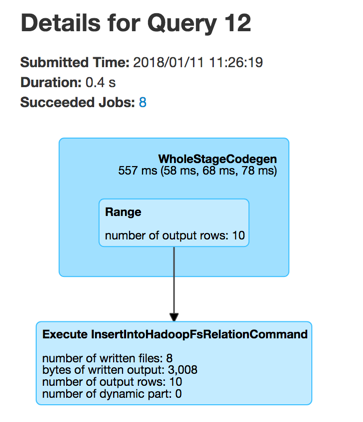

== [[DataFrameWriter]] DataFrameWriter -- Saving Data To External Data Sources

`DataFrameWriter` is the <<methods, interface>> to describe how data (as the result of executing a structured query) should be <<save, saved to an external data source>>.

[[methods]]
.DataFrameWriter API / Writing Operators
[cols="1,2",options="header",width="100%"]
|===
| Method
| Description

| <<bucketBy-internals, bucketBy>>
a| [[bucketBy]]

[source, scala]
----
bucketBy(numBuckets: Int, colName: String, colNames: String*): DataFrameWriter[T]
----

| <<csv-internals, csv>>
a| [[csv]]

[source, scala]
----
csv(path: String): Unit
----

| <<format-internals, format>>
a| [[format]]

[source, scala]
----
format(source: String): DataFrameWriter[T]
----

| <<insertInto-internals, insertInto>>
a| [[insertInto]]

[source, scala]
----
insertInto(tableName: String): Unit
----

Inserts (the results of) a `DataFrame` into a table

| <<jdbc-internals, jdbc>>
a| [[jdbc]]

[source, scala]
----
jdbc(url: String, table: String, connectionProperties: Properties): Unit
----

| <<json-internals, json>>
a| [[json]]

[source, scala]
----
json(path: String): Unit
----

| <<mode-internals, mode>>
a| [[mode]]

[source, scala]
----
mode(saveMode: SaveMode): DataFrameWriter[T]
mode(saveMode: String): DataFrameWriter[T]
----

| <<option-internals, option>>
a| [[option]]

[source, scala]
----
option(key: String, value: String): DataFrameWriter[T]
option(key: String, value: Boolean): DataFrameWriter[T]
option(key: String, value: Long): DataFrameWriter[T]
option(key: String, value: Double): DataFrameWriter[T]
----

| <<options-internals, options>>
a| [[options]]

[source, scala]
----
options(options: scala.collection.Map[String, String]): DataFrameWriter[T]
----

| <<orc-internals, orc>>
a| [[orc]]

[source, scala]
----
orc(path: String): Unit
----

| <<parquet-internals, parquet>>
a| [[parquet]]

[source, scala]
----
parquet(path: String): Unit
----

| <<partitionBy-internals, partitionBy>>
a| [[partitionBy]]

[source, scala]
----
partitionBy(colNames: String*): DataFrameWriter[T]
----

| <<save-internals, save>>
a| [[save]]

[source, scala]
----
save(): Unit
save(path: String): Unit
----

Saves a `DataFrame` (i.e. writes the result of executing a structured query) to the <<source, data source>>

| <<saveAsTable-internals, saveAsTable>>
a| [[saveAsTable]]

[source, scala]
----
saveAsTable(tableName: String): Unit
----

| <<sortBy-internals, sortBy>>
a| [[sortBy]]

[source, scala]
----
sortBy(colName: String, colNames: String*): DataFrameWriter[T]
----

| <<text-internals, text>>
a| [[text]]

[source, scala]
----
text(path: String): Unit
----
|===

`DataFrameWriter` is available using <<spark-sql-DataFrame.adoc#write, Dataset.write>> operator.

[source, scala]
----
scala> :type df
org.apache.spark.sql.DataFrame

val writer = df.write

scala> :type writer
org.apache.spark.sql.DataFrameWriter[org.apache.spark.sql.Row]
----

`DataFrameWriter` supports many <<writing-dataframes-to-files, file formats>> and <<jdbc, JDBC databases>>. It also allows for plugging in <<format, new formats>>.

`DataFrameWriter` defaults to <<parquet, parquet>> data source format. You can change the default format using link:spark-sql-properties.adoc[spark.sql.sources.default] configuration property or <<format, format>> or the format-specific methods.

[source, scala]
----
// see above for writer definition

// Save dataset in Parquet format
writer.save(path = "nums")

// Save dataset in JSON format
writer.format("json").save(path = "nums-json")

// Alternatively, use format-specific method
write.json(path = "nums-json")
----

In the end, you trigger the actual saving of the content of a `Dataset` (i.e. the result of executing a structured query) using <<save, save>> method.

[source, scala]
----
writer.save
----

[[internal-state]]
`DataFrameWriter` uses <<internal-attributes-and-corresponding-setters, internal mutable attributes>> to build a properly-defined _"write specification"_ for <<insertInto, insertInto>>, <<save, save>> and <<saveAsTable, saveAsTable>> methods.

[[internal-attributes-and-corresponding-setters]]
.Internal Attributes and Corresponding Setters
[cols="1m,2",options="header"]
|===
| Attribute
| Setters

| source
| [[source]] <<format, format>>

| mode
| [[mode-internal-property]] <<mode, mode>>

| extraOptions
| [[extraOptions]] <<option, option>>, <<options, options>>, <<save, save>>

| partitioningColumns
| [[partitioningColumns]] <<partitionBy, partitionBy>>

| bucketColumnNames
| [[bucketColumnNames]] <<bucketBy, bucketBy>>

| numBuckets
| [[numBuckets]] <<bucketBy, bucketBy>>

| sortColumnNames
| [[sortColumnNames]] <<sortBy, sortBy>>
|===

[[df]]
NOTE: `DataFrameWriter` is a type constructor in Scala that keeps an internal reference to the source `DataFrame` for the whole lifecycle (starting right from the moment it was created).

NOTE: Spark Structured Streaming's `DataStreamWriter` is responsible for writing the content of streaming Datasets in a streaming fashion.

=== [[runCommand]] Executing Logical Command(s) -- `runCommand` Internal Method

[source, scala]
----
runCommand(session: SparkSession, name: String)(command: LogicalPlan): Unit
----

`runCommand` uses the input `SparkSession` to access the <<spark-sql-SparkSession.adoc#sessionState, SessionState>> that is in turn requested to <<spark-sql-SessionState.adoc#executePlan, execute the logical command>> (that simply creates a <<spark-sql-QueryExecution.adoc#, QueryExecution>>).

`runCommand` records the current time (start time) and uses the `SQLExecution` helper object to <<spark-sql-SQLExecution.adoc#withNewExecutionId, execute the action (under a new execution id)>> that simply requests the `QueryExecution` for the <<spark-sql-QueryExecution.adoc#toRdd, RDD[InternalRow]>> (and triggers execution of logical commands).

TIP: Use web UI's SQL tab to see the execution or a `SparkListener` to be notified when the execution is started and finished. The `SparkListener` should intercept `SparkListenerSQLExecutionStart` and `SparkListenerSQLExecutionEnd` events.

`runCommand` records the current time (end time).

In the end, `runCommand` uses the input `SparkSession` to access the <<spark-sql-SparkSession.adoc#listenerManager, ExecutionListenerManager>> and requests it to <<spark-sql-ExecutionListenerManager.adoc#onSuccess, onSuccess>> (with the input `name`, the `QueryExecution` and the duration).

In case of any exceptions, `runCommand` requests the `ExecutionListenerManager` to <<spark-sql-ExecutionListenerManager.adoc#onFailure, onFailure>> (with the exception) and (re)throws it.

NOTE: `runCommand` is used when `DataFrameWriter` is requested to <<save, save the rows of a structured query (a DataFrame) to a data source>> (and indirectly <<saveToV1Source, executing a logical command for writing to a data source V1>>), <<insertInto, insert the rows of a structured streaming (a DataFrame) into a table>> and <<createTable, create a table>> (that is used exclusively for <<saveAsTable, saveAsTable>>).

=== [[saveAsTable-internals]] Saving Rows of Structured Streaming (DataFrame) to Table -- `saveAsTable` Method

[source, scala]
----
saveAsTable(tableName: String): Unit
// PRIVATE API
saveAsTable(tableIdent: TableIdentifier): Unit
----

`saveAsTable` saves the content of a `DataFrame` to the `tableName` table.

[source, scala]
----
val ids = spark.range(5)
ids.write.
  option("path", "/tmp/five_ids").
  saveAsTable("five_ids")

// Check out if saveAsTable as five_ids was successful
val q = spark.catalog.listTables.filter($"name" === "five_ids")
scala> q.show
+--------+--------+-----------+---------+-----------+
|    name|database|description|tableType|isTemporary|
+--------+--------+-----------+---------+-----------+
|five_ids| default|       null| EXTERNAL|      false|
+--------+--------+-----------+---------+-----------+
----

Internally, `saveAsTable` requests the current `ParserInterface` to <<spark-sql-ParserInterface.adoc#parseTableIdentifier, parse the input table name>>.

NOTE: `saveAsTable` uses the <<df, internal DataFrame>> to access the <<spark-sql-Dataset.adoc#sparkSession, SparkSession>> that is used to access the <<spark-sql-SparkSession.adoc#sessionState, SessionState>> and in the end the <<spark-sql-SessionState.adoc#sqlParser, ParserInterface>>.

`saveAsTable` then requests the `SessionCatalog` to <<spark-sql-SessionCatalog.adoc#tableExists, check whether the table exists or not>>.

NOTE: `saveAsTable` uses the <<df, internal DataFrame>> to access the <<spark-sql-Dataset.adoc#sparkSession, SparkSession>> that is used to access the <<spark-sql-SparkSession.adoc#sessionState, SessionState>> and in the end the <<spark-sql-SessionState.adoc#catalog, SessionCatalog>>.

In the end, `saveAsTable` branches off per whether the table exists or not and the <<mode, save mode>>.

.saveAsTable's Behaviour per Save Mode
[cols="1,1,2",options="header",width="100%"]
|===
| Does table exist?
| Save Mode
| Behaviour

| yes
| `Ignore`
| Does nothing

| yes
| `ErrorIfExists`
| Reports an `AnalysisException` with `Table [tableIdent] already exists.` error message

| yes
| `Overwrite`
| FIXME

| _anything_
| _anything_
| <<createTable, createTable>>
|===

=== [[save-internals]] Saving Rows of Structured Query (DataFrame) to Data Source -- `save` Method

[source, scala]
----
save(): Unit
----

`save` saves the rows of a structured query (a <<spark-sql-Dataset.adoc#, Dataset>>) to a data source.

Internally, `save` uses `DataSource` to <<spark-sql-DataSource.adoc#lookupDataSource, look up the class of the requested data source>> (for the <<source, source>> option and the <<spark-sql-SessionState.adoc#conf, SQLConf>>).

[NOTE]
====
`save` uses <<spark-sql-Dataset.adoc#sparkSession, SparkSession>> to access the <<spark-sql-SparkSession.adoc#sessionState, SessionState>> that is in turn used to access the <<spark-sql-SessionState.adoc#conf, SQLConf>>.

[source, scala]
----
val df: DataFrame = ???
df.sparkSession.sessionState.conf
----
====

If the class is a <<spark-sql-DataSourceV2.adoc#, DataSourceV2>>...FIXME

Otherwise, if not a <<spark-sql-DataSourceV2.adoc#, DataSourceV2>>, `save` simply <<saveToV1Source, saveToV1Source>>.

`save` does not support saving to Hive (i.e. the <<source, source>> is `hive`) and throws an `AnalysisException` when requested so.

```
Hive data source can only be used with tables, you can not write files of Hive data source directly.
```

`save` <<assertNotBucketed, does not support bucketing>> (i.e. when the <<numBuckets, numBuckets>> or <<sortColumnNames, sortColumnNames>> options are defined) and throws an `AnalysisException` when requested so.

```
'[operation]' does not support bucketing right now
```

=== [[jdbc-internals]] Saving Data to Table Using JDBC Data Source -- `jdbc` Method

[source, scala]
----
jdbc(url: String, table: String, connectionProperties: Properties): Unit
----

`jdbc` method saves the content of the `DataFrame` to an external database table via JDBC.

You can use <<mode, mode>> to control *save mode*, i.e. what happens when an external table exists when `save` is executed.

It is assumed that the `jdbc` save pipeline is not <<partitionBy, partitioned>> and <<bucketBy, bucketed>>.

All <<options, options>> are overriden by the input `connectionProperties`.

The required options are:

* `driver` which is the class name of the JDBC driver (that is passed to Spark's own `DriverRegistry.register` and later used to `connect(url, properties)`).

When `table` exists and the <<mode, override save mode>> is in use, `DROP TABLE table` is executed.

It creates the input `table` (using `CREATE TABLE table (schema)` where `schema` is the schema of the `DataFrame`).

=== [[bucketBy-internals]] `bucketBy` Method

[source, scala]
----
bucketBy(numBuckets: Int, colName: String, colNames: String*): DataFrameWriter[T]
----

`bucketBy` simply sets the internal <<numBuckets, numBuckets>> and <<bucketColumnNames, bucketColumnNames>> to the input `numBuckets` and `colName` with `colNames`, respectively.

[source, scala]
----
val df = spark.range(5)
import org.apache.spark.sql.DataFrameWriter
val writer: DataFrameWriter[java.lang.Long] = df.write

val bucketedTable = writer.bucketBy(numBuckets = 8, "col1", "col2")

scala> :type bucketedTable
org.apache.spark.sql.DataFrameWriter[Long]
----

=== [[partitionBy]] `partitionBy` Method

[source, scala]
----
partitionBy(colNames: String*): DataFrameWriter[T]
----

CAUTION: FIXME

=== [[mode-internals]] Specifying Save Mode -- `mode` Method

[source, scala]
----
mode(saveMode: String): DataFrameWriter[T]
mode(saveMode: SaveMode): DataFrameWriter[T]
----

`mode` defines the behaviour of <<save, save>> when an external file or table (Spark writes to) already exists, i.e. `SaveMode`.

[[SaveMode]]
.Types of SaveMode
[cols="1,2",options="header",width="100%"]
|===
| Name
| Description

| `Append`
| [[Append]] Records are appended to existing data.

| `ErrorIfExists`
| [[ErrorIfExists]] Exception is thrown.

| `Ignore`
| [[Ignore]] Do not save the records and not change the existing data in any way.

| `Overwrite`
| [[Overwrite]] Existing data is overwritten by new records.
|===

=== [[sortBy-internals]] Specifying Sorting Columns -- `sortBy` Method

[source, scala]
----
sortBy(colName: String, colNames: String*): DataFrameWriter[T]
----

`sortBy` simply sets <<sortColumnNames, sorting columns>> to the input `colName` and `colNames` column names.

NOTE: `sortBy` must be used together with <<bucketBy, bucketBy>> or `DataFrameWriter` reports an `IllegalArgumentException`.

NOTE: <<assertNotBucketed, assertNotBucketed>> asserts that bucketing is not used by some methods.

=== [[option-internals]] Specifying Writer Configuration -- `option` Method

[source, scala]
----
option(key: String, value: Boolean): DataFrameWriter[T]
option(key: String, value: Double): DataFrameWriter[T]
option(key: String, value: Long): DataFrameWriter[T]
option(key: String, value: String): DataFrameWriter[T]
----

`option`...FIXME

=== [[options-internals]] Specifying Writer Configuration -- `options` Method

[source, scala]
----
options(options: scala.collection.Map[String, String]): DataFrameWriter[T]
----

`options`...FIXME

=== [[writing-dataframes-to-files]] Writing DataFrames to Files

CAUTION: FIXME

=== [[format-internals]] Specifying Data Source (by Alias or Fully-Qualified Class Name) -- `format` Method

[source, scala]
----
format(source: String): DataFrameWriter[T]
----

`format` simply sets the <<source, source>> internal property.

=== [[parquet]] Parquet

CAUTION: FIXME

NOTE: Parquet is the default data source format.

=== [[insertInto-internals]] Inserting Rows of Structured Streaming (DataFrame) into Table -- `insertInto` Method

[source, scala]
----
insertInto(tableName: String): Unit // <1>
insertInto(tableIdent: TableIdentifier): Unit
----
<1> Parses `tableName` and calls the other `insertInto` with a `TableIdentifier`

`insertInto` inserts the content of the `DataFrame` to the specified `tableName` table.

NOTE: `insertInto` ignores column names and just uses a position-based resolution, i.e. the order (not the names!) of the columns in (the output of) the Dataset matters.

Internally, `insertInto` creates an link:spark-sql-LogicalPlan-InsertIntoTable.adoc#creating-instance[InsertIntoTable] logical operator (with link:spark-sql-LogicalPlan-UnresolvedRelation.adoc#creating-instance[UnresolvedRelation] operator as the only child) and <<runCommand, executes>> it right away (that submits a Spark job).

.DataFrameWrite.insertInto Executes SQL Command (as a Spark job)


`insertInto` reports a `AnalysisException` for bucketed DataFrames, i.e. <<numBuckets, buckets>> or <<sortColumnNames, sortColumnNames>> are defined.

```
'insertInto' does not support bucketing right now
```

[source, scala]
----
val writeSpec = spark.range(4).
  write.
  bucketBy(numBuckets = 3, colName = "id")
scala> writeSpec.insertInto("t1")
org.apache.spark.sql.AnalysisException: 'insertInto' does not support bucketing right now;
  at org.apache.spark.sql.DataFrameWriter.assertNotBucketed(DataFrameWriter.scala:334)
  at org.apache.spark.sql.DataFrameWriter.insertInto(DataFrameWriter.scala:302)
  at org.apache.spark.sql.DataFrameWriter.insertInto(DataFrameWriter.scala:298)
  ... 49 elided
----

`insertInto` reports a `AnalysisException` for partitioned DataFrames, i.e. <<partitioningColumns, partitioningColumns>> is defined.

[options="wrap"]
----
insertInto() can't be used together with partitionBy(). Partition columns have already been defined for the table. It is not necessary to use partitionBy().
----

[source, scala, options="wrap"]
----
val writeSpec = spark.range(4).
  write.
  partitionBy("id")
scala> writeSpec.insertInto("t1")
org.apache.spark.sql.AnalysisException: insertInto() can't be used together with partitionBy(). Partition columns have already be defined for the table. It is not necessary to use partitionBy().;
  at org.apache.spark.sql.DataFrameWriter.insertInto(DataFrameWriter.scala:305)
  at org.apache.spark.sql.DataFrameWriter.insertInto(DataFrameWriter.scala:298)
  ... 49 elided
----

=== [[getBucketSpec]] `getBucketSpec` Internal Method

[source, scala]
----
getBucketSpec: Option[BucketSpec]
----

`getBucketSpec` returns a new <<spark-sql-BucketSpec.adoc#, BucketSpec>> if <<numBuckets, numBuckets>> was defined (with <<bucketColumnNames, bucketColumnNames>> and <<sortColumnNames, sortColumnNames>>).

`getBucketSpec` throws an `IllegalArgumentException` when <<numBuckets, numBuckets>> are not defined when <<sortColumnNames, sortColumnNames>> are.

```
sortBy must be used together with bucketBy
```

NOTE: `getBucketSpec` is used exclusively when `DataFrameWriter` is requested to <<createTable, create a table>>.

=== [[createTable]] Creating Table -- `createTable` Internal Method

[source, scala]
----
createTable(tableIdent: TableIdentifier): Unit
----

`createTable` <<spark-sql-DataSource.adoc#buildStorageFormatFromOptions, builds a CatalogStorageFormat>> per <<extraOptions, extraOptions>>.

`createTable` assumes `CatalogTableType.EXTERNAL` when link:spark-sql-CatalogStorageFormat.adoc#locationUri[location URI] of `CatalogStorageFormat` is defined and `CatalogTableType.MANAGED` otherwise.

`createTable` creates a <<spark-sql-CatalogTable.adoc#, CatalogTable>> (with the <<spark-sql-CatalogTable.adoc#bucketSpec, bucketSpec>> per <<getBucketSpec, getBucketSpec>>).

In the end, `createTable` creates a <<spark-sql-LogicalPlan-CreateTable.adoc#, CreateTable>> logical command (with the `CatalogTable`, <<mode, mode>> and the <<spark-sql-Dataset.adoc#planWithBarrier, logical query plan>> of the <<df, dataset>>) and <<runCommand, runs>> it.

NOTE: `createTable` is used when `DataFrameWriter` is requested to <<saveAsTable, saveAsTable>>.

=== [[assertNotBucketed]] `assertNotBucketed` Internal Method

[source, scala]
----
assertNotBucketed(operation: String): Unit
----

`assertNotBucketed` simply throws an `AnalysisException` if either <<numBuckets, numBuckets>> or <<sortColumnNames, sortColumnNames>> internal property is defined:

```
'[operation]' does not support bucketing right now
```

NOTE: `assertNotBucketed` is used when `DataFrameWriter` is requested to <<save, save>>, <<insertInto, insertInto>> and <<jdbc, jdbc>>.

=== [[saveToV1Source]] Executing Logical Command for Writing to Data Source V1 -- `saveToV1Source` Internal Method

[source, scala]
----
saveToV1Source(): Unit
----

`saveToV1Source` creates a <<spark-sql-DataSource.adoc#apply, DataSource>> (for the <<source, source>> class name, the <<partitioningColumns, partitioningColumns>> and the <<extraOptions, extraOptions>>) and requests it for the <<spark-sql-DataSource.adoc#planForWriting, logical command for writing>> (with the <<mode, mode>> and the <<spark-sql-Dataset.adoc#logicalPlan, analyzed logical plan>> of the structured query).

NOTE: While requesting the <<spark-sql-Dataset.adoc#logicalPlan, analyzed logical plan>> of the structured query, `saveToV1Source` triggers execution of logical commands.

In the end, `saveToV1Source` <<runCommand, runs the logical command for writing>>.

[NOTE]
====
The <<spark-sql-DataSource.adoc#planForWriting, logical command for writing>> can be one of the following:

* A <<spark-sql-LogicalPlan-SaveIntoDataSourceCommand.adoc#, SaveIntoDataSourceCommand>> for <<spark-sql-CreatableRelationProvider.adoc#, CreatableRelationProviders>>

* An <<spark-sql-LogicalPlan-InsertIntoHadoopFsRelationCommand.adoc#, InsertIntoHadoopFsRelationCommand>> for <<spark-sql-FileFormat.adoc#, FileFormats>>
====

NOTE: `saveToV1Source` is used exclusively when `DataFrameWriter` is requested to <<save, save the rows of a structured query (a DataFrame) to a data source>> (for all but <<spark-sql-DataSourceV2.adoc#, DataSourceV2>> writers with `WriteSupport`).

=== [[assertNotPartitioned]] `assertNotPartitioned` Internal Method

[source, scala]
----
assertNotPartitioned(operation: String): Unit
----

`assertNotPartitioned`...FIXME

NOTE: `assertNotPartitioned` is used when...FIXME

=== [[csv-internals]] `csv` Method

[source, scala]
----
csv(path: String): Unit
----

`csv`...FIXME

=== [[json-internals]] `json` Method

[source, scala]
----
json(path: String): Unit
----

`json`...FIXME

=== [[orc-internals]] `orc` Method

[source, scala]
----
orc(path: String): Unit
----

`orc`...FIXME

=== [[parquet-internals]] `parquet` Method

[source, scala]
----
parquet(path: String): Unit
----

`parquet`...FIXME

=== [[text-internals]] `text` Method

[source, scala]
----
text(path: String): Unit
----

`text`...FIXME

=== [[partitionBy]] `partitionBy` Method

[source, scala]
----
partitionBy(colNames: String*): DataFrameWriter[T]
----

`partitionBy` simply sets the <<partitioningColumns, partitioningColumns>> internal property.
