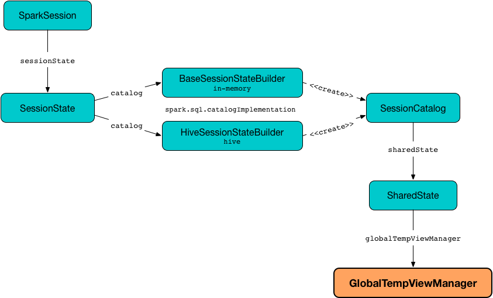

== [[GlobalTempViewManager]] GlobalTempViewManager -- Management Interface of Global Temporary Views

`GlobalTempViewManager` is the <<methods, interface>> to manage global temporary views (that `SessionCatalog` uses when requested to <<spark-sql-SessionCatalog.adoc#createGlobalTempView, create>>, <<spark-sql-SessionCatalog.adoc#alterTempViewDefinition, alter>> or <<spark-sql-SessionCatalog.adoc#dropGlobalTempView, drop>> global temporary views).

Strictly speaking, `GlobalTempViewManager` simply <<viewDefinitions, manages>> the names of the global temporary views registered (and the corresponding <<spark-sql-LogicalPlan.adoc#, logical plans>>) and has no interaction with other services in Spark SQL.

`GlobalTempViewManager` is available as <<spark-sql-SharedState.adoc#globalTempViewManager, globalTempViewManager>> property of a `SharedState`.

.GlobalTempViewManager and SparkSession
image::images/spark-sql-GlobalTempViewManager.png[align="center"]

[source, scala]
----
scala> :type spark
org.apache.spark.sql.SparkSession

scala> :type spark.sharedState.globalTempViewManager
org.apache.spark.sql.catalyst.catalog.GlobalTempViewManager
----

[[methods]]
.GlobalTempViewManager API
[cols="1,2",options="header",width="100%"]
|===
| Method
| Description

| <<clear, clear>>
a|

[source, scala]
----
clear(): Unit
----

| <<create, create>>
a|

[source, scala]
----
create(
  name: String,
  viewDefinition: LogicalPlan,
  overrideIfExists: Boolean): Unit
----

| <<get, get>>
a|

[source, scala]
----
get(name: String): Option[LogicalPlan]
----

| <<listViewNames, listViewNames>>
a|

[source, scala]
----
listViewNames(pattern: String): Seq[String]
----

| <<remove, remove>>
a|

[source, scala]
----
remove(name: String): Boolean
----

| <<rename, rename>>
a|

[source, scala]
----
rename(oldName: String, newName: String): Boolean
----

| <<update, update>>
a|

[source, scala]
----
update(name: String, viewDefinition: LogicalPlan): Boolean
----
|===

`GlobalTempViewManager` is <<creating-instance, created>> exclusively when `SharedState` is requested for <<spark-sql-SharedState.adoc#globalTempViewManager, one>> (for the very first time only as it is cached).

[[database]]
[[creating-instance]]
`GlobalTempViewManager` takes the name of the database when created.

.Creating GlobalTempViewManager


[[internal-registries]]
.GlobalTempViewManager's Internal Properties (e.g. Registries, Counters and Flags)
[cols="1m,2",options="header",width="100%"]
|===
| Name
| Description

| viewDefinitions
| [[viewDefinitions]] Registry of global temporary view definitions as <<spark-sql-LogicalPlan.adoc#, logical plans>> per view name.
|===

=== [[clear]] `clear` Method

[source, scala]
----
clear(): Unit
----

`clear` simply removes all the entries in the <<viewDefinitions, viewDefinitions>> internal registry.

NOTE: `clear` is used when `SessionCatalog` is requested to <<spark-sql-SessionCatalog.adoc#reset, reset>> (that happens to be exclusively in the Spark SQL internal tests).

=== [[create]] Creating (Registering) Global Temporary View (Definition) -- `create` Method

[source, scala]
----
create(
  name: String,
  viewDefinition: LogicalPlan,
  overrideIfExists: Boolean): Unit
----

`create` simply registers (adds) the input <<spark-sql-LogicalPlan.adoc#, LogicalPlan>> under the input `name`.

`create` throws an `AnalysisException` when the input `overrideIfExists` flag is off and the <<viewDefinitions, viewDefinitions>> internal registry contains the input `name`.

```
Temporary view '[table]' already exists
```

NOTE: `create` is used when `SessionCatalog` is requested to <<spark-sql-SessionCatalog.adoc#createGlobalTempView, createGlobalTempView>> (when <<spark-sql-LogicalPlan-CreateViewCommand.adoc#run, CreateViewCommand>> and <<spark-sql-LogicalPlan-CreateTempViewUsing.adoc#run, CreateTempViewUsing>> logical commands are executed).

=== [[get]] Retrieving Global View Definition Per Name -- `get` Method

[source, scala]
----
get(name: String): Option[LogicalPlan]
----

`get` simply returns the <<spark-sql-LogicalPlan.adoc#, LogicalPlan>> that was registered under the `name` if it defined.

NOTE: `get` is used when `SessionCatalog` is requested to <<spark-sql-SessionCatalog.adoc#getGlobalTempView, getGlobalTempView>>, <<spark-sql-SessionCatalog.adoc#getTempViewOrPermanentTableMetadata, getTempViewOrPermanentTableMetadata>>, <<spark-sql-SessionCatalog.adoc#lookupRelation, lookupRelation>>, <<spark-sql-SessionCatalog.adoc#isTemporaryTable, isTemporaryTable>> or <<spark-sql-SessionCatalog.adoc#refreshTable, refreshTable>>.

=== [[listViewNames]] Listing Global Temporary Views For Pattern -- `listViewNames` Method

[source, scala]
----
listViewNames(pattern: String): Seq[String]
----

`listViewNames` simply gives a list of the global temporary views with names matching the input `pattern`.

NOTE: `listViewNames` is used exclusively when `SessionCatalog` is requested to <<spark-sql-SessionCatalog.adoc#listTables, listTables>>

=== [[remove]] Removing (De-Registering) Global Temporary View -- `remove` Method

[source, scala]
----
remove(name: String): Boolean
----

`remove` simply tries to remove the `name` from the <<viewDefinitions, viewDefinitions>> internal registry and returns `true` when removed or `false` otherwise.

NOTE: `remove` is used when `SessionCatalog` is requested to drop a <<spark-sql-SessionCatalog.adoc#dropGlobalTempView, global temporary view>> or <<spark-sql-SessionCatalog.adoc#dropTable, table>>.

=== [[rename]] `rename` Method

[source, scala]
----
rename(oldName: String, newName: String): Boolean
----

`rename`...FIXME

NOTE: `rename` is used when...FIXME

=== [[update]] `update` Method

[source, scala]
----
update(name: String, viewDefinition: LogicalPlan): Boolean
----

`update`...FIXME

NOTE: `update` is used exclusively when `SessionCatalog` is requested to <<spark-sql-SessionCatalog.adoc#alterTempViewDefinition, alter a global temporary view>>.
