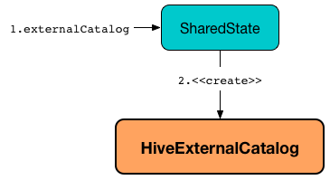

== [[HiveExternalCatalog]] HiveExternalCatalog -- Hive-Specific Metastore of Permanent Relational Entities

`HiveExternalCatalog` is a shared link:spark-sql-ExternalCatalog.adoc[metastore of permanent relational entities] that is used when `SparkSession` was created with link:spark-sql-SparkSession-Builder.adoc#enableHiveSupport[Hive support enabled].

.HiveExternalCatalog and SharedState

`HiveExternalCatalog` is available as link:spark-sql-SharedState.adoc#externalCatalog[externalCatalog] property of `SharedState` when `SparkSession` was created with link:spark-sql-SparkSession-Builder.adoc#enableHiveSupport[Hive support enabled] (that in the end sets link:spark-sql-StaticSQLConf.adoc#spark.sql.catalogImplementation[spark.sql.catalogImplementation] internal configuration property to `hive`).

[source, scala]
----
scala> spark.version
res0: String = 2.3.0-SNAPSHOT

import org.apache.spark.sql.internal.StaticSQLConf
val catalogType = spark.conf.get(StaticSQLConf.CATALOG_IMPLEMENTATION.key)
scala> println(catalogType)
hive

// You could also use the property key by name
scala> spark.conf.get("spark.sql.catalogImplementation")
res1: String = hive

val metastore = spark.sharedState.externalCatalog

scala> :type metastore
org.apache.spark.sql.catalyst.catalog.ExternalCatalog

// Since Hive is enabled HiveExternalCatalog is the metastore
scala> println(metastore)
org.apache.spark.sql.hive.HiveExternalCatalog@25e95d04
----

`HiveExternalCatalog` is <<creating-instance, created>> exclusively when `SharedState` is requested for the link:spark-sql-SharedState.adoc#externalCatalog[ExternalCatalog] for the first time (and link:spark-sql-StaticSQLConf.adoc#spark.sql.catalogImplementation[spark.sql.catalogImplementation] internal configuration property is `hive`).

[NOTE]
====
link:spark-sql-StaticSQLConf.adoc#spark.sql.catalogImplementation[spark.sql.catalogImplementation] configuration property is `in-memory` by default.

Use link:spark-sql-SparkSession-Builder.adoc#enableHiveSupport[Builder.enableHiveSupport] to enable Hive support (that sets link:spark-sql-StaticSQLConf.adoc#spark.sql.catalogImplementation[spark.sql.catalogImplementation] internal configuration property to `hive` when the Hive classes are available).

[source, scala]
----
import org.apache.spark.sql.SparkSession
val spark: SparkSession = SparkSession.builder
  .enableHiveSupport()  // <-- enables Hive support
  .getOrCreate
----
====

=== [[doAlterTableStats]] `doAlterTableStats` Method

[source, scala]
----
doAlterTableStats(
  db: String,
  table: String,
  stats: Option[CatalogStatistics]): Unit
----

NOTE: `doAlterTableStats` is a part of link:spark-sql-ExternalCatalog.adoc#doAlterTableStats[ExternalCatalog Contract] to alter the statistics of a table.

`doAlterTableStats`...FIXME

=== [[statsToProperties]] Converting Table Statistics to Properties -- `statsToProperties` Internal Method

[source, scala]
----
statsToProperties(
  stats: CatalogStatistics,
  schema: StructType): Map[String, String]
----

`statsToProperties` converts the link:spark-sql-CatalogStatistics.adoc[table statistics] to properties (i.e. key-value pairs that will be persisted as properties in the table metadata to a Hive metastore using the <<client, Hive client>>).

`statsToProperties` adds the following properties to the properties:

1. *spark.sql.statistics.totalSize* with link:spark-sql-CatalogStatistics.adoc#sizeInBytes[total size (in bytes)]
1. (if defined) *spark.sql.statistics.numRows* with link:spark-sql-CatalogStatistics.adoc#rowCount[number of rows]

`statsToProperties` takes the link:spark-sql-CatalogStatistics.adoc#colStats[column statistics] and for every column (field) in `schema` link:spark-sql-ColumnStat.adoc#toMap[converts the column statistics to properties] and adds the properties (as <<columnStatKeyPropName, column statistic property>>) to the properties.

[NOTE]
====
`statsToProperties` is used when `HiveExternalCatalog` is requested for:

1. <<doAlterTableStats, doAlterTableStats>>
1. <<alterPartitions, alterPartitions>>
====

=== [[statsFromProperties]] Restoring Table Statistics from Properties (from Hive Metastore) -- `statsFromProperties` Internal Method

[source, scala]
----
statsFromProperties(
  properties: Map[String, String],
  table: String,
  schema: StructType): Option[CatalogStatistics]
----

`statsFromProperties` collects statistics-related `properties`, i.e. the properties with their keys with *spark.sql.statistics* prefix.

`statsFromProperties` returns `None` if there are no keys with the `spark.sql.statistics` prefix in `properties`.

If there are keys with `spark.sql.statistics` prefix, `statsFromProperties` link:spark-sql-ColumnStat.adoc#creating-instance[creates] a `ColumnStat` that is the column statistics for every column in `schema`.

For every column name in `schema` `statsFromProperties` collects all the keys that start with `spark.sql.statistics.colStats.[name]` prefix (after having checked that the key `spark.sql.statistics.colStats.[name].version` exists that is a marker that the column statistics exist in the statistics properties) and link:spark-sql-ColumnStat.adoc#fromMap[converts] them to a `ColumnStat` (for the column name).

In the end, `statsFromProperties` creates a link:spark-sql-CatalogStatistics.adoc#creating-instance[CatalogStatistics] with the following properties:

* link:spark-sql-CatalogStatistics.adoc#sizeInBytes[sizeInBytes] as *spark.sql.statistics.totalSize* property
* link:spark-sql-CatalogStatistics.adoc#rowCount[rowCount] as *spark.sql.statistics.numRows* property
* link:spark-sql-CatalogStatistics.adoc#colStats[colStats] as the collection of the column names and their `ColumnStat` (calculated above)

NOTE: `statsFromProperties` is used when `HiveExternalCatalog` is requested for restoring <<restoreTableMetadata, table>> and <<restorePartitionMetadata, partition>> metadata.

=== [[restoreTableMetadata]] `restoreTableMetadata` Internal Method

[source, scala]
----
restoreTableMetadata(inputTable: CatalogTable): CatalogTable
----

`restoreTableMetadata`...FIXME

[NOTE]
====
`restoreTableMetadata` is used when `HiveExternalCatalog` is requested for:

1. <<getTable, getTable>>
1. <<doAlterTableStats, doAlterTableStats>>
1. <<alterPartitions, alterPartitions>>
1. <<listPartitionsByFilter, listPartitionsByFilter>>
====

=== [[listPartitionsByFilter]] `listPartitionsByFilter` Method

[source, scala]
----
listPartitionsByFilter(
  db: String,
  table: String,
  predicates: Seq[Expression],
  defaultTimeZoneId: String): Seq[CatalogTablePartition]
----

NOTE: `listPartitionsByFilter` is a part of link:spark-sql-ExternalCatalog.adoc#listPartitionsByFilter[ExternalCatalog Contract] to...FIXME.

`listPartitionsByFilter`...FIXME

=== [[alterPartitions]] `alterPartitions` Method

[source, scala]
----
alterPartitions(
  db: String,
  table: String,
  newParts: Seq[CatalogTablePartition]): Unit
----

NOTE: `alterPartitions` is a part of link:spark-sql-ExternalCatalog.adoc#alterPartitions[ExternalCatalog Contract] to...FIXME.

`alterPartitions`...FIXME

=== [[getTable]] `getTable` Method

[source, scala]
----
getTable(db: String, table: String): CatalogTable
----

NOTE: `getTable` is a part of link:spark-sql-ExternalCatalog.adoc#getTable[ExternalCatalog Contract] to...FIXME.

`getTable`...FIXME

=== [[doAlterTable]] `doAlterTable` Method

[source, scala]
----
doAlterTable(tableDefinition: CatalogTable): Unit
----

NOTE: `doAlterTable` is a part of link:spark-sql-ExternalCatalog.adoc#doAlterTable[ExternalCatalog Contract] to alter a table.

`doAlterTable`...FIXME

=== [[restorePartitionMetadata]] `restorePartitionMetadata` Internal Method

[source, scala]
----
restorePartitionMetadata(
  partition: CatalogTablePartition,
  table: CatalogTable): CatalogTablePartition
----

`restorePartitionMetadata`...FIXME

[NOTE]
====
`restorePartitionMetadata` is used when `HiveExternalCatalog` is requested for:

1. <<getPartition, getPartition>>
1. <<getPartitionOption, getPartitionOption>>
====

=== [[getPartition]] `getPartition` Method

[source, scala]
----
getPartition(
  db: String,
  table: String,
  spec: TablePartitionSpec): CatalogTablePartition
----

NOTE: `getPartition` is a part of link:spark-sql-ExternalCatalog.adoc#getPartition[ExternalCatalog Contract] to...FIXME.

`getPartition`...FIXME

=== [[getPartitionOption]] `getPartitionOption` Method

[source, scala]
----
getPartitionOption(
  db: String,
  table: String,
  spec: TablePartitionSpec): Option[CatalogTablePartition]
----

NOTE: `getPartitionOption` is a part of link:spark-sql-ExternalCatalog.adoc#getPartitionOption[ExternalCatalog Contract] to...FIXME.

`getPartitionOption`...FIXME

=== [[creating-instance]] Creating HiveExternalCatalog Instance

`HiveExternalCatalog` takes the following when created:

* [[conf]] Spark configuration (i.e. `SparkConf`)
* [[hadoopConf]] Hadoop's http://hadoop.apache.org/docs/r2.7.3/api/org/apache/hadoop/conf/Configuration.html[Configuration]

=== [[columnStatKeyPropName]] Building Property Name for Column and Statistic Key -- `columnStatKeyPropName` Internal Method

[source, scala]
----
columnStatKeyPropName(columnName: String, statKey: String): String
----

`columnStatKeyPropName` builds a property name of the form *spark.sql.statistics.colStats.[columnName].[statKey]* for the input `columnName` and `statKey`.

NOTE: `columnStatKeyPropName` is used when `HiveExternalCatalog` is requested to <<statsToProperties, statsToProperties>> or <<statsFromProperties, statsFromProperties>>.
