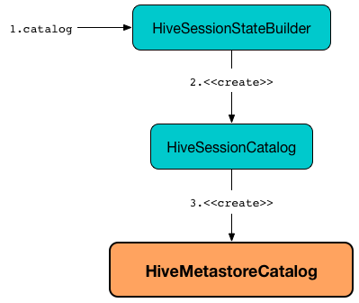

== [[HiveMetastoreCatalog]] HiveMetastoreCatalog -- Legacy SessionCatalog for Converting Hive Metastore Relations to Data Source Relations

`HiveMetastoreCatalog` is a legacy link:spark-sql-SessionCatalog.adoc[session-scoped catalog of relational entities] that `HiveSessionCatalog` link:spark-sql-HiveSessionCatalog.adoc#metastoreCatalog[uses] exclusively for <<convertToLogicalRelation, converting Hive metastore relations to data source relations>> (when `RelationConversions` logical evaluation rule is link:spark-sql-Analyzer-RelationConversions.adoc#apply[executed]).

`HiveMetastoreCatalog` is <<creating-instance, created>> exclusively when `HiveSessionStateBuilder` is requested for link:spark-sql-HiveSessionStateBuilder.adoc#catalog[SessionCatalog] (and creates a link:spark-sql-HiveSessionCatalog.adoc#metastoreCatalog[HiveSessionCatalog]).

.HiveMetastoreCatalog, HiveSessionCatalog and HiveSessionStateBuilder

[[creating-instance]][[sparkSession]]
`HiveMetastoreCatalog` takes a link:spark-sql-SparkSession.adoc[SparkSession] when created.

=== [[convertToLogicalRelation]] Converting HiveTableRelation to LogicalRelation -- `convertToLogicalRelation` Method

[source, scala]
----
convertToLogicalRelation(
  relation: HiveTableRelation,
  options: Map[String, String],
  fileFormatClass: Class[_ <: FileFormat],
  fileType: String): LogicalRelation
----

`convertToLogicalRelation`...FIXME

NOTE: `convertToLogicalRelation` is used exclusively when `RelationConversions` logical evaluation rule is requested to <<spark-sql-Analyzer-RelationConversions.adoc#convert, convert a HiveTableRelation to a LogicalRelation>> for `parquet`, `native` and `hive` ORC storage formats.

=== [[inferIfNeeded]] `inferIfNeeded` Internal Method

[source, scala]
----
inferIfNeeded(
  relation: HiveTableRelation,
  options: Map[String, String],
  fileFormat: FileFormat,
  fileIndexOpt: Option[FileIndex] = None): CatalogTable
----

`inferIfNeeded`...FIXME

NOTE: `inferIfNeeded` is used exclusively when `HiveMetastoreCatalog` is requested to <<convertToLogicalRelation, convertToLogicalRelation>>.
