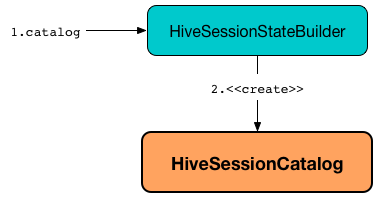

== [[HiveSessionCatalog]] HiveSessionCatalog -- Hive-Specific Catalog of Relational Entities

`HiveSessionCatalog` is a link:spark-sql-SessionCatalog.adoc[session-scoped catalog of relational entities] that is used when `SparkSession` was created with link:spark-sql-SparkSession-Builder.adoc#enableHiveSupport[Hive support enabled].

.HiveSessionCatalog and HiveSessionStateBuilder

`HiveSessionCatalog` is available as link:spark-sql-SessionState.adoc#catalog[catalog] property of `SessionState` when `SparkSession` was created with link:spark-sql-SparkSession-Builder.adoc#enableHiveSupport[Hive support enabled] (that in the end sets link:spark-sql-StaticSQLConf.adoc#spark.sql.catalogImplementation[spark.sql.catalogImplementation] internal configuration property to `hive`).

[source, scala]
----
import org.apache.spark.sql.internal.StaticSQLConf
val catalogType = spark.conf.get(StaticSQLConf.CATALOG_IMPLEMENTATION.key)
scala> println(catalogType)
hive

// You could also use the property key by name
scala> spark.conf.get("spark.sql.catalogImplementation")
res1: String = hive

// Since Hive is enabled HiveSessionCatalog is the implementation
scala> spark.sessionState.catalog
res2: org.apache.spark.sql.catalyst.catalog.SessionCatalog = org.apache.spark.sql.hive.HiveSessionCatalog@1ae3d0a8
----

`HiveSessionCatalog` is <<creating-instance, created>> exclusively when `HiveSessionStateBuilder` is requested for the link:spark-sql-HiveSessionStateBuilder.adoc#catalog[SessionCatalog].

`HiveSessionCatalog` uses the legacy <<metastoreCatalog, HiveMetastoreCatalog>> (which is another session-scoped catalog of relational entities) exclusively to allow `RelationConversions` logical evaluation rule to <<convertToLogicalRelation, convert Hive metastore relations to data source relations>> when link:spark-sql-Analyzer-RelationConversions.adoc#apply[executed].

=== [[creating-instance]] Creating HiveSessionCatalog Instance

`HiveSessionCatalog` takes the following when created:

* [[externalCatalog]] link:spark-sql-HiveExternalCatalog.adoc[HiveExternalCatalog]
* [[globalTempViewManager]] link:spark-sql-GlobalTempViewManager.adoc[GlobalTempViewManager]
* [[metastoreCatalog]] Legacy link:spark-sql-HiveMetastoreCatalog.adoc[HiveMetastoreCatalog]
* [[functionRegistry]] link:spark-sql-FunctionRegistry.adoc[FunctionRegistry]
* [[conf]] link:spark-sql-SQLConf.adoc[SQLConf]
* [[hadoopConf]] Hadoop http://hadoop.apache.org/docs/r2.7.3/api/org/apache/hadoop/conf/Configuration.html[Configuration]
* [[parser]] link:spark-sql-ParserInterface.adoc[ParserInterface]
* [[functionResourceLoader]] `FunctionResourceLoader`

=== [[lookupFunction0]] `lookupFunction0` Internal Method

[source, scala]
----
lookupFunction0(name: FunctionIdentifier, children: Seq[Expression]): Expression
----

`lookupFunction0`...FIXME

NOTE: `lookupFunction0` is used when...FIXME
