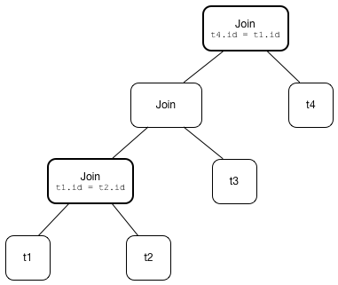

== [[ReorderJoin]] ReorderJoin Logical Optimization -- Reordering Inner and Cross Joins

`ReorderJoin` is a *logical optimization* for <<apply, join reordering>>.

`ReorderJoin` <<apply, applies>> the join optimizations on a logical plan with 2 or more inner and cross joins with at least one join condition.

CAUTION: FIXME A diagram of a logical plan tree before and after the rule.

Technically, `ReorderJoin` is a link:spark-sql-catalyst-Rule.adoc[Catalyst rule] for transforming link:spark-sql-LogicalPlan.adoc[logical plans], i.e. `Rule[LogicalPlan]`.

[source, scala]
----
// Build analyzed logical plan with at least 3 joins and zero or more filters
val belowBroadcastJoinThreshold = spark.sessionState.conf.autoBroadcastJoinThreshold - 1
val belowBroadcast = spark.range(belowBroadcastJoinThreshold)
val large = spark.range(2 * belowBroadcastJoinThreshold)
val tiny = Seq(1,2,3,4,5).toDF("id")

val q = belowBroadcast.
  crossJoin(large). // <-- CROSS JOIN of two fairly big datasets
  join(tiny).
  where(belowBroadcast("id") === tiny("id"))
val plan = q.queryExecution.analyzed
scala> println(plan.numberedTreeString)
00 Filter (id#0L = cast(id#9 as bigint))
01 +- Join Inner
02    :- Join Cross
03    :  :- Range (0, 10485759, step=1, splits=Some(8))
04    :  +- Range (0, 20971518, step=1, splits=Some(8))
05    +- Project [value#7 AS id#9]
06       +- LocalRelation [value#7]

// Apply ReorderJoin rule
// ReorderJoin alone is (usually?) not enough
// Let's go pro and create a custom RuleExecutor (i.e. a Optimizer)
import org.apache.spark.sql.catalyst.rules.RuleExecutor
import org.apache.spark.sql.catalyst.plans.logical.LogicalPlan
import org.apache.spark.sql.catalyst.analysis.EliminateSubqueryAliases
object Optimize extends RuleExecutor[LogicalPlan] {
  import org.apache.spark.sql.catalyst.optimizer._
  val batches =
    Batch("EliminateSubqueryAliases", Once, EliminateSubqueryAliases) ::
    Batch("Operator Optimization", FixedPoint(maxIterations = 100),
      ConvertToLocalRelation,
      PushDownPredicate,
      PushPredicateThroughJoin) :: Nil
}
val preOptimizedPlan = Optimize.execute(plan)
// Note Join Cross as a child of Join Inner
scala> println(preOptimizedPlan.numberedTreeString)
00 Join Inner, (id#0L = cast(id#9 as bigint))
01 :- Join Cross
02 :  :- Range (0, 10485759, step=1, splits=Some(8))
03 :  +- Range (0, 20971518, step=1, splits=Some(8))
04 +- LocalRelation [id#9]

// Time...for...ReorderJoin!
import org.apache.spark.sql.catalyst.optimizer.ReorderJoin
val optimizedPlan = ReorderJoin(preOptimizedPlan)
scala> println(optimizedPlan.numberedTreeString)
00 Join Cross
01 :- Join Inner, (id#0L = cast(id#9 as bigint))
02 :  :- Range (0, 10485759, step=1, splits=Some(8))
03 :  +- LocalRelation [id#9]
04 +- Range (0, 20971518, step=1, splits=Some(8))

// ReorderJoin works differently when the following holds:
// * starSchemaDetection is enabled
// * cboEnabled is disabled
import org.apache.spark.sql.internal.SQLConf.STARSCHEMA_DETECTION
spark.sessionState.conf.setConf(STARSCHEMA_DETECTION, true)

spark.sessionState.conf.starSchemaDetection
spark.sessionState.conf.cboEnabled
----

`ReorderJoin` is part of the link:spark-sql-Optimizer.adoc#Operator-Optimizations[Operator Optimizations] fixed-point batch in the standard batches of the link:spark-sql-Optimizer.adoc[Catalyst Optimizer].

=== [[apply]] Applying ReorderJoin Rule To Logical Plan (Executing ReorderJoin) -- `apply` Method

[source, scala]
----
apply(plan: LogicalPlan): LogicalPlan
----

NOTE: `apply` is part of link:spark-sql-catalyst-Rule.adoc#apply[Rule Contract] to apply a rule to a link:spark-sql-LogicalPlan.adoc[logical plan].

`apply` traverses the input link:spark-sql-LogicalPlan.adoc[logical plan] down and finds the following logical operators for <<flattenJoin, flattenJoin>>:

* link:spark-sql-LogicalPlan-Filter.adoc[Filter] with a inner or cross link:spark-sql-LogicalPlan-Join.adoc[Join] child operator

* link:spark-sql-LogicalPlan-Join.adoc[Join] (of any type)

NOTE: `apply` uses `ExtractFiltersAndInnerJoins` Scala extractor object (using <<ExtractFiltersAndInnerJoins-unapply, unapply>> method) to "destructure" a logical plan to its logical operators.

=== [[createOrderedJoin]] Creating Join Logical Operator (Possibly as Child of Filter Operator) -- `createOrderedJoin` Method

[source, scala]
----
createOrderedJoin(input: Seq[(LogicalPlan, InnerLike)], conditions: Seq[Expression]): LogicalPlan
----

`createOrderedJoin` takes a collection of pairs of a link:spark-sql-LogicalPlan.adoc[logical plan] and the link:spark-sql-joins.adoc#join-types[join type] with join condition link:spark-sql-Expression.adoc[expressions] and...FIXME

NOTE: `createOrderedJoin` makes sure that the `input` has at least two pairs in the `input`.

NOTE: `createOrderedJoin` is used recursively when `ReorderJoin` is <<apply, applied>> to a logical plan.

==== [[createOrderedJoin-two-joins]] "Two Logical Plans" Case

For two joins exactly (i.e. the `input` has two logical plans and their join types), `createOrderedJoin` partitions (aka _splits_) the input condition expressions to the ones that link:spark-sql-PredicateHelper.adoc#canEvaluateWithinJoin[can be evaluated within a join] and not.

`createOrderedJoin` determines the join type of the result join. It chooses link:spark-sql-joins.adoc#inner[inner] if the left and right join types are both inner and link:spark-sql-joins.adoc#cross[cross] otherwise.

`createOrderedJoin` creates a link:spark-sql-LogicalPlan-Join.adoc#creating-instance[Join] logical operator with the input join conditions combined together using `And` expression and the join type (inner or cross).

If there are condition expressions that link:spark-sql-PredicateHelper.adoc#canEvaluateWithinJoin[could not be evaluated within a join], `createOrderedJoin` creates a link:spark-sql-LogicalPlan-Filter.adoc#creating-instance[Filter] logical operator with the join conditions combined together using `And` expression and the result join operator as the link:spark-sql-LogicalPlan-Filter.adoc#child[child] operator.

[source, scala]
----
import org.apache.spark.sql.catalyst.expressions.Expression
import org.apache.spark.sql.catalyst.expressions.Literal
val a: Expression = Literal("a")
val b: Expression = Literal("b")
// Use Catalyst DSL to compose expressions
import org.apache.spark.sql.catalyst.dsl.expressions._
val cond1 = a === b

// RowNumber is Unevaluable so it cannot be evaluated within a join
import org.apache.spark.sql.catalyst.expressions.RowNumber
val rn = RowNumber()
import org.apache.spark.sql.catalyst.expressions.Unevaluable
assert(rn.isInstanceOf[Unevaluable])
val cond2 = rn === Literal(2)

val cond3 = Literal.TrueLiteral

// Use Catalyst DSL to create logical plans
import org.apache.spark.sql.catalyst.dsl.plans._
val t1 = table("t1")
val t2 = table("t2")

// Use input with exactly 2 pairs
import org.apache.spark.sql.catalyst.plans.logical.LogicalPlan
import org.apache.spark.sql.catalyst.plans.{Cross, Inner, InnerLike}
val input: Seq[(LogicalPlan, InnerLike)] = (t1, Inner) :: (t2, Cross) :: Nil
val conditions: Seq[Expression] = cond1 :: cond2 :: cond3 :: Nil

import org.apache.spark.sql.catalyst.optimizer.ReorderJoin
val plan = ReorderJoin.createOrderedJoin(input, conditions)
scala> println(plan.numberedTreeString)
00 'Filter (row_number() = 2)
01 +- 'Join Cross, ((a = b) && true)
02    :- 'UnresolvedRelation `t1`
03    +- 'UnresolvedRelation `t2`
----

==== [[createOrderedJoin-three-or-more-joins]] "Three Or More Logical Plans" Case

For three or more link:spark-sql-LogicalPlan.adoc[logical plans] in the `input`, `createOrderedJoin` takes the first plan and tries to find another that has at least one _matching_ join condition, i.e. a logical plan with the following:

. link:spark-sql-catalyst-QueryPlan.adoc#outputSet[Output attributes] together with the first plan's output attributes are the superset of the link:spark-sql-Expression.adoc#references[references] of a join condition expression (i.e. both plans are required to resolve join references)

. References of the join condition link:spark-sql-PredicateHelper.adoc#canEvaluate[cannot be evaluated] using the first plan's or the current plan's link:spark-sql-catalyst-QueryPlan.adoc#outputSet[output attributes] (i.e. neither the first plan nor the current plan themselves are enough to resolve join references)

.createOrderedJoin with Three Joins (Before)
image::images/ReorderJoin-createOrderedJoin-four-plans-before.png[align="center"]

.createOrderedJoin with Three Joins (After)
image::images/ReorderJoin-createOrderedJoin-four-plans-after.png[align="center"]

[source, scala]
----
// HACK: Disable symbolToColumn implicit conversion
// It is imported automatically in spark-shell (and makes demos impossible)
// implicit def symbolToColumn(s: Symbol): org.apache.spark.sql.ColumnName
trait ThatWasABadIdea
implicit def symbolToColumn(ack: ThatWasABadIdea) = ack

import org.apache.spark.sql.catalyst.plans.logical.LocalRelation
import org.apache.spark.sql.catalyst.dsl.expressions._
import org.apache.spark.sql.catalyst.dsl.plans._
// Note analyze at the end to analyze the queries
val p1 = LocalRelation('id.long, 'a.long, 'b.string).as("t1").where("id".attr =!= 0).select('id).analyze
val p2 = LocalRelation('id.long, 'b.long).as("t2").analyze
val p3 = LocalRelation('id.long, 'a.string).where("id".attr > 0).select('id, 'id * 2 as "a").as("t3").analyze

// The following input and conditions are equivalent to the following query
val _p1 = Seq((0,1,"one")).toDF("id", "a", "b").as("t1").where(col("id") =!= 0).select("id")
val _p2 = Seq((0,1)).toDF("id", "b").as("t2")
val _p3 = Seq((0,"one")).toDF("id", "a").where(col("id") > 0).select(col("id"), col("id") * 2 as "a").as("t3")
val _plan = _p1.
  as("p1").
  crossJoin(_p1).
  join(_p2).
  join(_p3).
  where((col("p1.id") === col("t3.id")) && (col("t2.b") === col("t3.a"))).
  queryExecution.
  analyzed
import org.apache.spark.sql.catalyst.planning.ExtractFiltersAndInnerJoins
val Some((plans, conds)) = ExtractFiltersAndInnerJoins.unapply(_plan)

import org.apache.spark.sql.catalyst.plans.logical.LogicalPlan
import org.apache.spark.sql.catalyst.plans.{Cross, Inner, InnerLike}
val input: Seq[(LogicalPlan, InnerLike)] = Seq(
  (p1, Cross),
  (p1, Cross),
  (p2, Inner),
  (p3, Inner))

// (left ++ right).outputSet > expr.references
// ! expr.references > left.outputSet
// ! expr.references > right.outputSet
val p1_id = p1.outputSet.head
val p3_id = p3.outputSet.head
val p2_b = p2.outputSet.tail.head
val p3_a = p3.outputSet.tail.head
val c1 = p1_id === p3_id
val c2 = p2_b === p3_a

// A condition has no references or the references are not a subset of left or right plans
// A couple of assertions that createOrderedJoin does internally
assert(c1.references.nonEmpty)
assert(!c1.references.subsetOf(p1.outputSet))
assert(!c1.references.subsetOf(p3.outputSet))
val refs = p1.analyze.outputSet ++ p3.outputSet
assert(c1.references.subsetOf(refs))

import org.apache.spark.sql.catalyst.expressions.Expression
val conditions: Seq[Expression] = Seq(c1, c2)

assert(input.size > 2)
assert(conditions.nonEmpty)

import org.apache.spark.sql.catalyst.optimizer.ReorderJoin
val plan = ReorderJoin.createOrderedJoin(input, conditions)
scala> println(plan.numberedTreeString)
00 'Join Cross
01 :- Join Inner, (b#553L = a#556L)
02 :  :- Join Inner, (id#549L = id#554L)
03 :  :  :- Project [id#549L]
04 :  :  :  +- Filter NOT (id#549L = cast(0 as bigint))
05 :  :  :     +- LocalRelation <empty>, [id#549L, a#550L, b#551]
06 :  :  +- Project [id#554L, (id#554L * cast(2 as bigint)) AS a#556L]
07 :  :     +- Filter (id#554L > cast(0 as bigint))
08 :  :        +- LocalRelation <empty>, [id#554L, a#555]
09 :  +- LocalRelation <empty>, [id#552L, b#553L]
10 +- Project [id#549L]
11    +- Filter NOT (id#549L = cast(0 as bigint))
12       +- LocalRelation <empty>, [id#549L, a#550L, b#551]
----

`createOrderedJoin` takes the plan that has at least one matching join condition if found or the next plan from the `input` plans.

`createOrderedJoin` partitions (aka _splits_) the input condition expressions to expressions that meet the following requirements (aka _join conditions_) or not (aka _others_):

. link:spark-sql-Expression.adoc#references[Expression references] being a subset of the link:spark-sql-catalyst-QueryPlan.adoc#outputSet[output attributes] of the left and the right operators

. link:spark-sql-PredicateHelper.adoc#canEvaluateWithinJoin[Can be evaluated within a join]

`createOrderedJoin` creates a link:spark-sql-LogicalPlan-Join.adoc#creating-instance[Join] logical operator with:

. Left logical operator as the first operator from the `input`

. Right logical operator as the right as chosen above

. Join type as the right's join type as chosen above

. Join conditions combined together using `And` expression

`createOrderedJoin` calls itself recursively with the following:

. `input` logical joins as a new pair of the new `Join` and `Inner` join type with the remaining logical plans (all but the right)

. `conditions` expressions as the _others_ conditions (all but the _join conditions_ used for the new join)

.createOrderedJoin with Three Joins

[source, scala]
----
import org.apache.spark.sql.catalyst.expressions.Expression
import org.apache.spark.sql.catalyst.expressions.AttributeReference
import org.apache.spark.sql.types.LongType
val t1_id: Expression = AttributeReference(name = "id", LongType)(qualifier = Some("t1"))
val t2_id: Expression = AttributeReference(name = "id", LongType)(qualifier = Some("t2"))
val t4_id: Expression = AttributeReference(name = "id", LongType)(qualifier = Some("t4"))
// Use Catalyst DSL to compose expressions
import org.apache.spark.sql.catalyst.dsl.expressions._
val cond1 = t1_id === t2_id

// RowNumber is Unevaluable so it cannot be evaluated within a join
import org.apache.spark.sql.catalyst.expressions.RowNumber
val rn = RowNumber()
import org.apache.spark.sql.catalyst.expressions.Unevaluable
assert(rn.isInstanceOf[Unevaluable])
import org.apache.spark.sql.catalyst.expressions.Literal
val cond2 = rn === Literal(2)

// That would hardly appear in the condition list
// Just for the demo
val cond3 = Literal.TrueLiteral

val cond4 = t4_id === t1_id

// Use Catalyst DSL to create logical plans
import org.apache.spark.sql.catalyst.dsl.plans._
val t1 = table("t1")
val t2 = table("t2")
val t3 = table("t3")
val t4 = table("t4")

// Use input with 3 or more pairs
import org.apache.spark.sql.catalyst.plans.logical.LogicalPlan
import org.apache.spark.sql.catalyst.plans.{Cross, Inner, InnerLike}
val input: Seq[(LogicalPlan, InnerLike)] = Seq(
  (t1, Inner),
  (t2, Inner),
  (t3, Cross),
  (t4, Inner))
val conditions: Seq[Expression] = cond1 :: cond2 :: cond3 :: cond4 :: Nil

import org.apache.spark.sql.catalyst.optimizer.ReorderJoin
val plan = ReorderJoin.createOrderedJoin(input, conditions)
scala> println(plan.numberedTreeString)
00 'Filter (row_number() = 2)
01 +- 'Join Inner, ((id#11L = id#12L) && (id#13L = id#11L))
02    :- 'Join Cross
03    :  :- 'Join Inner, true
04    :  :  :- 'UnresolvedRelation `t1`
05    :  :  +- 'UnresolvedRelation `t2`
06    :  +- 'UnresolvedRelation `t3`
07    +- 'UnresolvedRelation `t4`
----

=== [[ExtractFiltersAndInnerJoins]][[ExtractFiltersAndInnerJoins-unapply]][[unapply]] Extracting Filter and Join Operators from Logical Plan -- `unapply` Method (of ExtractFiltersAndInnerJoins)

[source, scala]
----
unapply(plan: LogicalPlan): Option[(Seq[(LogicalPlan, InnerLike)], Seq[Expression])]
----

`unapply` extracts link:spark-sql-LogicalPlan-Filter.adoc[Filter] (with an inner or cross join) or link:spark-sql-LogicalPlan-Join.adoc[Join] logical operators (per the input link:spark-sql-LogicalPlan.adoc[logical plan]) to...FIXME

NOTE: `unapply` is a feature of the Scala programming language to define https://docs.scala-lang.org/tour/extractor-objects.html[extractor objects] that take an object and try to give the arguments back. This is most often used in pattern matching and partial functions.

. For a link:spark-sql-LogicalPlan-Filter.adoc[Filter] logical operator with a cross or inner link:spark-sql-LogicalPlan-Join.adoc[Join] child operator, `unapply` <<ExtractFiltersAndInnerJoins-flattenJoin, flattenJoin>> on the `Filter`.

. For a link:spark-sql-LogicalPlan-Join.adoc[Join] logical operator, `unapply` <<ExtractFiltersAndInnerJoins-flattenJoin, flattenJoin>> on the `Join`.

[source, scala]
----
val d1 = Seq((0, "a"), (1, "b")).toDF("id", "c")
val d2 = Seq((0, "c"), (2, "b")).toDF("id", "c")
val q = d1.join(d2, "id").where($"id" > 0)
val plan = q.queryExecution.analyzed

scala> println(plan.numberedTreeString)
00 Filter (id#34 > 0)
01 +- Project [id#34, c#35, c#44]
02    +- Join Inner, (id#34 = id#43)
03       :- Project [_1#31 AS id#34, _2#32 AS c#35]
04       :  +- LocalRelation [_1#31, _2#32]
05       +- Project [_1#40 AS id#43, _2#41 AS c#44]
06          +- LocalRelation [_1#40, _2#41]

// Let's use Catalyst DSL instead so the plan is cleaner (e.g. no Project in-between)
// We could have used logical rules to clean up the plan
// Leaving the cleaning up as a home exercise for you :)
import org.apache.spark.sql.catalyst.dsl.plans._
val t1 = table("t1")
val t2 = table("t2")
import org.apache.spark.sql.catalyst.expressions.Expression
import org.apache.spark.sql.catalyst.expressions.Literal
val id: Expression = Literal("id")
import org.apache.spark.sql.catalyst.dsl.expressions._
import org.apache.spark.sql.catalyst.plans.Cross
val plan = t1.join(t1, joinType = Cross).join(t2).where(id > 0)
scala> println(plan.numberedTreeString)
00 'Filter (id > 0)
01 +- 'Join Inner
02    :- 'Join Cross
03    :  :- 'UnresolvedRelation `t1`
04    :  +- 'UnresolvedRelation `t1`
05    +- 'UnresolvedRelation `t2`

import org.apache.spark.sql.catalyst.planning.ExtractFiltersAndInnerJoins
// Option[(Seq[(LogicalPlan, InnerLike)], Seq[Expression])]
val Some((plans, conditions)) = ExtractFiltersAndInnerJoins.unapply(plan)

assert(plans.size > 2)
assert(conditions.nonEmpty)

CAUTION: FIXME
----

NOTE: `unapply` is used exclusively when `ReorderJoin` is <<apply, executed>>, i.e. applied to a logical plan.

=== [[ExtractFiltersAndInnerJoins-flattenJoin]][[flattenJoin]] Flattening Consecutive Joins -- `flattenJoin` Method (of ExtractFiltersAndInnerJoins)

[source, scala]
----
flattenJoin(plan: LogicalPlan, parentJoinType: InnerLike = Inner):
  (Seq[(LogicalPlan, InnerLike)], Seq[Expression])
----

`flattenJoin` branches off per the input logical `plan`:

* For an inner or cross link:spark-sql-LogicalPlan-Join.adoc[Join] logical operator, `flattenJoin` calls itself recursively with the left-side of the join and the type of the join, and gives:

a. The logical plans from recursive `flattenJoin` with the right-side of the join and the right join's type
b. The join conditions from `flattenJoin` with the conditions of the join

* For a link:spark-sql-LogicalPlan-Filter.adoc[Filter] with an inner or cross link:spark-sql-LogicalPlan-Join.adoc[Join] child operator, `flattenJoin` calls itself recursively on the join (that simply removes the `Filter` "layer" and assumes an inner join) and gives:

a. The logical plans from recursive `flattenJoin`
b. The join conditions from `flattenJoin` with ``Filter``'s link:spark-sql-LogicalPlan-Filter.adoc#condition[conditions]

* For all other logical operators, `flattenJoin` gives the input `plan`, the current join type (an inner or cross join) and the empty join condition.

In either case, `flattenJoin` splits _conjunctive predicates_, i.e. removes `And` expressions and gives their child expressions.

[source, scala]
----
// Use Catalyst DSL to create a logical plan
// Example 1: One cross join
import org.apache.spark.sql.catalyst.dsl.plans._
val t1 = table("t1")
import org.apache.spark.sql.catalyst.dsl.expressions._
val id = "id".expr
import org.apache.spark.sql.catalyst.plans.Cross
val plan = t1.join(t1, joinType = Cross)
scala> println(plan.numberedTreeString)
00 'Join Cross
01 :- 'UnresolvedRelation `t1`
02 +- 'UnresolvedRelation `t1`

import org.apache.spark.sql.catalyst.planning.ExtractFiltersAndInnerJoins
val (plans, conditions) = ExtractFiltersAndInnerJoins.flattenJoin(plan)
assert(plans.size == 2)
assert(conditions.size == 0)

// Example 2: One inner join with a filter
val t2 = table("t2")
val plan = t1.join(t2).where("t1".expr === "t2".expr)
scala> println(plan.numberedTreeString)
00 'Filter (t1 = t2)
01 +- 'Join Inner
02    :- 'UnresolvedRelation `t1`
03    +- 'UnresolvedRelation `t2`

val (plans, conditions) = ExtractFiltersAndInnerJoins.flattenJoin(plan)
assert(plans.size == 2)
assert(conditions.size == 1)

// Example 3: One inner and one cross join with a compound filter
val plan = t1.
  join(t1, joinType = Cross).
  join(t2).
  where("t2.id".expr === "t1.id".expr && "t1.id".expr > 10)
scala> println(plan.numberedTreeString)
00 'Filter ((t2.id = t1.id) && (t1.id > 10))
01 +- 'Join Inner
02    :- 'Join Cross
03    :  :- 'UnresolvedRelation `t1`
04    :  +- 'UnresolvedRelation `t1`
05    +- 'UnresolvedRelation `t2`

val (plans, conditions) = ExtractFiltersAndInnerJoins.flattenJoin(plan)
assert(plans.size == 3)
assert(conditions.size == 2)

// Example 4
val t3 = table("t3")
val plan = t1.
  join(t1, joinType = Cross).
  join(t2).
  where("t2.id".expr === "t1.id".expr && "t1.id".expr > 10).
  join(t3.select(star())).  // <-- just for more fun
  where("t3.id".expr === "t1.id".expr)
scala> println(plan.numberedTreeString)
00 'Filter (t3.id = t1.id)
01 +- 'Join Inner
02    :- 'Filter ((t2.id = t1.id) && (t1.id > 10))
03    :  +- 'Join Inner
04    :     :- 'Join Cross
05    :     :  :- 'UnresolvedRelation `t1`
06    :     :  +- 'UnresolvedRelation `t1`
07    :     +- 'UnresolvedRelation `t2`
08    +- 'Project [*]
09       +- 'UnresolvedRelation `t3`

val (plans, conditions) = ExtractFiltersAndInnerJoins.flattenJoin(plan)
assert(plans.size == 4)
assert(conditions.size == 3)

// Example 5: Join under project is no longer consecutive
val plan = t1.
  join(t1, joinType = Cross).
  select(star()). // <-- separates the cross join from the other joins
  join(t2).
  where("t2.id".expr === "t1.id".expr && "t1.id".expr > 10).
  join(t3.select(star())).
  where("t3.id".expr === "t1.id".expr)
scala> println(plan.numberedTreeString)
00 'Filter (t3.id = t1.id)
01 +- 'Join Inner
02    :- 'Filter ((t2.id = t1.id) && (t1.id > 10))
03    :  +- 'Join Inner
04    :     :- 'Project [*]
05    :     :  +- 'Join Cross
06    :     :     :- 'UnresolvedRelation `t1`
07    :     :     +- 'UnresolvedRelation `t1`
08    :     +- 'UnresolvedRelation `t2`
09    +- 'Project [*]
10       +- 'UnresolvedRelation `t3`

val (plans, conditions) = ExtractFiltersAndInnerJoins.flattenJoin(plan)
assert(plans.size == 3) // <-- one join less due to Project
assert(conditions.size == 3)

// Example 6: Join on right-hand side is not considered
val plan = t1.
  join(
    t1.join(t2).where("t2.id".expr === "t1.id".expr && "t1.id".expr > 10), // <-- join on RHS
    joinType = Cross).
  join(t2).
  where("t2.id".expr === "t1.id".expr && "t1.id".expr > 10)
scala> println(plan.numberedTreeString)
00 'Filter ((t2.id = t1.id) && (t1.id > 10))
01 +- 'Join Inner
02    :- 'Join Cross
03    :  :- 'UnresolvedRelation `t1`
04    :  +- 'Filter ((t2.id = t1.id) && (t1.id > 10))
05    :     +- 'Join Inner
06    :        :- 'UnresolvedRelation `t1`
07    :        +- 'UnresolvedRelation `t2`
08    +- 'UnresolvedRelation `t2`

val (plans, conditions) = ExtractFiltersAndInnerJoins.flattenJoin(plan)
assert(plans.size == 3) // <-- one join less due to being on right side
assert(conditions.size == 2)
----

NOTE: `flattenJoin` is used recursively when `ReorderJoin` is <<ExtractFiltersAndInnerJoins-unapply, destructures>> a logical plan (when <<apply, executed>>).
