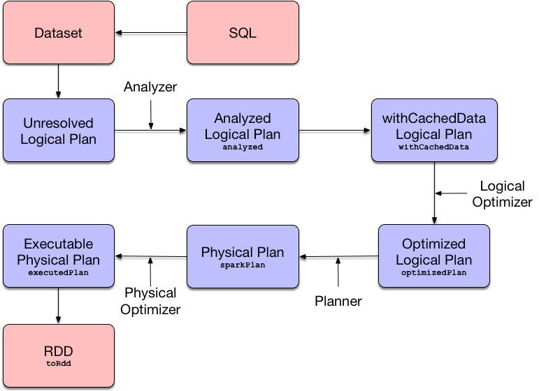

== [[QueryExecution]] QueryExecution -- Structured Query Execution Pipeline (of Dataset)

`QueryExecution` is the <<execution-pipeline, execution pipeline>> of a structured query (i.e. link:spark-sql-Dataset.adoc[Dataset]).

.Query Execution &mdash; From SQL through Dataset to RDD

NOTE: When you execute an operator on a `Dataset` it triggers <<toRdd, query execution>> that gives the good ol' `RDD` of link:spark-sql-InternalRow.adoc[internal binary rows], i.e. `RDD[InternalRow]`, that is Spark's execution plan followed by executing an RDD action and so the result of the structured query.

You can access the `QueryExecution` of a `Dataset` using link:spark-sql-Dataset.adoc#queryExecution[queryExecution] attribute.

[source, scala]
----
val ds: Dataset[Long] = ...
val queryExec = ds.queryExecution
----

`QueryExecution` is the result of link:spark-sql-SessionState.adoc#executePlan[executing a LogicalPlan in a SparkSession] (and so you could create a `Dataset` from a link:spark-sql-LogicalPlan.adoc[logical operator] or use the `QueryExecution` after executing a logical operator).

[source, scala]
----
val plan: LogicalPlan = ...
val qe = new QueryExecution(sparkSession, plan)
----

[[attributes]]
[[execution-pipeline]]
[[query-plan-lifecycle]]
.QueryExecution's Properties (aka Structured Query Execution Pipeline)
[cols="1,3",options="header",width="100%"]
|===
| Attribute / Phase
| Description

| [[analyzed]] `analyzed`
a| Analyzed <<logical, logical plan>> that has passed link:spark-sql-Analyzer.adoc#execute[Analyzer]'s check rules.

TIP: Use Dataset's link:spark-sql-dataset-operators.adoc#explain[explain(extended = true)] or SQL's `EXPLAIN EXTENDED` to see the analyzed logical plan of a structured query.

| [[withCachedData]] `withCachedData`
| <<analyzed, analyzed>> logical plan after `CacheManager` was requested to link:spark-sql-CacheManager.adoc#useCachedData[replace logical query segments with cached query plans].

`withCachedData` makes sure that the logical plan <<assertAnalyzed, can be analyzed>> and <<assertSupported, uses supported operations only>>.

| [[optimizedPlan]] `optimizedPlan`
| Optimized link:spark-sql-LogicalPlan.adoc[logical plan] that is the result of executing the link:spark-sql-SessionState.adoc#optimizer[logical query plan optimizer] on <<withCachedData, withCachedData>>.

| [[sparkPlan]] `sparkPlan`
a| link:spark-sql-SparkPlan.adoc[Physical plan] (after link:spark-sql-SparkPlanner.adoc[SparkPlanner] has planned the <<optimizedPlan, optimized logical plan>>).

NOTE: `sparkPlan` is the first physical plan from the collection of all possible physical plans.

NOTE: It is guaranteed that Catalyst's `QueryPlanner` (which `SparkPlanner` extends) link:spark-sql-catalyst-QueryPlanner.adoc#plan[will always generate at least one physical plan].

| [[executedPlan]] `executedPlan`
a| Optimized link:spark-sql-SparkPlan.adoc[physical plan] ready for execution, i.e. <<sparkPlan, physical plan>> with <<prepareForExecution, optimization rules applied sequentially>>.

NOTE: `executedPlan` is the phase when link:spark-sql-CollapseCodegenStages.adoc[CollapseCodegenStages] physical preparation rule is executed to collapse physical operators that support code generation together as a link:spark-sql-SparkPlan-WholeStageCodegenExec.adoc[WholeStageCodegenExec] operator.

| [[toRdd]] `toRdd`
a| `RDD` of link:spark-sql-InternalRow.adoc[internal binary rows] (i.e. `RDD[InternalRow]`) after link:spark-sql-SparkPlan.adoc#execute[executing] the <<executedPlan, executedPlan>>).

The `RDD` is the top-level RDD of the DAG of RDDs (that represent physical operators).

[NOTE]
====
`toRdd` is a "boundary" between two Spark modules: Spark SQL and Spark Core.

After you have executed `toRdd` (directly or not), you basically "leave" Spark SQL's Dataset world and "enter" Spark Core's RDD space.
====

`toRdd` triggers a structured query execution (i.e. physical planning, but not execution of the plan) using link:spark-sql-SparkPlan.adoc#execute[SparkPlan.execute] that recursively triggers execution of every child physical operator in the physical plan tree.

NOTE: You can use link:spark-sql-SparkSession.adoc#internalCreateDataFrame[SparkSession.internalCreateDataFrame] to apply a link:spark-sql-StructType.adoc[schema] to an `RDD[InternalRow]`.

NOTE: Use link:spark-sql-dataset-operators.adoc#rdd[Dataset.rdd] to access the `RDD[InternalRow]` with internal binary rows deserialized to a Scala type.
|===

You can access the lazy attributes as follows:

[source, scala]
----
val dataset: Dataset[Long] = ...
dataset.queryExecution.executedPlan
----

[[properties]]
.QueryExecution's Properties
[cols="1,2",options="header",width="100%"]
|===
| Name
| Description

| [[planner]] `planner`
| link:spark-sql-SparkPlanner.adoc[SparkPlanner]
|===

`QueryExecution` uses the input `SparkSession` to access the current link:spark-sql-SparkPlanner.adoc[SparkPlanner] (through link:spark-sql-SessionState.adoc[SessionState]) when <<creating-instance, it is created>>. It then computes a link:spark-sql-SparkPlan.adoc[SparkPlan] (a `PhysicalPlan` exactly) using the planner. It is available as the <<sparkPlan, `sparkPlan` attribute>>.

[NOTE]
====
A variant of `QueryExecution` that Spark Structured Streaming uses for query planning is `IncrementalExecution`.

Refer to https://jaceklaskowski.gitbooks.io/spark-structured-streaming/spark-sql-streaming-IncrementalExecution.html[IncrementalExecution — QueryExecution of Streaming Datasets] in the Spark Structured Streaming gitbook.
====

TIP: Use link:spark-sql-dataset-operators.adoc#explain[explain] operator to know about the logical and physical plans of a `Dataset`.

[source, scala]
----
val ds = spark.range(5)
scala> ds.queryExecution
res17: org.apache.spark.sql.execution.QueryExecution =
== Parsed Logical Plan ==
Range 0, 5, 1, 8, [id#39L]

== Analyzed Logical Plan ==
id: bigint
Range 0, 5, 1, 8, [id#39L]

== Optimized Logical Plan ==
Range 0, 5, 1, 8, [id#39L]

== Physical Plan ==
WholeStageCodegen
:  +- Range 0, 1, 8, 5, [id#39L]
----

NOTE: `QueryExecution` belongs to `org.apache.spark.sql.execution` package.

NOTE: `QueryExecution` is a transient feature of a link:spark-sql-Dataset.adoc[Dataset], i.e. it is not preserved across serializations.

=== [[stringWithStats]] Text Representation With Statistics -- `stringWithStats` Method

[source, scala]
----
stringWithStats: String
----

`stringWithStats`...FIXME

NOTE: `stringWithStats` is used exclusively when `ExplainCommand` command is link:spark-sql-LogicalPlan-ExplainCommand.adoc#run[executed] (with `cost` flag enabled).

=== [[simpleString]] `simpleString` Method

CAUTION: FIXME

=== [[debug]] debug Object

CAUTION: FIXME

=== [[completeString]] Building Complete Text Representation -- `completeString` Internal Method

CAUTION: FIXME

=== [[creating-instance]] Creating QueryExecution Instance

`QueryExecution` takes the following when created:

* [[sparkSession]] link:spark-sql-SparkSession.adoc[SparkSession]
* [[logical]] link:spark-sql-LogicalPlan.adoc[Logical plan]

=== [[preparations]] Physical Query Optimizations (Physical Query Plan Preparation Rules) -- `preparations` Method

[source, scala]
----
preparations: Seq[Rule[SparkPlan]]
----

`preparations` are link:spark-sql-SparkPlan.adoc[physical plan] preparation rules (i.e. `Rule[SparkPlan]`) that...FIXME

1. link:spark-sql-ExtractPythonUDFs.adoc[ExtractPythonUDFs]
1. link:spark-sql-PlanSubqueries.adoc[PlanSubqueries]
1. link:spark-sql-EnsureRequirements.adoc[EnsureRequirements]
1. link:spark-sql-CollapseCodegenStages.adoc[CollapseCodegenStages]
1. link:spark-sql-ReuseExchange.adoc[ReuseExchange]
1. link:spark-sql-ReuseSubquery.adoc[ReuseSubquery]

TIP: A `SparkPlan` preparation rule transforms a link:spark-sql-SparkPlan.adoc[physical plan] to a more efficient variant.

NOTE: The physical preparation rules are applied sequentially in order to the physical plan before execution, i.e. they generate a `SparkPlan` when <<executedPlan, executedPlan>> lazy value is first accessed (and is cached afterwards).

=== [[prepareForExecution]] Applying preparations Physical Query Plan Optimization Rules to Physical Plan -- `prepareForExecution` Method

[source, scala]
----
prepareForExecution(plan: SparkPlan): SparkPlan
----

`prepareForExecution` takes <<preparations, physical preparation rules>> and applies them one by one to the input physical `plan`.

NOTE: `prepareForExecution` is used exclusively when `QueryExecution` <<executedPlan, prepares physical plan for execution>>.

=== [[assertSupported]] `assertSupported` Method

[source, scala]
----
assertSupported(): Unit
----

`assertSupported` requests `UnsupportedOperationChecker` to link:spark-sql-UnsupportedOperationChecker.adoc#checkForBatch[checkForBatch] when...FIXME

NOTE: `assertSupported` is used exclusively when `QueryExecution` is requested for <<withCachedData, withCachedData>> logical plan.

=== [[assertAnalyzed]] Creating Analyzed Logical Plan and Checking Correctness -- `assertAnalyzed` Method

[source, scala]
----
assertAnalyzed(): Unit
----

`assertAnalyzed` triggers initialization of <<analyzed, analyzed>> (which is almost like executing it).

NOTE: `assertAnalyzed` executes <<analyzed, analyzed>> by accessing it and throwing the result away. Since `analyzed` is a lazy value in Scala, it will then get initialized for the first time and stays so forever.

`assertAnalyzed` then requests `Analyzer` to link:spark-sql-Analyzer-CheckAnalysis.adoc#checkAnalysis[validate analysis of the logical plan] (i.e. `analyzed`).

[NOTE]
====
`assertAnalyzed` uses <<sparkSession, SparkSession>> to link:spark-sql-SparkSession.adoc#sessionState[access the current `SessionState`] that it then uses to link:spark-sql-SessionState.adoc#analyzer[access the `Analyzer`].

In Scala the access path looks as follows.

[source, scala]
----
sparkSession.sessionState.analyzer
----
====

In case of any `AnalysisException`, `assertAnalyzed` creates a new `AnalysisException` to make sure that it holds <<analyzed, analyzed>> and reports it.

[NOTE]
====
`assertAnalyzed` is used when:

* `Dataset` link:spark-sql-Dataset.adoc#creating-instance[is created]
* `QueryExecution` <<withCachedData, is requested for `LogicalPlan` with cached data>>
* link:spark-sql-LogicalPlan-CreateViewCommand.adoc#run[CreateViewCommand] and link:spark-sql-LogicalPlan-AlterViewAsCommand.adoc#run[AlterViewAsCommand] are executed
====

=== [[toString]] Building Extended Text Representation with Logical and Physical Plans -- `toString` Method

[source, scala]
----
toString: String
----

`toString` is a mere alias for <<completeString, completeString>> with `appendStats` flag disabled.

NOTE: `toString` is on the "other" side of <<toStringWithStats, toStringWithStats>> which has `appendStats` flag enabled.

NOTE: `toString` is used when...FIXME

=== [[toStringWithStats]] Building Text Representation with Cost Stats -- `toStringWithStats` Method

[source, scala]
----
toStringWithStats: String
----

`toStringWithStats` is a mere alias for <<completeString, completeString>> with `appendStats` flag enabled.

NOTE: `toStringWithStats` is a custom <<toString, toString>> with link:spark-sql-Statistics.adoc[cost statistics].

[source, scala]
----
// test dataset
val dataset = spark.range(20).limit(2)

// toStringWithStats in action - note Optimized Logical Plan section with Statistics
scala> dataset.queryExecution.toStringWithStats
res6: String =
== Parsed Logical Plan ==
GlobalLimit 2
+- LocalLimit 2
   +- Range (0, 20, step=1, splits=Some(8))

== Analyzed Logical Plan ==
id: bigint
GlobalLimit 2
+- LocalLimit 2
   +- Range (0, 20, step=1, splits=Some(8))

== Optimized Logical Plan ==
GlobalLimit 2, Statistics(sizeInBytes=32.0 B, rowCount=2, isBroadcastable=false)
+- LocalLimit 2, Statistics(sizeInBytes=160.0 B, isBroadcastable=false)
   +- Range (0, 20, step=1, splits=Some(8)), Statistics(sizeInBytes=160.0 B, isBroadcastable=false)

== Physical Plan ==
CollectLimit 2
+- *Range (0, 20, step=1, splits=Some(8))
----

NOTE: `toStringWithStats` is used exclusively when `ExplainCommand` link:spark-sql-LogicalPlan-ExplainCommand.adoc#run[is executed] (only when `cost` attribute is enabled).

=== [[hiveResultString]] Transforming SparkPlan Execution Result to Hive-Compatible Output Format -- `hiveResultString` Method

[source, scala]
----
hiveResultString(): Seq[String]
----

`hiveResultString` returns the result as a Hive-compatible output format.

[source, scala]
----
scala> spark.range(5).queryExecution.hiveResultString
res0: Seq[String] = ArrayBuffer(0, 1, 2, 3, 4)

scala> spark.read.csv("people.csv").queryExecution.hiveResultString
res4: Seq[String] = ArrayBuffer(id	name	age, 0	Jacek	42)
----

Internally, `hiveResultString` <<hiveResultString-transformations, transformation>> the <<executedPlan, SparkPlan>>.

[[hiveResultString-transformations]]
.hiveResultString's SparkPlan Transformations (in execution order)
[width="100%",cols="1,2",options="header"]
|===
| SparkPlan
| Description

| link:spark-sql-SparkPlan-ExecutedCommandExec.adoc[ExecutedCommandExec] for link:spark-sql-LogicalPlan-DescribeTableCommand.adoc[DescribeTableCommand]
| Executes `DescribeTableCommand` and transforms every link:spark-sql-Row.adoc[Row] to a Hive-compatible output format.

| link:spark-sql-SparkPlan-ExecutedCommandExec.adoc[ExecutedCommandExec] for `ShowTablesCommand`
| Executes `ExecutedCommandExec` and transforms the result to a collection of table names.

| Any other link:spark-sql-SparkPlan.adoc[SparkPlan]
| Executes `SparkPlan` and transforms the result to a Hive-compatible output format.
|===

NOTE: `hiveResultString` is used exclusively when `SparkSQLDriver` (of ThriftServer) runs a command.
