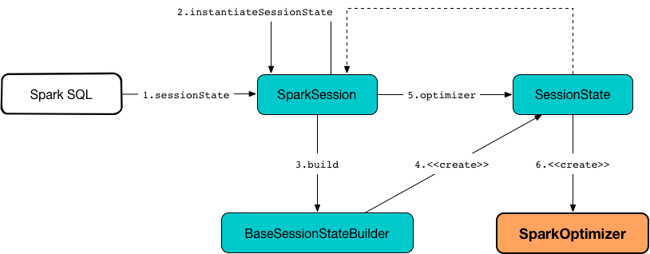

== [[SparkOptimizer]] SparkOptimizer -- Logical Query Plan Optimizer

`SparkOptimizer` is a concrete <<spark-sql-Optimizer.adoc#, logical query plan optimizer>> with additional <<batches, optimization rules>> (that extend the <<spark-sql-Optimizer.adoc#batches, base logical optimization rules>>).

`SparkOptimizer` gives three extension points for additional optimization rules:

. <<preOptimizationBatches, Pre-Optimization Batches>>

. <<postHocOptimizationBatches, Post-Hoc Optimization Batches>>

. <<User-Provided-Optimizers, User Provided Optimizers>> (as <<spark-sql-ExperimentalMethods.adoc#extraOptimizations, extraOptimizations>> of the <<experimentalMethods, ExperimentalMethods>>)

`SparkOptimizer` is <<creating-instance, created>> when `SessionState` is requested for the <<spark-sql-SessionState.adoc#optimizer, Logical Optimizer>> the first time (through <<spark-sql-BaseSessionStateBuilder.adoc#optimizer, BaseSessionStateBuilder>>).

.Creating SparkOptimizer


`SparkOptimizer` is available as the <<spark-sql-SessionState.adoc#optimizer, optimizer>> property of a session-specific `SessionState`.

[source, scala]
----
scala> :type spark
org.apache.spark.sql.SparkSession

scala> :type spark.sessionState.optimizer
org.apache.spark.sql.catalyst.optimizer.Optimizer

// It is a SparkOptimizer really.
// Let's check that out with a type cast

import org.apache.spark.sql.execution.SparkOptimizer
scala> spark.sessionState.optimizer.isInstanceOf[SparkOptimizer]
res1: Boolean = true
----

You can access the optimization logical plan of a structured query through the `QueryExecution` as link:spark-sql-QueryExecution.adoc#optimizedPlan[optimizedPlan].

[source, scala]
----
// Applying two filter in sequence on purpose
// We want to kick CombineTypedFilters optimizer in
val dataset = spark.range(10).filter(_ % 2 == 0).filter(_ == 0)

// optimizedPlan is a lazy value
// Only at the first time you call it you will trigger optimizations
// Next calls end up with the cached already-optimized result
// Use explain to trigger optimizations again
scala> dataset.queryExecution.optimizedPlan
res0: org.apache.spark.sql.catalyst.plans.logical.LogicalPlan =
TypedFilter <function1>, class java.lang.Long, [StructField(value,LongType,true)], newInstance(class java.lang.Long)
+- Range (0, 10, step=1, splits=Some(8))
----

`SparkOptimizer` defines the custom <<spark-sql-Optimizer.adoc#defaultBatches, default rule batches>>.

[[defaultBatches]]
.SparkOptimizer's Default Optimization Batch Rules (in the order of execution)
[cols="2,1,3,3",options="header",width="100%"]
|===
^.^| Batch Name
^.^| Strategy
| Rules
| Description

|
|
| <<preOptimizationBatches, preOptimizationBatches>>
|

|
|
| <<spark-sql-Optimizer.adoc#batches, Base Logical Optimization Batches>>
|

^.^| Optimize Metadata Only Query
^.^| `Once`
| link:spark-sql-SparkOptimizer-OptimizeMetadataOnlyQuery.adoc[OptimizeMetadataOnlyQuery]
|

^.^| Extract Python UDF from Aggregate
^.^| `Once`
| link:spark-sql-SparkOptimizer-ExtractPythonUDFFromAggregate.adoc[ExtractPythonUDFFromAggregate]
|

^.^| Prune File Source Table Partitions
^.^| `Once`
| link:spark-sql-SparkOptimizer-PruneFileSourcePartitions.adoc[PruneFileSourcePartitions]
|

^.^| Push down operators to data source scan
^.^| `Once`
| [[PushDownOperatorsToDataSource]] <<spark-sql-SparkOptimizer-PushDownOperatorsToDataSource.adoc#, PushDownOperatorsToDataSource>>
| Pushes down operators to underlying data sources (i.e. <<spark-sql-LogicalPlan-DataSourceV2Relation.adoc#, DataSourceV2Relations>>)

^.^|
^.^|
| <<postHocOptimizationBatches, postHocOptimizationBatches>>
|

^.^| [[User-Provided-Optimizers]] User Provided Optimizers
^.^| link:spark-sql-Optimizer.adoc#fixedPoint[FixedPoint]
| <<spark-sql-ExperimentalMethods.adoc#extraOptimizations, extraOptimizations>> of the <<experimentalMethods, ExperimentalMethods>>
|
|===

[[nonExcludableRules]]
`SparkOptimizer` considers `ExtractPythonUDFFromAggregate` optimization rule as <<spark-sql-Optimizer.adoc#nonExcludableRules, non-excludable>>.

[TIP]
====
Enable `DEBUG` or `TRACE` logging levels for `org.apache.spark.sql.execution.SparkOptimizer` logger to see what happens inside.

Add the following line to `conf/log4j.properties`:

```
log4j.logger.org.apache.spark.sql.execution.SparkOptimizer=TRACE
```

Refer to link:spark-logging.adoc[Logging].
====

=== [[creating-instance]] Creating SparkOptimizer Instance

`SparkOptimizer` takes the following when created:

* [[catalog]] <<spark-sql-SessionCatalog.adoc#, SessionCatalog>>
* [[experimentalMethods]] <<spark-sql-ExperimentalMethods.adoc#, ExperimentalMethods>>

=== [[preOptimizationBatches]] Extension Point for Additional Pre-Optimization Batches -- `preOptimizationBatches` Method

[source, scala]
----
preOptimizationBatches: Seq[Batch]
----

`preOptimizationBatches` are the additional *pre-optimization batches* that are executed right before the <<batches, regular optimization batches>>.

=== [[postHocOptimizationBatches]] Extension Point for Additional Post-Hoc Optimization Batches -- `postHocOptimizationBatches` Method

[source, scala]
----
postHocOptimizationBatches: Seq[Batch] = Nil
----

`postHocOptimizationBatches` are the additional *post-optimization batches* that are executed right after the <<batches, regular optimization batches>> (before <<User-Provided-Optimizers, User Provided Optimizers>>).

=== [[i-want-more]] Further Reading and Watching

1. https://databricks.com/blog/2015/04/13/deep-dive-into-spark-sqls-catalyst-optimizer.html[Deep Dive into Spark SQL’s Catalyst Optimizer]

2. (video) https://youtu.be/_1byVWTEK1s?t=19m7s[Modern Spark DataFrame and Dataset (Intermediate Tutorial)] by https://twitter.com/adbreind[Adam Breindel]
