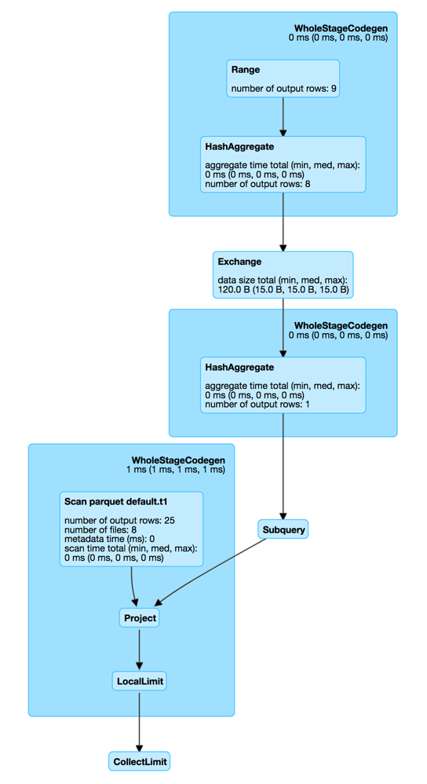

== [[SubqueryExec]] SubqueryExec Unary Physical Operator

`SubqueryExec` is a link:spark-sql-SparkPlan.adoc#UnaryExecNode[unary physical operator] (i.e. with one <<child, child>> physical operator) that...FIXME

`SubqueryExec` uses <<relationFuture, relationFuture>> that is lazily and executed only once when `SubqueryExec`  is first requested to <<doPrepare, prepare execution>> that simply triggers execution of the <<child, child>> operator asynchronously (i.e. on a separate thread) and to <<executeCollect, collect the result>> soon after (that makes `SubqueryExec` waiting indefinitely for the child operator to be finished).

CAUTION: FIXME When is `doPrepare` executed?

`SubqueryExec` is <<creating-instance, created>> exclusively when `PlanSubqueries` preparation rule is link:spark-sql-PlanSubqueries.adoc#apply[executed] (and transforms `ScalarSubquery` expressions in a physical plan).

[source, scala]
----
val q = sql("select (select max(id) from t1) tt from t1")
scala> q.explain
== Physical Plan ==
*Project [Subquery subquery32 AS tt#33L]
:  +- Subquery subquery32
:     +- *HashAggregate(keys=[], functions=[max(id#20L)])
:        +- Exchange SinglePartition
:           +- *HashAggregate(keys=[], functions=[partial_max(id#20L)])
:              +- *FileScan parquet default.t1[id#20L] Batched: true, Format: Parquet, Location: InMemoryFileIndex[file:/Users/jacek/dev/oss/spark/spark-warehouse/t1], PartitionFilters: [], PushedFilters: [], ReadSchema: struct<id:bigint>
+- *FileScan parquet default.t1[] Batched: true, Format: Parquet, Location: InMemoryFileIndex[file:/Users/jacek/dev/oss/spark/spark-warehouse/t1], PartitionFilters: [], PushedFilters: [], ReadSchema: struct<>
----

[[metrics]]
.SubqueryExec's Performance Metrics
[cols="1,2,2",options="header",width="100%"]
|===
| Key
| Name (in web UI)
| Description

| [[collectTime]] `collectTime`
| time to collect (ms)
|

| [[dataSize]] `dataSize`
| data size (bytes)
|
|===

.SubqueryExec in web UI (Details for Query)

NOTE: `SubqueryExec` physical operator is _almost_ an exact copy of link:spark-sql-SparkPlan-BroadcastExchangeExec.adoc[BroadcastExchangeExec] physical operator.

=== [[doPrepare]] Executing Child Operator Asynchronously -- `doPrepare` Method

[source, scala]
----
doPrepare(): Unit
----

NOTE: `doPrepare` is part of link:spark-sql-SparkPlan.adoc#doPrepare[SparkPlan Contract] to prepare a physical operator for execution.

`doPrepare` simply triggers initialization of the internal lazily-once-initialized <<relationFuture, relationFuture>> asynchronous computation.

=== [[relationFuture]] `relationFuture` Internal Lazily-Once-Initialized Property

[source, scala]
----
relationFuture: Future[Array[InternalRow]]
----

When "materialized" (aka _executed_), `relationFuture` spawns a new thread of execution that requests `SQLExecution` to execute an action (with the current link:spark-sql-SQLExecution.adoc#EXECUTION_ID_KEY[execution id]) on *subquery* <<executionContext, daemon cached thread pool>>.

NOTE: `relationFuture` uses Scala's https://docs.scala-lang.org/overviews/core/futures.html[scala.concurrent.Future] that spawns a new thread of execution once instantiated.

The action tracks execution of the <<child, child physical operator>> to link:spark-sql-SparkPlan.adoc#executeCollect[executeCollect] and collects <<collectTime, collectTime>> and <<dataSize, dataSize>> SQL metrics.

In the end, `relationFuture` link:spark-sql-SQLMetric.adoc#postDriverMetricUpdates[posts metric updates] and returns the internal rows.

[[executionContext]]
NOTE: `relationFuture` is executed on a separate thread from a custom https://www.scala-lang.org/api/2.11.8/index.html#scala.concurrent.ExecutionContext[scala.concurrent.ExecutionContext] (built from a cached https://docs.oracle.com/javase/8/docs/api/java/util/concurrent/ThreadPoolExecutor.html[java.util.concurrent.ThreadPoolExecutor] with the prefix *subquery* and up to 16 threads).

NOTE: `relationFuture` is used when `SubqueryExec` is requested to <<doPrepare, prepare for execution>> (that triggers execution of the child operator) and <<executeCollect, execute collect>> (that waits indefinitely until the child operator has finished).

=== [[creating-instance]] Creating SubqueryExec Instance

`SubqueryExec` takes the following when created:

* [[name]] Name of the subquery
* [[child]] Child link:spark-sql-SparkPlan.adoc[physical plan]

=== [[executeCollect]] Collecting Internal Rows of Executing SubqueryExec Operator -- `executeCollect` Method

[source, scala]
----
executeCollect(): Array[InternalRow]
----

NOTE: `executeCollect` is part of link:spark-sql-SparkPlan.adoc#executeCollect[SparkPlan Contract] to execute a physical operator and collect the results as collection of internal rows.

`executeCollect` waits till <<relationFuture, relationFuture>> gives a result (as a `Array[InternalRow]`).
