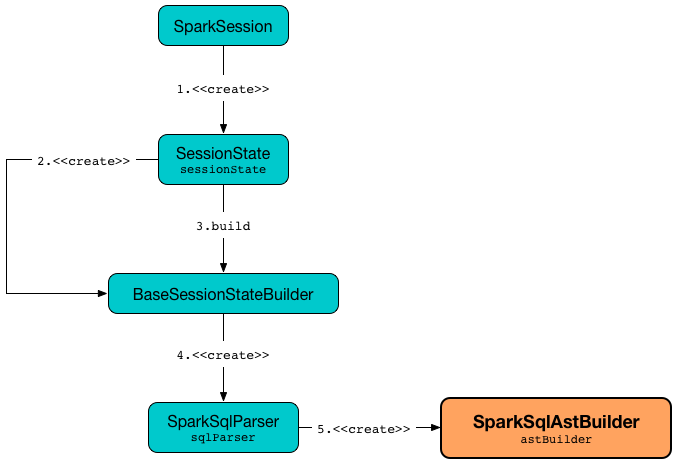

== [[SparkSqlAstBuilder]] SparkSqlAstBuilder

`SparkSqlAstBuilder` is an link:spark-sql-AstBuilder.adoc[AstBuilder] that converts valid Spark SQL statements into Catalyst expressions, logical plans or table identifiers (using <<visit-callbacks, visit callback methods>>).

NOTE: Spark SQL uses http://www.antlr.org/[ANTLR parser generator] for parsing structured text.

`SparkSqlAstBuilder` is created exclusively when `SparkSqlParser` is link:spark-sql-SparkSqlParser.adoc#astBuilder[created] (which is when `SparkSession` is requested for the lazily-created link:spark-sql-SparkSession.adoc#sessionState[SessionState]).

.Creating SparkSqlAstBuilder


[source, scala]
----
scala> :type spark.sessionState.sqlParser
org.apache.spark.sql.catalyst.parser.ParserInterface

import org.apache.spark.sql.execution.SparkSqlParser
val sqlParser = spark.sessionState.sqlParser.asInstanceOf[SparkSqlParser]

scala> :type sqlParser.astBuilder
org.apache.spark.sql.execution.SparkSqlAstBuilder
----

[[conf]]
`SparkSqlAstBuilder` takes a link:spark-sql-SQLConf.adoc[SQLConf] when created.

[NOTE]
====
`SparkSqlAstBuilder` can also be temporarily created for link:spark-sql-functions.adoc#expr[expr] standard function (to create column expressions).

[source, scala]
----
val c = expr("from_json(value, schema)")
scala> :type c
org.apache.spark.sql.Column

scala> :type c.expr
org.apache.spark.sql.catalyst.expressions.Expression

scala> println(c.expr.numberedTreeString)
00 'from_json('value, 'schema)
01 :- 'value
02 +- 'schema
----
====

[[visit-callbacks]]
.SparkSqlAstBuilder's Visit Callback Methods
[cols="1,1,3",options="header",width="100%"]
|===
| Callback Method
| ANTLR rule / labeled alternative
| Spark SQL Entity

| [[visitAnalyze]][[ANALYZE-TABLE]] `visitAnalyze`
| `#analyze`
a|

[[AnalyzeColumnCommand]]
* link:spark-sql-LogicalPlan-AnalyzeColumnCommand.adoc[AnalyzeColumnCommand] logical command for `ANALYZE TABLE` with `FOR COLUMNS` clause (but no `PARTITION` specification)
+
[source, scala]
----
// Seq((0, 0, "zero"), (1, 1, "one")).toDF("id", "p1", "p2").write.partitionBy("p1", "p2").saveAsTable("t1")
val sqlText = "ANALYZE TABLE t1 COMPUTE STATISTICS FOR COLUMNS id, p1"
val plan = spark.sql(sqlText).queryExecution.logical
import org.apache.spark.sql.execution.command.AnalyzeColumnCommand
val cmd = plan.asInstanceOf[AnalyzeColumnCommand]
scala> println(cmd)
AnalyzeColumnCommand `t1`, [id, p1]
----

[[AnalyzePartitionCommand]]
* link:spark-sql-LogicalPlan-AnalyzePartitionCommand.adoc[AnalyzePartitionCommand] logical command for `ANALYZE TABLE` with `PARTITION` specification (but no `FOR COLUMNS` clause)
+
[source, scala]
----
// Seq((0, 0, "zero"), (1, 1, "one")).toDF("id", "p1", "p2").write.partitionBy("p1", "p2").saveAsTable("t1")
val analyzeTable = "ANALYZE TABLE t1 PARTITION (p1, p2) COMPUTE STATISTICS"
val plan = spark.sql(analyzeTable).queryExecution.logical
import org.apache.spark.sql.execution.command.AnalyzePartitionCommand
val cmd = plan.asInstanceOf[AnalyzePartitionCommand]
scala> println(cmd)
AnalyzePartitionCommand `t1`, Map(p1 -> None, p2 -> None), false
----

[[AnalyzeTableCommand]]
* link:spark-sql-LogicalPlan-AnalyzeTableCommand.adoc[AnalyzeTableCommand] logical command for `ANALYZE TABLE` with neither `PARTITION` specification nor `FOR COLUMNS` clause
+
[source, scala]
----
// Seq((0, 0, "zero"), (1, 1, "one")).toDF("id", "p1", "p2").write.partitionBy("p1", "p2").saveAsTable("t1")
val sqlText = "ANALYZE TABLE t1 COMPUTE STATISTICS NOSCAN"
val plan = spark.sql(sqlText).queryExecution.logical
import org.apache.spark.sql.execution.command.AnalyzeTableCommand
val cmd = plan.asInstanceOf[AnalyzeTableCommand]
scala> println(cmd)
AnalyzeTableCommand `t1`, false
----

[[ANALYZE-TABLE-NOSCAN]]
[NOTE]
====
`visitAnalyze` supports `NOSCAN` identifier only (and reports a `ParseException` if not used).

`NOSCAN` is used for `AnalyzePartitionCommand` and `AnalyzeTableCommand` logical commands only.
====

| [[visitBucketSpec]] `visitBucketSpec`
| `#bucketSpec`
|

| [[visitCacheTable]] `visitCacheTable`
| `#cacheTable`
a|

* link:spark-sql-LogicalPlan-RunnableCommand.adoc#CacheTableCommand[CacheTableCommand] logical command for `CACHE LAZY? TABLE [table] (AS? [query])?`

| [[visitCreateHiveTable]] `visitCreateHiveTable`
| `#createHiveTable`
| link:spark-sql-LogicalPlan-CreateTable.adoc[CreateTable]

| [[visitCreateTable]] `visitCreateTable`
| `#createTable`
a|

* link:spark-sql-LogicalPlan-CreateTable.adoc[CreateTable] logical operator for `CREATE TABLE &hellip; AS &hellip;`

* <<spark-sql-LogicalPlan-CreateTempViewUsing.adoc#, CreateTempViewUsing>> logical operator for `CREATE TEMPORARY VIEW &hellip; USING &hellip;`

| `visitCreateView`
| `#createView`
a| [[visitCreateView]] <<spark-sql-LogicalPlan-CreateViewCommand.adoc#, CreateViewCommand>> for `CREATE VIEW AS` SQL statement

```
CREATE [OR REPLACE] [[GLOBAL] TEMPORARY]
VIEW [IF NOT EXISTS] tableIdentifier
[identifierCommentList] [COMMENT STRING]
[PARTITIONED ON identifierList]
[TBLPROPERTIES tablePropertyList] AS query
```

| `visitCreateTempViewUsing`
| `#createTempViewUsing`
| [[visitCreateTempViewUsing]] <<spark-sql-LogicalPlan-CreateTempViewUsing.adoc#, CreateTempViewUsing>> for `CREATE TEMPORARY VIEW &hellip; USING`

| [[visitDescribeTable]][[DESCRIBE]] `visitDescribeTable`
| `#describeTable`
a|

* [[DescribeColumnCommand]] link:spark-sql-LogicalPlan-DescribeColumnCommand.adoc[DescribeColumnCommand] logical command for `DESCRIBE TABLE` with a single column only (i.e. no `PARTITION` specification).
+
[source, scala]
----
// Seq((0, 0, "zero"), (1, 1, "one")).toDF("id", "p1", "p2").write.partitionBy("p1", "p2").saveAsTable("t1")
val sqlCmd = "DESC EXTENDED t1 p1"
val plan = spark.sql(sqlCmd).queryExecution.logical
import org.apache.spark.sql.execution.command.DescribeColumnCommand
val cmd = plan.asInstanceOf[DescribeColumnCommand]
scala> println(cmd)
DescribeColumnCommand `t1`, [p1], true
----

* [[DescribeTableCommand]] link:spark-sql-LogicalPlan-DescribeTableCommand.adoc[DescribeTableCommand] logical command for all other variants of `DESCRIBE TABLE` (i.e. no column)
+
[source, scala]
----
// Seq((0, 0, "zero"), (1, 1, "one")).toDF("id", "p1", "p2").write.partitionBy("p1", "p2").saveAsTable("t1")
val sqlCmd = "DESC t1"
val plan = spark.sql(sqlCmd).queryExecution.logical
import org.apache.spark.sql.execution.command.DescribeTableCommand
val cmd = plan.asInstanceOf[DescribeTableCommand]
scala> println(cmd)
DescribeTableCommand `t1`, false
----

| [[visitInsertOverwriteHiveDir]] `visitInsertOverwriteHiveDir`
| `#insertOverwriteHiveDir`
|

| `visitShowCreateTable`
| `#showCreateTable`
a| [[visitShowCreateTable]] <<spark-sql-LogicalPlan-ShowCreateTableCommand.adoc#, ShowCreateTableCommand>> logical command for `SHOW CREATE TABLE` SQL statement

```
SHOW CREATE TABLE tableIdentifier
```

|===

[[with-methods]]
.SparkSqlAstBuilder's Parsing Handlers
[cols="1,3",options="header",width="100%"]
|===
| Parsing Handler
| LogicalPlan Added

| [[withRepartitionByExpression]] `withRepartitionByExpression`
|
|===
