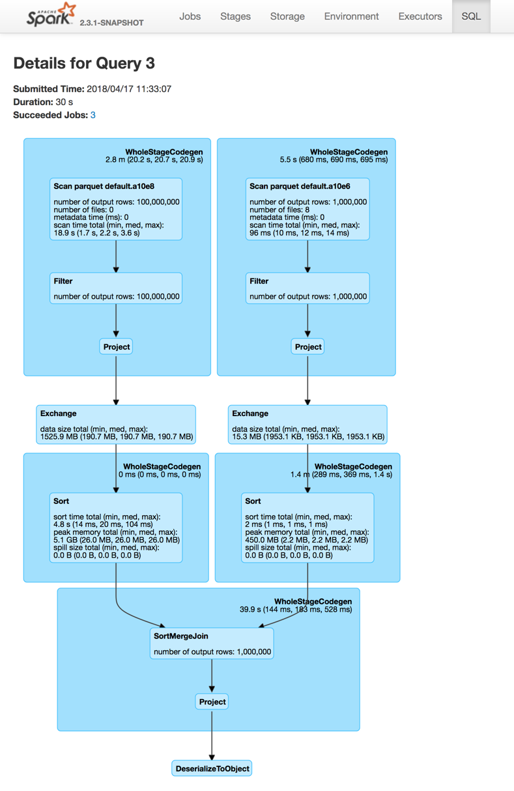
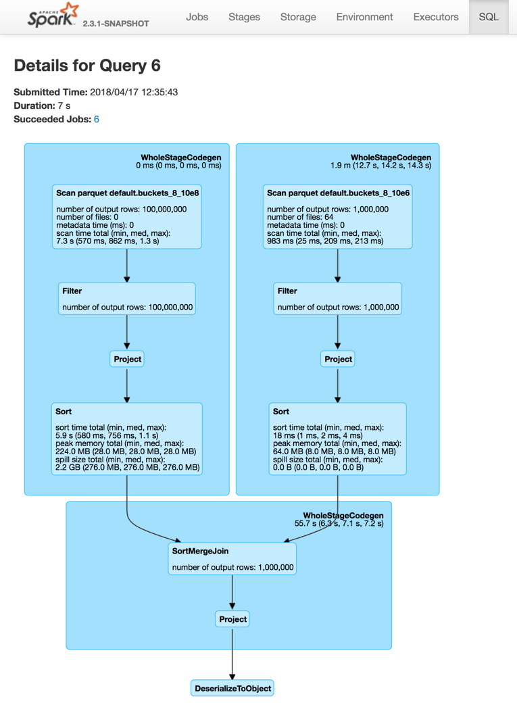
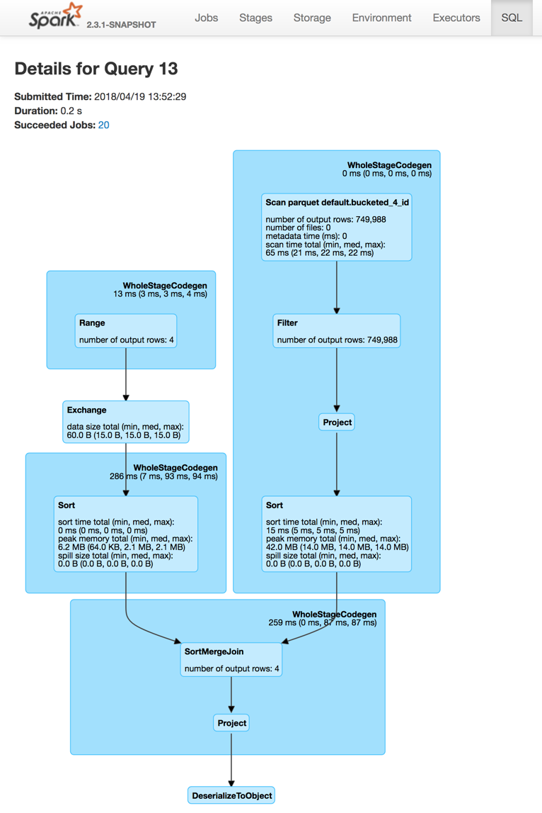
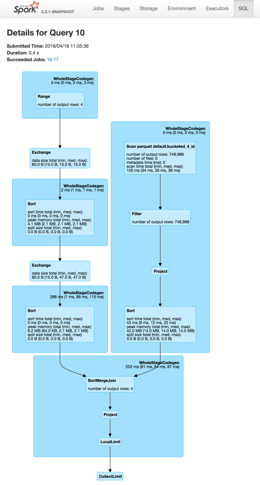

== Bucketing

*Bucketing* is an optimization technique that uses *buckets* (and *bucketing columns*) to determine data partitioning and avoid data shuffle.

The motivation is to optimize performance of a join query by avoiding shuffles (aka _exchanges_) of tables participating in the join. Bucketing results in fewer exchanges (and so stages).

NOTE: Bucketing can show the biggest benefit when *pre-shuffled bucketed tables* are used more than once as bucketing itself takes time (that you will offset executing multiple join queries later).

Bucketing is enabled by default. Spark SQL uses <<spark.sql.sources.bucketing.enabled, spark.sql.sources.bucketing.enabled>> configuration property to control whether bucketing should be enabled and used for query optimization or not.

Bucketing is used exclusively in link:spark-sql-SparkPlan-FileSourceScanExec.adoc[FileSourceScanExec] physical operator (when it is requested for the link:spark-sql-SparkPlan-FileSourceScanExec.adoc#inputRDD[input RDD] and to determine the link:spark-sql-SparkPlan-FileSourceScanExec.adoc#outputPartitioning[partitioning] and link:spark-sql-SparkPlan-FileSourceScanExec.adoc#outputOrdering[ordering] of the output).

.Example: SortMergeJoin of two FileScans
[source, scala]
----
import org.apache.spark.sql.SaveMode
spark.range(10e4.toLong).write.mode(SaveMode.Overwrite).saveAsTable("t10e4")
spark.range(10e6.toLong).write.mode(SaveMode.Overwrite).saveAsTable("t10e6")

// Bucketing is enabled by default
// Let's check it out anyway
assert(spark.sessionState.conf.bucketingEnabled, "Bucketing disabled?!")

// Make sure that you don't end up with a BroadcastHashJoin and a BroadcastExchange
// For that, let's disable auto broadcasting
spark.conf.set("spark.sql.autoBroadcastJoinThreshold", -1)

val tables = spark.catalog.listTables.where($"name" startsWith "t10e")
scala> tables.show
+-----+--------+-----------+---------+-----------+
| name|database|description|tableType|isTemporary|
+-----+--------+-----------+---------+-----------+
|t10e4| default|       null|  MANAGED|      false|
|t10e6| default|       null|  MANAGED|      false|
+-----+--------+-----------+---------+-----------+

val t4 = spark.table("t10e4")
val t6 = spark.table("t10e6")

assert(t4.count == 10e4)
assert(t6.count == 10e6)

// trigger execution of the join query
t4.join(t6, "id").foreach(_ => ())
----

The above join query is a fine example of a link:spark-sql-SparkPlan-SortMergeJoinExec.adoc[SortMergeJoinExec] (aka _SortMergeJoin_) of two link:spark-sql-SparkPlan-FileSourceScanExec.adoc[FileSourceScanExecs] (aka _Scan_). The join query uses link:spark-sql-SparkPlan-ShuffleExchangeExec.adoc[ShuffleExchangeExec] physical operators (aka _Exchange_) to shuffle the table datasets for the SortMergeJoin.

.SortMergeJoin of FileScans (Details for Query)


One way to avoid the exchanges (and so optimize the join query) is to use table bucketing that is applicable for all file-based data sources, e.g. Parquet, ORC, JSON, CSV, that are saved as a table using link:spark-sql-DataFrameWriter.adoc#saveAsTable[DataFrameWrite.saveAsTable] or simply available in a link:spark-sql-Catalog.adoc[catalog] by link:spark-sql-SparkSession.adoc#table[SparkSession.table].

NOTE: Bucketing link:spark-sql-DataFrameWriter.adoc#assertNotBucketed[is not supported] for link:spark-sql-DataFrameWriter.adoc#save[DataFrameWriter.save], link:spark-sql-DataFrameWriter.adoc#insertInto[DataFrameWriter.insertInto] and link:spark-sql-DataFrameWriter.adoc#jdbc[DataFrameWriter.jdbc] methods.

You use link:spark-sql-DataFrameWriter.adoc#bucketBy[DataFrameWriter.bucketBy] method to specify the number of buckets and the bucketing columns.

You can optionally sort the output rows in buckets using link:spark-sql-DataFrameWriter.adoc#sortBy[DataFrameWriter.sortBy] method.

[source, scala]
----
people.write
  .bucketBy(42, "name")
  .sortBy("age")
  .saveAsTable("people_bucketed")
----

NOTE: link:spark-sql-DataFrameWriter.adoc#bucketBy[DataFrameWriter.bucketBy] and link:spark-sql-DataFrameWriter.adoc#sortBy[DataFrameWriter.sortBy] simply set respective internal properties that eventually become a link:spark-sql-BucketSpec.adoc[bucketing specification].

Unlike bucketing in Apache Hive, Spark SQL creates the bucket files per the number of buckets and partitions. In other words, the number of bucketing files is the number of buckets multiplied by the number of task writers (one per partition).

[source, scala]
----
val large = spark.range(10e6.toLong)
import org.apache.spark.sql.SaveMode
large.write
  .bucketBy(4, "id")
  .sortBy("id")
  .mode(SaveMode.Overwrite)
  .saveAsTable("bucketed_4_id")

scala> println(large.queryExecution.toRdd.getNumPartitions)
8

// That gives 8 (partitions/task writers) x 4 (buckets) = 32 files
// With _SUCCESS extra file and the ls -l header "total 794624" that gives 34 files
$ ls -tlr spark-warehouse/bucketed_4_id | wc -l
      34
----

With bucketing, the Exchanges are no longer needed (as the tables are already pre-shuffled).

[source, scala]
----
// Create bucketed tables
import org.apache.spark.sql.SaveMode
spark.range(10e4.toLong)
  .write
  .bucketBy(4, "id")
  .sortBy("id")
  .mode(SaveMode.Overwrite)
  .saveAsTable("bucketed_4_10e4")
spark.range(10e6.toLong)
  .write
  .bucketBy(4, "id")
  .sortBy("id")
  .mode(SaveMode.Overwrite)
  .saveAsTable("bucketed_4_10e6")

val bucketed_4_10e4 = spark.table("bucketed_4_10e4")
val bucketed_4_10e6 = spark.table("bucketed_4_10e6")

// trigger execution of the join query
bucketed_4_10e4.join(bucketed_4_10e6, "id").foreach(_ => ())
----

The above join query of the bucketed tables shows no link:spark-sql-SparkPlan-ShuffleExchangeExec.adoc[ShuffleExchangeExec] physical operators (aka _Exchange_) as the shuffling has already been executed (before the query was run).

.SortMergeJoin of Bucketed Tables (Details for Query)


The number of partitions of a bucketed table is exactly the number of buckets.

[source, scala]
----
val bucketed_4_10e4 = spark.table("bucketed_4_10e4")
val numPartitions = bucketed_4_10e4.queryExecution.toRdd.getNumPartitions
assert(numPartitions == 4)
----

Use link:spark-sql-SessionCatalog.adoc#getTableMetadata[SessionCatalog] or `DESCRIBE EXTENDED` SQL command to find the bucketing information.

[source, scala]
----
val bucketed_tables = spark.catalog.listTables.where($"name" startsWith "bucketed_")
scala> bucketed_tables.show
+---------------+--------+-----------+---------+-----------+
|           name|database|description|tableType|isTemporary|
+---------------+--------+-----------+---------+-----------+
|bucketed_4_10e4| default|       null|  MANAGED|      false|
|bucketed_4_10e6| default|       null|  MANAGED|      false|
+---------------+--------+-----------+---------+-----------+

val demoTable = "bucketed_4_10e4"

// DESC EXTENDED or DESC FORMATTED would also work
val describeSQL = sql(s"DESCRIBE EXTENDED $demoTable")
scala> describeSQL.show(numRows = 21, truncate = false)
+----------------------------+---------------------------------------------------------------+-------+
|col_name                    |data_type                                                      |comment|
+----------------------------+---------------------------------------------------------------+-------+
|id                          |bigint                                                         |null   |
|                            |                                                               |       |
|# Detailed Table Information|                                                               |       |
|Database                    |default                                                        |       |
|Table                       |bucketed_4_10e4                                                |       |
|Owner                       |jacek                                                          |       |
|Created Time                |Tue Oct 02 10:50:50 CEST 2018                                  |       |
|Last Access                 |Thu Jan 01 01:00:00 CET 1970                                   |       |
|Created By                  |Spark 2.3.2                                                    |       |
|Type                        |MANAGED                                                        |       |
|Provider                    |parquet                                                        |       |
|Num Buckets                 |4                                                              |       |
|Bucket Columns              |[`id`]                                                         |       |
|Sort Columns                |[`id`]                                                         |       |
|Table Properties            |[transient_lastDdlTime=1538470250]                             |       |
|Statistics                  |413954 bytes                                                   |       |
|Location                    |file:/Users/jacek/dev/oss/spark/spark-warehouse/bucketed_4_10e4|       |
|Serde Library               |org.apache.hadoop.hive.serde2.lazy.LazySimpleSerDe             |       |
|InputFormat                 |org.apache.hadoop.mapred.SequenceFileInputFormat               |       |
|OutputFormat                |org.apache.hadoop.hive.ql.io.HiveSequenceFileOutputFormat      |       |
|Storage Properties          |[serialization.format=1]                                       |       |
+----------------------------+---------------------------------------------------------------+-------+

import org.apache.spark.sql.catalyst.TableIdentifier
val metadata = spark.sessionState.catalog.getTableMetadata(TableIdentifier(demoTable))
scala> metadata.bucketSpec.foreach(println)
4 buckets, bucket columns: [id], sort columns: [id]
----

The link:spark-sql-BucketSpec.adoc#numBuckets[number of buckets] has to be between `0` and `100000` exclusive or Spark SQL throws an `AnalysisException`:

```
Number of buckets should be greater than 0 but less than 100000. Got `[numBuckets]`
```

There are however requirements that have to be met before link:spark-sql-SparkOptimizer.adoc[Spark Optimizer] gives a no-Exchange query plan:

. The number of partitions on both sides of a join has to be exactly the same.

. Both join operators have to use link:spark-sql-SparkPlan-Partitioning.adoc#HashPartitioning[HashPartitioning] partitioning scheme.

It is acceptable to use bucketing for one side of a join.

[source, scala]
----
// Make sure that you don't end up with a BroadcastHashJoin and a BroadcastExchange
// For this, let's disable auto broadcasting
spark.conf.set("spark.sql.autoBroadcastJoinThreshold", -1)

val bucketedTableName = "bucketed_4_id"
val large = spark.range(10e5.toLong)
import org.apache.spark.sql.SaveMode
large.write
  .bucketBy(4, "id")
  .sortBy("id")
  .mode(SaveMode.Overwrite)
  .saveAsTable(bucketedTableName)
val bucketedTable = spark.table(bucketedTableName)

val t1 = spark
  .range(4)
  .repartition(4, $"id")  // Make sure that the number of partitions matches the other side

val q = t1.join(bucketedTable, "id")
scala> q.explain
== Physical Plan ==
*(4) Project [id#169L]
+- *(4) SortMergeJoin [id#169L], [id#167L], Inner
   :- *(2) Sort [id#169L ASC NULLS FIRST], false, 0
   :  +- Exchange hashpartitioning(id#169L, 4)
   :     +- *(1) Range (0, 4, step=1, splits=8)
   +- *(3) Sort [id#167L ASC NULLS FIRST], false, 0
      +- *(3) Project [id#167L]
         +- *(3) Filter isnotnull(id#167L)
            +- *(3) FileScan parquet default.bucketed_4_id[id#167L] Batched: true, Format: Parquet, Location: InMemoryFileIndex[file:/Users/jacek/dev/oss/spark/spark-warehouse/bucketed_4_id], PartitionFilters: [], PushedFilters: [IsNotNull(id)], ReadSchema: struct<id:bigint>

q.foreach(_ => ())
----

.SortMergeJoin of One Bucketed Table (Details for Query)


=== [[bucket-pruning]] Bucket Pruning -- Optimizing Filtering on Bucketed Column (Reducing Bucket Files to Scan)

As of https://issues.apache.org/jira/browse/SPARK-23803[Spark 2.4], Spark SQL supports *bucket pruning* to optimize filtering on bucketed column (by reducing the number of bucket files to scan).

Bucket pruning supports the following predicate expressions:

* `EqualTo` (`=`)
* `EqualNullSafe` (`++<=>++`)
* <<spark-sql-Expression-In.adoc#, In>>
* <<spark-sql-Expression-InSet.adoc#, InSet>>
* `And` and `Or` of the above

<<spark-sql-SparkStrategy-FileSourceStrategy.adoc#, FileSourceStrategy>> execution planning strategy is responsible for selecting only <<spark-sql-LogicalPlan-LogicalRelation.adoc#, LogicalRelations>> over <<spark-sql-BaseRelation-HadoopFsRelation.adoc#, HadoopFsRelation>> with the <<spark-sql-BaseRelation-HadoopFsRelation.adoc#bucketSpec, bucketing specification>> with the following:

. There is exactly one bucketing column
. The number of buckets is greater than 1

.Example: Bucket Pruning
[source, scala]
----
// Enable INFO logging level of FileSourceStrategy logger to see the details of the strategy
import org.apache.spark.sql.execution.datasources.FileSourceStrategy
val logger = FileSourceStrategy.getClass.getName.replace("$", "")
import org.apache.log4j.{Level, Logger}
Logger.getLogger(logger).setLevel(Level.INFO)

val q57 = q.where($"id" isin (50, 70))
scala> val sparkPlan57 = q57.queryExecution.executedPlan
18/11/17 23:18:04 INFO FileSourceStrategy: Pruning directories with:
18/11/17 23:18:04 INFO FileSourceStrategy: Pruned 2 out of 4 buckets.
18/11/17 23:18:04 INFO FileSourceStrategy: Post-Scan Filters: id#0L IN (50,70)
18/11/17 23:18:04 INFO FileSourceStrategy: Output Data Schema: struct<id: bigint>
18/11/17 23:18:04 INFO FileSourceScanExec: Pushed Filters: In(id, [50,70])
...

scala> println(sparkPlan57.numberedTreeString)
00 *(1) Filter id#0L IN (50,70)
01 +- *(1) FileScan parquet default.bucketed_4_id[id#0L,part#1L] Batched: true, Format: Parquet, Location: CatalogFileIndex[file:/Users/jacek/dev/oss/spark/spark-warehouse/bucketed_4_id], PartitionCount: 2, PartitionFilters: [], PushedFilters: [In(id, [50,70])], ReadSchema: struct<id:bigint>, SelectedBucketsCount: 2 out of 4

import org.apache.spark.sql.execution.FileSourceScanExec
val scan57 = sparkPlan57.collectFirst { case exec: FileSourceScanExec => exec }.get

import org.apache.spark.sql.execution.datasources.FileScanRDD
val rdd57 = scan57.inputRDDs.head.asInstanceOf[FileScanRDD]

import org.apache.spark.sql.execution.datasources.FilePartition
val bucketFiles57 = for {
  FilePartition(bucketId, files) <- rdd57.filePartitions
  f <- files
} yield s"Bucket $bucketId => $f"

scala> println(bucketFiles57.size)
24
----

=== Sorting

[source, scala]
----
// Make sure that you don't end up with a BroadcastHashJoin and a BroadcastExchange
// Disable auto broadcasting
spark.conf.set("spark.sql.autoBroadcastJoinThreshold", -1)

val bucketedTableName = "bucketed_4_id"
val large = spark.range(10e5.toLong)
import org.apache.spark.sql.SaveMode
large.write
  .bucketBy(4, "id")
  .sortBy("id")
  .mode(SaveMode.Overwrite)
  .saveAsTable(bucketedTableName)

// Describe the table and include bucketing spec only
val descSQL = sql(s"DESC FORMATTED $bucketedTableName")
  .filter($"col_name".contains("Bucket") || $"col_name" === "Sort Columns")
scala> descSQL.show
+--------------+---------+-------+
|      col_name|data_type|comment|
+--------------+---------+-------+
|   Num Buckets|        4|       |
|Bucket Columns|   [`id`]|       |
|  Sort Columns|   [`id`]|       |
+--------------+---------+-------+

val bucketedTable = spark.table(bucketedTableName)

val t1 = spark.range(4)
  .repartition(2, $"id")  // Use just 2 partitions
  .sortWithinPartitions("id") // sort partitions

val q = t1.join(bucketedTable, "id")
// Note two exchanges and sorts
scala> q.explain
== Physical Plan ==
*(5) Project [id#205L]
+- *(5) SortMergeJoin [id#205L], [id#203L], Inner
   :- *(3) Sort [id#205L ASC NULLS FIRST], false, 0
   :  +- Exchange hashpartitioning(id#205L, 4)
   :     +- *(2) Sort [id#205L ASC NULLS FIRST], false, 0
   :        +- Exchange hashpartitioning(id#205L, 2)
   :           +- *(1) Range (0, 4, step=1, splits=8)
   +- *(4) Sort [id#203L ASC NULLS FIRST], false, 0
      +- *(4) Project [id#203L]
         +- *(4) Filter isnotnull(id#203L)
            +- *(4) FileScan parquet default.bucketed_4_id[id#203L] Batched: true, Format: Parquet, Location: InMemoryFileIndex[file:/Users/jacek/dev/oss/spark/spark-warehouse/bucketed_4_id], PartitionFilters: [], PushedFilters: [IsNotNull(id)], ReadSchema: struct<id:bigint>

q.foreach(_ => ())
----

WARNING: There are two exchanges and sorts which makes the above use case almost unusable. I filed an issue at https://issues.apache.org/jira/browse/SPARK-24025[SPARK-24025 Join of bucketed and non-bucketed tables can give two exchanges and sorts for non-bucketed side].

.SortMergeJoin of Sorted Dataset and Bucketed Table (Details for Query)


=== [[spark.sql.sources.bucketing.enabled]] spark.sql.sources.bucketing.enabled Spark SQL Configuration Property

Bucketing is enabled when link:spark-sql-properties.adoc#spark.sql.sources.bucketing.enabled[spark.sql.sources.bucketing.enabled] configuration property is turned on (`true`) and it is by default.

TIP: Use link:spark-sql-SQLConf.adoc#bucketingEnabled[SQLConf.bucketingEnabled] to access the current value of `spark.sql.sources.bucketing.enabled` property.

[source, scala]
----
// Bucketing is on by default
assert(spark.sessionState.conf.bucketingEnabled, "Bucketing disabled?!")
----
